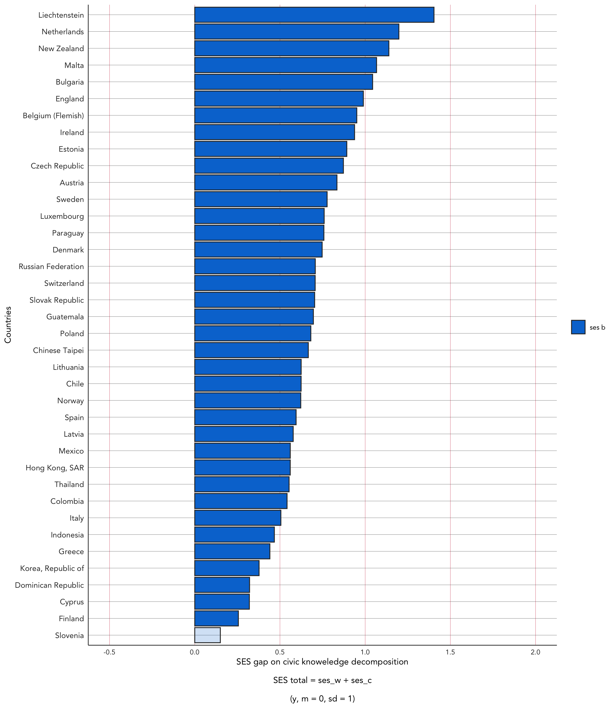
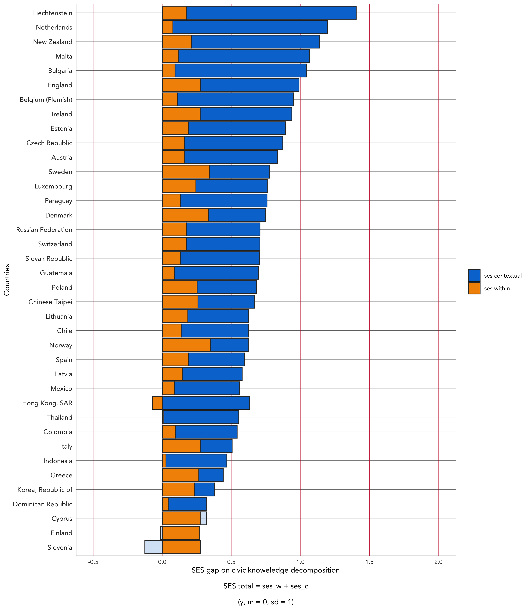
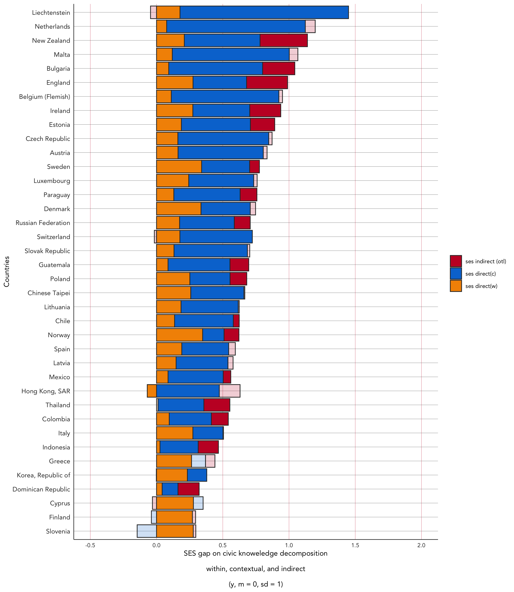

Code: Mediación (OTL) ejemplos
================
dacarras
Noviembre 17, 2022

# Update psi2301 packages

``` r
#------------------------------------------------------------------------------
# update psi2301
#------------------------------------------------------------------------------

# -----------------------------------------------
# get github
# -----------------------------------------------

# credentials::set_github_pat()

# remotes::install_github("dacarras/psi2301")
```

# Prepare data

``` r
#------------------------------------------------------------------------------
# prepare data
#------------------------------------------------------------------------------

# -----------------------------------------------
# load dplyr
# -----------------------------------------------

library(dplyr)


ctry_name_table <- read.table(text = "
IDCNTRY  ctry_name
12  'Algeria'
32  'Argentina'
36  'Australia'
40  'Austria'
48  'Bahrain'
51  'Armenia'
70  'Bosnia and Herzegovina'
72  'Botswana'
76  'Brazil'
84  'Belize'
100 'Bulgaria'
124 'Canada'
152 'Chile'
158 'Chinese Taipei'
170 'Colombia'
196 'Cyprus'
200 'Czech Republic'
203 'Czech Republic'
208 'Denmark'
214 'Dominican Republic'
222 'El Salvador'
233 'Estonia'
246 'Finland'
250 'France'
268 'Georgia'
275 'Palestinian National Authority'
276 'Germany'
288 'Ghana'
300 'Greece'
320 'Guatemala'
344 'Hong Kong, SAR'
348 'Hungary'
352 'Iceland'
360 'Indonesia'
364 'Iran, Islamic Republic of'
372 'Ireland'
376 'Israel'
380 'Italy'
392 'Japan'
398 'Kazakhstan'
400 'Jordan'
410 'Korea, Republic of'
414 'Kuwait'
422 'Lebanon'
428 'Latvia'
438 'Liechtenstein'
440 'Lithuania'
442 'Luxembourg'
458 'Malaysia'
470 'Malta'
484 'Mexico'
496 'Mongolia'
498 'Moldova'
504 'Morocco'
512 'Oman'
528 'Netherlands'
554 'New Zealand'
578 'Norway'
600 'Paraguay'
608 'Philippines'
616 'Poland'
620 'Portugal'
634 'Qatar'
642 'Romania'
643 'Russian Federation'
682 'Saudi Arabia'
702 'Singapore'
703 'Slovak Republic'
705 'Slovenia'
710 'South Africa'
724 'Spain'
752 'Sweden'
756 'Switzerland'
760 'Syria, Arab Republic of'
764 'Thailand'
780 'Trinidad And Tobago'
788 'Tunisia'
792 'Turkey'
804 'Ukraine'
807 'Macedonia'
818 'Egypt'
826 'England'
840 'United States'
887 'Yemen'
891 'Serbia'
926 'England'
927 'Scotland'
956 'Belgium (Flemish)'
957 'Belgium (French)'
3724  'Spain (Basque Country)'
3752  'Sweden (Grade 3)'
4710  'South Africa (Grade 4)'
6162  'Poland (Second-Cycle Programs)'
6431  'Russian Federation (Moscow)'
7241  'Spain (Catalonia)'
7841  'United Arab Emirates (Dubai)'
9132  'Canada (Ontario)'
9133  'Canada (Quebec)'
9134  'Canada (Alberta)'
9135  'Canada (British Columbia)'
9136  'Canada (Novia Scotia)'
9352  'Iceland (Grade 5)'
9578  'Norway (Grade 5)'
9702  'Singapore National'
11800 'United States (Indiana)'
12500 'United States (Massachusetts)'
12700 'United States (Minnesota)'
48401 'Mexico (Generales/Tecnicas/Privadas)'
48402 'Mexico (Telesecundarias)'
48499 'Mexico (Talis-Nacional)'
57891 'Norway (ALU)'
57892 'Norway (ALU +)'
57893 'Norway (PPU)'
57894 'Norway (MASTERS)'
",
head = TRUE)


# -----------------------------------------------
# load data
# -----------------------------------------------

iccs_09 <- psi2301::iccs_2009

# -----------------------------------------------
# variable centering
# -----------------------------------------------

iccs_otl <- iccs_09 %>%
# add country names
dplyr::left_join(., ctry_name_table, by = 'IDCNTRY') %>%
# father tertiary education
mutate(edt_m = case_when(
    MISCED == 0 ~ 0, # not complete ISCED 1
    MISCED == 1 ~ 0, # ISCED 1 primary
    MISCED == 2 ~ 0, # ISCED 2 lower secondary
    MISCED == 3 ~ 0, # ISCED 3 upper secondary
    MISCED == 4 ~ 0, # ISCED 4 post secondary, non tertiary
    MISCED == 5 ~ 1  # ISCED 5A or 6 Tertiary Education
    )) %>%
# highest parent tertiary education
mutate(edt_f = case_when(
    FISCED == 0 ~ 0, # not complete ISCED 1
    FISCED == 1 ~ 0, # ISCED 1 primary
    FISCED == 2 ~ 0, # ISCED 2 lower secondary
    FISCED == 3 ~ 0, # ISCED 3 upper secondary
    FISCED == 4 ~ 0, # ISCED 4 post secondary, non tertiary
    FISCED == 5 ~ 1  # ISCED 5A or 6 Tertiary Education
    )) %>%
mutate(edt_max = pmax(edt_f, edt_m)) %>%
## tertiary education among parents
mutate(edt = edt_max)        %>%  # mean score
mutate(edt_c = r4sda::c_mean(edt, id_j)) %>%  # means by group
mutate(edt_g = r4sda::c_mean(edt, id_k)) %>%  # grand mean             
mutate(edt_w = edt - edt_c   )    %>%  # centering within cluster
mutate(edt_m = edt - edt_g   )    %>%  # centering to the grand mean
mutate(edt_b = edt_c - edt_g )    %>%  # centered cluster means
## ses
mutate(ses = NISB) %>%
mutate(ses = r4sda::z_score(ses))        %>%  # mean score
mutate(ses_c = r4sda::c_mean(ses, id_j)) %>%  # means by group
mutate(ses_g = r4sda::c_mean(ses, id_k)) %>%  # grand mean             
mutate(ses_w = ses - ses_c   )    %>%  # centering within cluster
mutate(ses_m = ses - ses_g   )    %>%  # centering to the grand mean
mutate(ses_b = ses_c - ses_g )    %>%  # centered cluster means
## classroom discussion
mutate(opd = OPDISC)                     %>%  # mean score
mutate(opd = r4sda::z_score(opd))        %>%  # mean score
mutate(opd_c = r4sda::c_mean(opd, id_j)) %>%  # means by group
mutate(opd_g = r4sda::c_mean(opd, id_k)) %>%  # grand mean
mutate(opd_w = opd - opd_c   )    %>%  # centering within cluster
mutate(opd_m = opd - opd_g   )    %>%  # centering to the grand mean
mutate(opd_b = opd_c - opd_g )    %>%  # centered cluster means
## civ
mutate(civ = PV1CIV) %>%
mutate(civ = (civ-500)/100)              %>%  # mean score
mutate(civ_c = r4sda::c_mean(civ, id_j)) %>%  # means by group
mutate(civ_g = r4sda::c_mean(civ, id_k)) %>%  # grand mean                     
mutate(civ_w = civ - civ_c  )  %>%  # centering within cluster
mutate(civ_m = civ - civ_g  )  %>%  # centering to the grand mean
mutate(civ_b = civ_c - civ_g)  %>%  # centered cluster means
# select variables
dplyr::select(ctry_name, id_j, edt:edt_b, ses:ses_b, opd:opd_b, civ:civ_b) %>%
dplyr::glimpse()
```

    ## Rows: 140,650
    ## Columns: 25
    ## $ ctry_name <chr> "Austria", "Austria", "Austria", "Austria", "Austria", "Aust…
    ## $ id_j      <dbl> 11001, 11001, 11001, 11001, 11001, 11001, 11001, 11001, 1100…
    ## $ edt       <dbl> 0, 0, 1, 0, 1, 0, 0, 1, 0, 0, 1, 0, 0, 0, 0, 0, 0, 0, 0, 0, …
    ## $ edt_c     <dbl> 0.25, 0.25, 0.25, 0.25, 0.25, 0.25, 0.25, 0.25, 0.25, 0.25, …
    ## $ edt_g     <dbl> 0.232115, 0.232115, 0.232115, 0.232115, 0.232115, 0.232115, …
    ## $ edt_w     <dbl> -0.25, -0.25, 0.75, -0.25, 0.75, -0.25, -0.25, 0.75, -0.25, …
    ## $ edt_b     <dbl> 0.01788504, 0.01788504, 0.01788504, 0.01788504, 0.01788504, …
    ## $ ses       <dbl> -0.66635686, -0.25525314, 0.74874405, -0.57526798, 1.5828307…
    ## $ ses_c     <dbl> 0.2330568, 0.2330568, 0.2330568, 0.2330568, 0.2330568, 0.233…
    ## $ ses_g     <dbl> 0.01058484, 0.01058484, 0.01058484, 0.01058484, 0.01058484, …
    ## $ ses_w     <dbl> -0.899413622, -0.488309893, 0.515687293, -0.808324738, 1.349…
    ## $ ses_m     <dbl> -0.676941700, -0.265837971, 0.738159215, -0.585852816, 1.572…
    ## $ ses_b     <dbl> 0.2224719, 0.2224719, 0.2224719, 0.2224719, 0.2224719, 0.222…
    ## $ opd       <dbl> -0.52006864, 0.60435219, -0.70997374, 0.91650770, 0.91650770…
    ## $ opd_c     <dbl> 0.09458842, 0.09458842, 0.09458842, 0.09458842, 0.09458842, …
    ## $ opd_g     <dbl> -0.2571651, -0.2571651, -0.2571651, -0.2571651, -0.2571651, …
    ## $ opd_w     <dbl> -0.614657052, 0.509763776, -0.804562160, 0.821919288, 0.8219…
    ## $ opd_m     <dbl> -0.2629036, 0.8615173, -0.4528087, 1.1736728, 1.1736728, 0.3…
    ## $ opd_b     <dbl> 0.3517535, 0.3517535, 0.3517535, 0.3517535, 0.3517535, 0.351…
    ## $ civ       <labelled> 1.0625686, 0.7681462, 2.2612886, 1.5988381, 0.3475427, …
    ## $ civ_c     <labelled> 0.8587377, 0.8587377, 0.8587377, 0.8587377, 0.8587377, …
    ## $ civ_g     <labelled> 0.05667708, 0.05667708, 0.05667708, 0.05667708, 0.05667…
    ## $ civ_w     <labelled> 0.203830917, -0.090591519, 1.402550837, 0.740100355, -0…
    ## $ civ_m     <labelled> 1.00589155, 0.71146911, 2.20461147, 1.54216099, 0.29086…
    ## $ civ_b     <labelled> 0.8020606, 0.8020606, 0.8020606, 0.8020606, 0.8020606, …

# Population Model

## Naive Model

-   New Zealand

``` r
# -------------------------------------------------------------------
# lavaan
# -------------------------------------------------------------------

# -----------------------------------------------
# prep data
# -----------------------------------------------

data_med <- iccs_otl %>%
            dplyr::filter(ctry_name %in% c('New Zealand')) %>%
            dplyr::select(civ, ses, opd_b, id_j) %>%
            na.omit()

# -----------------------------------------------
# define model
# -----------------------------------------------

lavaan_model <-'
civ ~ c*ses   # y <- x
civ ~ b*opd_b # y <- m

opd_b ~ a*ses # m <- x

# effects of interest
xm  := a
my  := b
xy  := c
tot := c + a*b
ind := a*b
dir := c
pme := ind/tot
'

# -----------------------------------------------
# fit model
# -----------------------------------------------

m01 <- lavaan::sem(lavaan_model, 
       mimic = 'MPLUS',
       data = data_med)

# -----------------------------------------------
# display summary
# -----------------------------------------------

lavaan::summary(m01, 
  fit.measures=TRUE,
  standardized=TRUE,
  rsquare=TRUE)
```

    ## lavaan 0.6-12 ended normally after 17 iterations
    ## 
    ##   Estimator                                         ML
    ##   Optimization method                           NLMINB
    ##   Number of model parameters                         7
    ## 
    ##   Number of observations                          3851
    ##   Number of missing patterns                         1
    ## 
    ## Model Test User Model:
    ##                                                       
    ##   Test statistic                                 0.000
    ##   Degrees of freedom                                 0
    ## 
    ## Model Test Baseline Model:
    ## 
    ##   Test statistic                              1295.243
    ##   Degrees of freedom                                 3
    ##   P-value                                        0.000
    ## 
    ## User Model versus Baseline Model:
    ## 
    ##   Comparative Fit Index (CFI)                    1.000
    ##   Tucker-Lewis Index (TLI)                       1.000
    ## 
    ## Loglikelihood and Information Criteria:
    ## 
    ##   Loglikelihood user model (H0)              -7003.934
    ##   Loglikelihood unrestricted model (H1)      -7003.934
    ##                                                       
    ##   Akaike (AIC)                               14021.868
    ##   Bayesian (BIC)                             14065.660
    ##   Sample-size adjusted Bayesian (BIC)        14043.418
    ## 
    ## Root Mean Square Error of Approximation:
    ## 
    ##   RMSEA                                          0.000
    ##   90 Percent confidence interval - lower         0.000
    ##   90 Percent confidence interval - upper         0.000
    ##   P-value RMSEA <= 0.05                             NA
    ## 
    ## Standardized Root Mean Square Residual:
    ## 
    ##   SRMR                                           0.000
    ## 
    ## Parameter Estimates:
    ## 
    ##   Standard errors                             Standard
    ##   Information                                 Observed
    ##   Observed information based on                Hessian
    ## 
    ## Regressions:
    ##                    Estimate  Std.Err  z-value  P(>|z|)   Std.lv  Std.all
    ##   civ ~                                                                 
    ##     ses        (c)    0.315    0.015   20.386    0.000    0.315    0.293
    ##     opd_b      (b)    0.938    0.040   23.622    0.000    0.938    0.339
    ##   opd_b ~                                                               
    ##     ses        (a)    0.089    0.006   14.545    0.000    0.089    0.228
    ## 
    ## Intercepts:
    ##                    Estimate  Std.Err  z-value  P(>|z|)   Std.lv  Std.all
    ##    .civ               0.221    0.015   14.496    0.000    0.221    0.203
    ##    .opd_b             0.006    0.006    1.020    0.308    0.006    0.016
    ## 
    ## Variances:
    ##                    Estimate  Std.Err  z-value  P(>|z|)   Std.lv  Std.all
    ##    .civ               0.890    0.020   43.881    0.000    0.890    0.754
    ##    .opd_b             0.146    0.003   43.881    0.000    0.146    0.948
    ## 
    ## R-Square:
    ##                    Estimate
    ##     civ               0.246
    ##     opd_b             0.052
    ## 
    ## Defined Parameters:
    ##                    Estimate  Std.Err  z-value  P(>|z|)   Std.lv  Std.all
    ##     xm                0.089    0.006   14.545    0.000    0.089    0.228
    ##     my                0.938    0.040   23.622    0.000    0.938    0.339
    ##     xy                0.315    0.015   20.386    0.000    0.315    0.293
    ##     tot               0.398    0.016   24.744    0.000    0.398    0.370
    ##     ind               0.083    0.007   12.386    0.000    0.083    0.077
    ##     dir               0.315    0.015   20.386    0.000    0.315    0.293
    ##     pme               0.209    0.016   12.725    0.000    0.209    0.209

``` r
#------------------------------------------------
# indirect effects
#------------------------------------------------

lavaan::parameterEstimates(m01) %>%
dplyr::filter(op == ':=') %>%
knitr::kable(., digits = 2)
```

| lhs | op  | rhs     | label |  est |   se |     z | pvalue | ci.lower | ci.upper |
|:----|:----|:--------|:------|-----:|-----:|------:|-------:|---------:|---------:|
| xm  | :=  | a       | xm    | 0.09 | 0.01 | 14.55 |      0 |     0.08 |     0.10 |
| my  | :=  | b       | my    | 0.94 | 0.04 | 23.62 |      0 |     0.86 |     1.02 |
| xy  | :=  | c       | xy    | 0.31 | 0.02 | 20.39 |      0 |     0.28 |     0.35 |
| tot | :=  | c+a\*b  | tot   | 0.40 | 0.02 | 24.74 |      0 |     0.37 |     0.43 |
| ind | :=  | a\*b    | ind   | 0.08 | 0.01 | 12.39 |      0 |     0.07 |     0.10 |
| dir | :=  | c       | dir   | 0.31 | 0.02 | 20.39 |      0 |     0.28 |     0.35 |
| pme | :=  | ind/tot | pme   | 0.21 | 0.02 | 12.73 |      0 |     0.18 |     0.24 |

## Clustered Errors

``` r
# -------------------------------------------------------------------
# lavaan
# -------------------------------------------------------------------

# -----------------------------------------------
# prep data
# -----------------------------------------------

data_med <- iccs_otl %>%
            dplyr::filter(ctry_name %in% c('New Zealand')) %>%
            dplyr::select(civ, ses, opd_b, id_j) %>%
            na.omit()

# -----------------------------------------------
# define model
# -----------------------------------------------

lavaan_model <-'
civ ~ c*ses   # y <- x
civ ~ b*opd_b # y <- m

opd_b ~ a*ses # m <- x

# effects of interest
xm  := a
my  := b
xy  := c
tot := c + a*b
ind := a*b
dir := c
pme := ind/tot
'

# -----------------------------------------------
# fit model
# -----------------------------------------------

m02 <- lavaan::sem(lavaan_model, 
       mimic = 'MPLUS',
       data = data_med,
       cluster = 'id_j') 

# Mote: last line requests clustered errors

# -----------------------------------------------
# display summary
# -----------------------------------------------

lavaan::summary(m02, 
  fit.measures=TRUE,
  standardized=TRUE,
  rsquare=TRUE)
```

    ## lavaan 0.6-12 ended normally after 17 iterations
    ## 
    ##   Estimator                                         ML
    ##   Optimization method                           NLMINB
    ##   Number of model parameters                         7
    ## 
    ##   Number of observations                          3851
    ##   Number of clusters [id_j]                        146
    ##   Number of missing patterns                         1
    ## 
    ## Model Test User Model:
    ##                                               Standard      Robust
    ##   Test Statistic                                 0.000       0.000
    ##   Degrees of freedom                                 0           0
    ##   Information                                 Observed            
    ## 
    ## Model Test Baseline Model:
    ## 
    ##   Test statistic                              1295.243     950.718
    ##   Degrees of freedom                                 3           3
    ##   P-value                                        0.000       0.000
    ##   Scaling correction factor                                  1.362
    ## 
    ## User Model versus Baseline Model:
    ## 
    ##   Comparative Fit Index (CFI)                    1.000       1.000
    ##   Tucker-Lewis Index (TLI)                       1.000       1.000
    ##                                                                   
    ##   Robust Comparative Fit Index (CFI)                            NA
    ##   Robust Tucker-Lewis Index (TLI)                               NA
    ## 
    ## Loglikelihood and Information Criteria:
    ## 
    ##   Loglikelihood user model (H0)              -7003.934   -7003.934
    ##   Loglikelihood unrestricted model (H1)      -7003.934   -7003.934
    ##                                                                   
    ##   Akaike (AIC)                               14021.868   14021.868
    ##   Bayesian (BIC)                             14065.660   14065.660
    ##   Sample-size adjusted Bayesian (BIC)        14043.418   14043.418
    ## 
    ## Root Mean Square Error of Approximation:
    ## 
    ##   RMSEA                                          0.000       0.000
    ##   90 Percent confidence interval - lower         0.000       0.000
    ##   90 Percent confidence interval - upper         0.000       0.000
    ##   P-value RMSEA <= 0.05                             NA          NA
    ##                                                                   
    ##   Robust RMSEA                                               0.000
    ##   90 Percent confidence interval - lower                     0.000
    ##   90 Percent confidence interval - upper                     0.000
    ## 
    ## Standardized Root Mean Square Residual:
    ## 
    ##   SRMR                                           0.000       0.000
    ## 
    ## Parameter Estimates:
    ## 
    ##   Standard errors                        Robust.cluster
    ##   Information                                  Expected
    ##   Information saturated (h1) model           Structured
    ## 
    ## Regressions:
    ##                    Estimate  Std.Err  z-value  P(>|z|)   Std.lv  Std.all
    ##   civ ~                                                                 
    ##     ses        (c)    0.315    0.023   13.753    0.000    0.315    0.293
    ##     opd_b      (b)    0.938    0.096    9.812    0.000    0.938    0.339
    ##   opd_b ~                                                               
    ##     ses        (a)    0.089    0.017    5.361    0.000    0.089    0.228
    ## 
    ## Intercepts:
    ##                    Estimate  Std.Err  z-value  P(>|z|)   Std.lv  Std.all
    ##    .civ               0.221    0.041    5.394    0.000    0.221    0.203
    ##    .opd_b             0.006    0.033    0.192    0.848    0.006    0.016
    ## 
    ## Variances:
    ##                    Estimate  Std.Err  z-value  P(>|z|)   Std.lv  Std.all
    ##    .civ               0.890    0.035   25.431    0.000    0.890    0.754
    ##    .opd_b             0.146    0.016    9.189    0.000    0.146    0.948
    ## 
    ## R-Square:
    ##                    Estimate
    ##     civ               0.246
    ##     opd_b             0.052
    ## 
    ## Defined Parameters:
    ##                    Estimate  Std.Err  z-value  P(>|z|)   Std.lv  Std.all
    ##     xm                0.089    0.017    5.361    0.000    0.089    0.228
    ##     my                0.938    0.096    9.812    0.000    0.938    0.339
    ##     xy                0.315    0.023   13.753    0.000    0.315    0.293
    ##     tot               0.398    0.030   13.364    0.000    0.398    0.370
    ##     ind               0.083    0.020    4.185    0.000    0.083    0.077
    ##     dir               0.315    0.023   13.753    0.000    0.315    0.293
    ##     pme               0.209    0.042    5.013    0.000    0.209    0.209

``` r
#------------------------------------------------
# indirect effects
#------------------------------------------------

lavaan::parameterEstimates(m02) %>%
dplyr::filter(op == ':=') %>%
knitr::kable(., digits = 2)
```

| lhs | op  | rhs     | label |  est |   se |     z | pvalue | ci.lower | ci.upper |
|:----|:----|:--------|:------|-----:|-----:|------:|-------:|---------:|---------:|
| xm  | :=  | a       | xm    | 0.09 | 0.02 |  5.36 |      0 |     0.06 |     0.12 |
| my  | :=  | b       | my    | 0.94 | 0.10 |  9.81 |      0 |     0.75 |     1.13 |
| xy  | :=  | c       | xy    | 0.31 | 0.02 | 13.75 |      0 |     0.27 |     0.36 |
| tot | :=  | c+a\*b  | tot   | 0.40 | 0.03 | 13.36 |      0 |     0.34 |     0.46 |
| ind | :=  | a\*b    | ind   | 0.08 | 0.02 |  4.19 |      0 |     0.04 |     0.12 |
| dir | :=  | c       | dir   | 0.31 | 0.02 | 13.75 |      0 |     0.27 |     0.36 |
| pme | :=  | ind/tot | pme   | 0.21 | 0.04 |  5.01 |      0 |     0.13 |     0.29 |

## Bootstrapped errors

``` r
# -------------------------------------------------------------------
# lavaan
# -------------------------------------------------------------------


# -----------------------------------------------
# prep data
# -----------------------------------------------

data_med <- iccs_otl %>%
            dplyr::filter(ctry_name %in% c('New Zealand')) %>%
            dplyr::select(civ, ses, opd_b, id_j) %>%
            na.omit()

# -----------------------------------------------
# define model
# -----------------------------------------------

lavaan_model <-'
civ ~ c*ses   # y <- x
civ ~ b*opd_b # y <- m

opd_b ~ a*ses # m <- x

# effects of interest
xm  := a
my  := b
xy  := c
tot := c + a*b
ind := a*b
dir := c
pme := ind/tot
'

# -----------------------------------------------
# fit model
# -----------------------------------------------

m03 <- lavaan::sem(lavaan_model, 
       mimic = 'MPLUS',
       data = data_med,
       bootstrap = 5000,
       se = 'bootstrap')

# -----------------------------------------------
# display summary
# -----------------------------------------------

lavaan::summary(m03, 
  fit.measures=TRUE,
  standardized=TRUE,
  rsquare=TRUE)
```

    ## lavaan 0.6-12 ended normally after 17 iterations
    ## 
    ##   Estimator                                         ML
    ##   Optimization method                           NLMINB
    ##   Number of model parameters                         7
    ## 
    ##   Number of observations                          3851
    ##   Number of missing patterns                         1
    ## 
    ## Model Test User Model:
    ##                                                       
    ##   Test statistic                                 0.000
    ##   Degrees of freedom                                 0
    ## 
    ## Model Test Baseline Model:
    ## 
    ##   Test statistic                              1295.243
    ##   Degrees of freedom                                 3
    ##   P-value                                        0.000
    ## 
    ## User Model versus Baseline Model:
    ## 
    ##   Comparative Fit Index (CFI)                    1.000
    ##   Tucker-Lewis Index (TLI)                       1.000
    ## 
    ## Loglikelihood and Information Criteria:
    ## 
    ##   Loglikelihood user model (H0)              -7003.934
    ##   Loglikelihood unrestricted model (H1)      -7003.934
    ##                                                       
    ##   Akaike (AIC)                               14021.868
    ##   Bayesian (BIC)                             14065.660
    ##   Sample-size adjusted Bayesian (BIC)        14043.418
    ## 
    ## Root Mean Square Error of Approximation:
    ## 
    ##   RMSEA                                          0.000
    ##   90 Percent confidence interval - lower         0.000
    ##   90 Percent confidence interval - upper         0.000
    ##   P-value RMSEA <= 0.05                             NA
    ## 
    ## Standardized Root Mean Square Residual:
    ## 
    ##   SRMR                                           0.000
    ## 
    ## Parameter Estimates:
    ## 
    ##   Standard errors                            Bootstrap
    ##   Number of requested bootstrap draws             5000
    ##   Number of successful bootstrap draws            5000
    ## 
    ## Regressions:
    ##                    Estimate  Std.Err  z-value  P(>|z|)   Std.lv  Std.all
    ##   civ ~                                                                 
    ##     ses        (c)    0.315    0.016   20.258    0.000    0.315    0.293
    ##     opd_b      (b)    0.938    0.039   24.034    0.000    0.938    0.339
    ##   opd_b ~                                                               
    ##     ses        (a)    0.089    0.006   14.374    0.000    0.089    0.228
    ## 
    ## Intercepts:
    ##                    Estimate  Std.Err  z-value  P(>|z|)   Std.lv  Std.all
    ##    .civ               0.221    0.016   14.115    0.000    0.221    0.203
    ##    .opd_b             0.006    0.006    1.008    0.314    0.006    0.016
    ## 
    ## Variances:
    ##                    Estimate  Std.Err  z-value  P(>|z|)   Std.lv  Std.all
    ##    .civ               0.890    0.020   44.048    0.000    0.890    0.754
    ##    .opd_b             0.146    0.003   42.775    0.000    0.146    0.948
    ## 
    ## R-Square:
    ##                    Estimate
    ##     civ               0.246
    ##     opd_b             0.052
    ## 
    ## Defined Parameters:
    ##                    Estimate  Std.Err  z-value  P(>|z|)   Std.lv  Std.all
    ##     xm                0.089    0.006   14.373    0.000    0.089    0.228
    ##     my                0.938    0.039   24.031    0.000    0.938    0.339
    ##     xy                0.315    0.016   20.256    0.000    0.315    0.293
    ##     tot               0.398    0.016   24.647    0.000    0.398    0.370
    ##     ind               0.083    0.007   12.438    0.000    0.083    0.077
    ##     dir               0.315    0.016   20.256    0.000    0.315    0.293
    ##     pme               0.209    0.016   12.697    0.000    0.209    0.209

``` r
#------------------------------------------------
# indirect effects
#------------------------------------------------

lavaan::parameterEstimates(m03,
boot.ci.type = "bca.simple") %>% 
dplyr::filter(op == ':=') %>%
knitr::kable(., digits = 2)
```

| lhs | op  | rhs     | label |  est |   se |     z | pvalue | ci.lower | ci.upper |
|:----|:----|:--------|:------|-----:|-----:|------:|-------:|---------:|---------:|
| xm  | :=  | a       | xm    | 0.09 | 0.01 | 14.37 |      0 |     0.08 |     0.10 |
| my  | :=  | b       | my    | 0.94 | 0.04 | 24.03 |      0 |     0.86 |     1.01 |
| xy  | :=  | c       | xy    | 0.31 | 0.02 | 20.26 |      0 |     0.28 |     0.35 |
| tot | :=  | c+a\*b  | tot   | 0.40 | 0.02 | 24.65 |      0 |     0.37 |     0.43 |
| ind | :=  | a\*b    | ind   | 0.08 | 0.01 | 12.44 |      0 |     0.07 |     0.10 |
| dir | :=  | c       | dir   | 0.31 | 0.02 | 20.26 |      0 |     0.28 |     0.35 |
| pme | :=  | ind/tot | pme   | 0.21 | 0.02 | 12.70 |      0 |     0.18 |     0.24 |

# Multilevel

## Multilevel latent covariate with SES

-   1-1-1 model (unconflated MLM)
-   Preacher, K. J., Zyphur, M. J., & Zhang, Z. (2010). A general
    multilevel SEM framework for assessing multilevel mediation.
    Psychological Methods, 15(3), 209–233.
    <https://doi.org/10.1037/a0020141>
-   [download
    link](https://www.dropbox.com/s/gxa0hj0o61fu7tg/Preacher%2C%20Zyphur%2C%20Zhang_2010.pdf?dl=1)

``` r
# -------------------------------------------------------------------
# lavaan
# -------------------------------------------------------------------

# -----------------------------------------------
# prep data
# -----------------------------------------------

data_mlm <- iccs_otl %>%
            dplyr::filter(ctry_name %in% c('New Zealand')) %>%
            dplyr::select(civ, ses, opd, id_j) %>%
            na.omit()


# -----------------------------------------------
# define model
# -----------------------------------------------

lavaan_model <-'
level: 1
civ ~ c1*ses # y <- x
civ ~ b1*opd # y <- m
opd ~ a1*ses # m <- x

opd ~ 0*1 

level: 2
civ ~ c2*ses # y <- x
civ ~ b2*opd # y <- m
opd ~ a2*ses # m <- x

## L1 effects
xm1  := a1
my1  := b1
xy1  := c1
tot1 := c1 + a1*b1
ind1 := a1*b1
dir1 := c1
pme1 := ind1/tot1

## L2 effects
xm2  := a2
my2  := b2
xy2  := c2
tot2 := c2 + a2*b2
ind2 := a2*b2
dir2 := c2
pme2 := ind2/tot2

# decomposition
ses_c  := tot2 - tot1
ses_w  := tot1
otl_b  := a2*b2
ses_p  := tot2 - tot1 - a2*b2
total  := ses_p + ses_w + otl_b
pme_c  := ind2/ses_c
pme_t  := ind2/total

'


# -----------------------------------------------
# fit model
# -----------------------------------------------

m04 <- lavaan::sem(lavaan_model, 
       mimic = 'MPLUS',
       data = data_mlm,
       cluster = 'id_j')

# -----------------------------------------------
# display summary
# -----------------------------------------------

lavaan::summary(m04, 
  fit.measures=TRUE,
  standardized=TRUE,
  rsquare=TRUE)
```

    ## lavaan 0.6-12 ended normally after 40 iterations
    ## 
    ##   Estimator                                         ML
    ##   Optimization method                           NLMINB
    ##   Number of model parameters                        12
    ## 
    ##   Number of observations                          3811
    ##   Number of clusters [id_j]                        146
    ##   Number of missing patterns -- level 1              1
    ## 
    ## Model Test User Model:
    ##                                                       
    ##   Test statistic                                 1.132
    ##   Degrees of freedom                                 0
    ## 
    ## Model Test Baseline Model:
    ## 
    ##   Test statistic                               494.298
    ##   Degrees of freedom                                 6
    ##   P-value                                        0.000
    ## 
    ## User Model versus Baseline Model:
    ## 
    ##   Comparative Fit Index (CFI)                    0.998
    ##   Tucker-Lewis Index (TLI)                       1.000
    ## 
    ## Loglikelihood and Information Criteria:
    ## 
    ##   Loglikelihood user model (H0)             -15440.062
    ##   Loglikelihood unrestricted model (H1)     -15439.496
    ##                                                       
    ##   Akaike (AIC)                               30904.124
    ##   Bayesian (BIC)                             30979.072
    ##   Sample-size adjusted Bayesian (BIC)        30940.942
    ## 
    ## Root Mean Square Error of Approximation:
    ## 
    ##   RMSEA                                          0.000
    ##   90 Percent confidence interval - lower         0.000
    ##   90 Percent confidence interval - upper         0.000
    ##   P-value RMSEA <= 0.05                             NA
    ## 
    ## Standardized Root Mean Square Residual (corr metric):
    ## 
    ##   SRMR (within covariance matrix)                0.000
    ##   SRMR (between covariance matrix)               0.000
    ## 
    ## Parameter Estimates:
    ## 
    ##   Standard errors                             Standard
    ##   Information                                 Observed
    ##   Observed information based on                Hessian
    ## 
    ## 
    ## Level 1 [within]:
    ## 
    ## Regressions:
    ##                    Estimate  Std.Err  z-value  P(>|z|)   Std.lv  Std.all
    ##   civ ~                                                                 
    ##     ses       (c1)    0.201    0.015   13.596    0.000    0.201    0.215
    ##     opd       (b1)    0.155    0.013   11.766    0.000    0.155    0.186
    ##   opd ~                                                                 
    ##     ses       (a1)    0.053    0.019    2.880    0.004    0.053    0.048
    ## 
    ## Intercepts:
    ##                    Estimate  Std.Err  z-value  P(>|z|)   Std.lv  Std.all
    ##    .opd               0.000                               0.000    0.000
    ##    .civ               0.000                               0.000    0.000
    ## 
    ## Variances:
    ##                    Estimate  Std.Err  z-value  P(>|z|)   Std.lv  Std.all
    ##    .civ               0.652    0.015   42.771    0.000    0.652    0.915
    ##    .opd               1.027    0.024   42.788    0.000    1.027    0.998
    ## 
    ## R-Square:
    ##                    Estimate
    ##     civ               0.085
    ##     opd               0.002
    ## 
    ## 
    ## Level 2 [id_j]:
    ## 
    ## Regressions:
    ##                    Estimate  Std.Err  z-value  P(>|z|)   Std.lv  Std.all
    ##   civ ~                                                                 
    ##     ses       (c2)    0.781    0.123    6.372    0.000    0.781    0.518
    ##     opd       (b2)    0.865    0.184    4.700    0.000    0.865    0.418
    ##   opd ~                                                                 
    ##     ses       (a2)    0.414    0.070    5.945    0.000    0.414    0.567
    ## 
    ## Intercepts:
    ##                    Estimate  Std.Err  z-value  P(>|z|)   Std.lv  Std.all
    ##    .civ              -0.039    0.075   -0.513    0.608   -0.039   -0.055
    ##    .opd               0.347    0.030   11.600    0.000    0.347    1.018
    ## 
    ## Variances:
    ##                    Estimate  Std.Err  z-value  P(>|z|)   Std.lv  Std.all
    ##    .civ               0.156    0.027    5.771    0.000    0.156    0.312
    ##    .opd               0.079    0.015    5.136    0.000    0.079    0.678
    ## 
    ## R-Square:
    ##                    Estimate
    ##     civ               0.688
    ##     opd               0.322
    ## 
    ## Defined Parameters:
    ##                    Estimate  Std.Err  z-value  P(>|z|)   Std.lv  Std.all
    ##     xm1               0.053    0.019    2.880    0.004    0.053    0.048
    ##     my1               0.155    0.013   11.766    0.000    0.155    0.186
    ##     xy1               0.201    0.015   13.596    0.000    0.201    0.215
    ##     tot1              0.210    0.015   13.911    0.000    0.210    0.224
    ##     ind1              0.008    0.003    2.798    0.005    0.008    0.009
    ##     dir1              0.201    0.015   13.596    0.000    0.201    0.215
    ##     pme1              0.040    0.014    2.847    0.004    0.040    0.040
    ##     xm2               0.414    0.070    5.945    0.000    0.414    0.567
    ##     my2               0.865    0.184    4.700    0.000    0.865    0.418
    ##     xy2               0.781    0.123    6.372    0.000    0.781    0.518
    ##     tot2              1.139    0.102   11.183    0.000    1.139    0.755
    ##     ind2              0.358    0.093    3.863    0.000    0.358    0.237
    ##     dir2              0.781    0.123    6.372    0.000    0.781    0.518
    ##     pme2              0.314    0.080    3.911    0.000    0.314    0.314
    ##     ses_c             0.929    0.103    8.987    0.000    0.929    0.531
    ##     ses_w             0.210    0.015   13.911    0.000    0.210    0.224
    ##     otl_b             0.358    0.093    3.863    0.000    0.358    0.237
    ##     ses_p             0.572    0.124    4.609    0.000    0.572    0.293
    ##     total             1.139    0.102   11.183    0.000    1.139    0.755
    ##     pme_c             0.385    0.100    3.843    0.000    0.385    0.447
    ##     pme_t             0.314    0.080    3.911    0.000    0.314    0.314

``` r
#------------------------------------------------
# indirect effects
#------------------------------------------------

lavaan::parameterEstimates(m04)%>% 
dplyr::filter(op == ':=') %>%
knitr::kable(., digits = 2)
```

| lhs   | op  | rhs               | block | level | label |  est |   se |     z | pvalue | ci.lower | ci.upper |
|:------|:----|:------------------|------:|------:|:------|-----:|-----:|------:|-------:|---------:|---------:|
| xm1   | :=  | a1                |     0 |     0 | xm1   | 0.05 | 0.02 |  2.88 |   0.00 |     0.02 |     0.09 |
| my1   | :=  | b1                |     0 |     0 | my1   | 0.15 | 0.01 | 11.77 |   0.00 |     0.13 |     0.18 |
| xy1   | :=  | c1                |     0 |     0 | xy1   | 0.20 | 0.01 | 13.60 |   0.00 |     0.17 |     0.23 |
| tot1  | :=  | c1+a1\*b1         |     0 |     0 | tot1  | 0.21 | 0.02 | 13.91 |   0.00 |     0.18 |     0.24 |
| ind1  | :=  | a1\*b1            |     0 |     0 | ind1  | 0.01 | 0.00 |  2.80 |   0.01 |     0.00 |     0.01 |
| dir1  | :=  | c1                |     0 |     0 | dir1  | 0.20 | 0.01 | 13.60 |   0.00 |     0.17 |     0.23 |
| pme1  | :=  | ind1/tot1         |     0 |     0 | pme1  | 0.04 | 0.01 |  2.85 |   0.00 |     0.01 |     0.07 |
| xm2   | :=  | a2                |     0 |     0 | xm2   | 0.41 | 0.07 |  5.94 |   0.00 |     0.28 |     0.55 |
| my2   | :=  | b2                |     0 |     0 | my2   | 0.87 | 0.18 |  4.70 |   0.00 |     0.50 |     1.23 |
| xy2   | :=  | c2                |     0 |     0 | xy2   | 0.78 | 0.12 |  6.37 |   0.00 |     0.54 |     1.02 |
| tot2  | :=  | c2+a2\*b2         |     0 |     0 | tot2  | 1.14 | 0.10 | 11.18 |   0.00 |     0.94 |     1.34 |
| ind2  | :=  | a2\*b2            |     0 |     0 | ind2  | 0.36 | 0.09 |  3.86 |   0.00 |     0.18 |     0.54 |
| dir2  | :=  | c2                |     0 |     0 | dir2  | 0.78 | 0.12 |  6.37 |   0.00 |     0.54 |     1.02 |
| pme2  | :=  | ind2/tot2         |     0 |     0 | pme2  | 0.31 | 0.08 |  3.91 |   0.00 |     0.16 |     0.47 |
| ses_c | :=  | tot2-tot1         |     0 |     0 | ses_c | 0.93 | 0.10 |  8.99 |   0.00 |     0.73 |     1.13 |
| ses_w | :=  | tot1              |     0 |     0 | ses_w | 0.21 | 0.02 | 13.91 |   0.00 |     0.18 |     0.24 |
| otl_b | :=  | a2\*b2            |     0 |     0 | otl_b | 0.36 | 0.09 |  3.86 |   0.00 |     0.18 |     0.54 |
| ses_p | :=  | tot2-tot1-a2\*b2  |     0 |     0 | ses_p | 0.57 | 0.12 |  4.61 |   0.00 |     0.33 |     0.81 |
| total | :=  | ses_p+ses_w+otl_b |     0 |     0 | total | 1.14 | 0.10 | 11.18 |   0.00 |     0.94 |     1.34 |
| pme_c | :=  | ind2/ses_c        |     0 |     0 | pme_c | 0.38 | 0.10 |  3.84 |   0.00 |     0.19 |     0.58 |
| pme_t | :=  | ind2/total        |     0 |     0 | pme_t | 0.31 | 0.08 |  3.91 |   0.00 |     0.16 |     0.47 |

# MLM estimates from all countries

## MSEM as a function

``` r
# -------------------------------------------------------------------
# lavaan
# -------------------------------------------------------------------

get_otl <- function(data){

data_model <- data

get_otl_mlm <- function(data){

# -----------------------------------------------
# prep data
# -----------------------------------------------

data_mlm <- data %>%
            dplyr::select(civ, ses, opd, id_j) %>%
            group_by(id_j) %>%
            mutate(n_j = n()) %>%
            ungroup() %>%
            # dplyr::filter(n_j > 9) %>%
            na.omit()

# -----------------------------------------------
# define model
# -----------------------------------------------

lavaan_model <-'
level: 1
civ ~ c1 * ses   # y <- x
civ ~ b1 * opd   # y <- m
opd ~ a1 * ses   # m <- x


level: 2
civ ~ c2 * ses   # y <- x
civ ~ b2 * opd   # y <- m
opd ~ a2 * ses   # m <- x


# L1 effects
xm1  := a1
my1  := b1
xy1  := c1
tot1 := c1 + a1*b1
ind1 := a1*b1
dir1 := c1
pme1 := ind1/tot1


# L2 effects
xm2  := a2
my2  := b2
xy2  := c2
tot2 := c2 + a2*b2
ind2 := a2*b2
dir2 := c2
pme2 := ind2/tot2

# decomposition
ses_c  := tot2 - tot1
ses_w  := tot1
otl_b  := a2*b2
ses_p  := tot2 - tot1 - a2*b2
total  := ses_p + ses_w + otl_b
pme_c  := ind2/ses_c
pme_t  := ind2/total
'


# -----------------------------------------------
# fit model
# -----------------------------------------------

m04 <- lavaan::sem(lavaan_model, 
       mimic = 'MPLUS',
       data = data_mlm,
       cluster = 'id_j')

#------------------------------------------------
# indirect effects
#------------------------------------------------

est <- lavaan::parameterEstimates(m04)%>% 
dplyr::filter(op == ':=')

#------------------------------------------------
# return
#------------------------------------------------

return(est)

}

#------------------------------------------------
# run through all
#------------------------------------------------

otl_est <- data_model %>%
           split(.$ctry_name) %>%
           purrr::map( ~ get_otl_mlm(data = .))  %>%
           dplyr::bind_rows(., .id = 'ctry_name')

#------------------------------------------------
# return
#------------------------------------------------

return(otl_est)

}

# -----------------------------------------------
# create estimates
# -----------------------------------------------

otl_est <- get_otl(iccs_otl)
```

    ## Warning in lav_data_full(data = data, group = group, cluster = cluster, : lavaan WARNING:
    ##     Level-1 variable "opd" has no variance within some clusters. The
    ##     cluster ids with zero within variance are: 131138

``` r
# -----------------------------------------------
# display estimates
# -----------------------------------------------

otl_est %>%
knitr::kable(., digits = 2)
```

| ctry_name          | lhs   | op  | rhs               | block | level | label |   est |   se |     z | pvalue | ci.lower | ci.upper |
|:-------------------|:------|:----|:------------------|------:|------:|:------|------:|-----:|------:|-------:|---------:|---------:|
| Austria            | xm1   | :=  | a1                |     0 |     0 | xm1   |  0.03 | 0.02 |  1.51 |   0.13 |    -0.01 |     0.07 |
| Austria            | my1   | :=  | b1                |     0 |     0 | my1   |  0.11 | 0.01 |  8.24 |   0.00 |     0.09 |     0.14 |
| Austria            | xy1   | :=  | c1                |     0 |     0 | xy1   |  0.16 | 0.02 |  9.88 |   0.00 |     0.13 |     0.19 |
| Austria            | tot1  | :=  | c1+a1\*b1         |     0 |     0 | tot1  |  0.16 | 0.02 | 10.00 |   0.00 |     0.13 |     0.19 |
| Austria            | ind1  | :=  | a1\*b1            |     0 |     0 | ind1  |  0.00 | 0.00 |  1.49 |   0.14 |     0.00 |     0.01 |
| Austria            | dir1  | :=  | c1                |     0 |     0 | dir1  |  0.16 | 0.02 |  9.88 |   0.00 |     0.13 |     0.19 |
| Austria            | pme1  | :=  | ind1/tot1         |     0 |     0 | pme1  |  0.02 | 0.01 |  1.50 |   0.13 |    -0.01 |     0.05 |
| Austria            | xm2   | :=  | a2                |     0 |     0 | xm2   |  0.09 | 0.06 |  1.41 |   0.16 |    -0.03 |     0.21 |
| Austria            | my2   | :=  | b2                |     0 |     0 | my2   |  0.33 | 0.13 |  2.52 |   0.01 |     0.07 |     0.59 |
| Austria            | xy2   | :=  | c2                |     0 |     0 | xy2   |  0.81 | 0.06 | 12.55 |   0.00 |     0.68 |     0.93 |
| Austria            | tot2  | :=  | c2+a2\*b2         |     0 |     0 | tot2  |  0.83 | 0.07 | 12.79 |   0.00 |     0.71 |     0.96 |
| Austria            | ind2  | :=  | a2\*b2            |     0 |     0 | ind2  |  0.03 | 0.02 |  1.29 |   0.20 |    -0.02 |     0.07 |
| Austria            | dir2  | :=  | c2                |     0 |     0 | dir2  |  0.81 | 0.06 | 12.55 |   0.00 |     0.68 |     0.93 |
| Austria            | pme2  | :=  | ind2/tot2         |     0 |     0 | pme2  |  0.03 | 0.03 |  1.31 |   0.19 |    -0.02 |     0.09 |
| Austria            | ses_c | :=  | tot2-tot1         |     0 |     0 | ses_c |  0.67 | 0.07 |  9.94 |   0.00 |     0.54 |     0.80 |
| Austria            | ses_w | :=  | tot1              |     0 |     0 | ses_w |  0.16 | 0.02 | 10.00 |   0.00 |     0.13 |     0.19 |
| Austria            | otl_b | :=  | a2\*b2            |     0 |     0 | otl_b |  0.03 | 0.02 |  1.29 |   0.20 |    -0.02 |     0.07 |
| Austria            | ses_p | :=  | tot2-tot1-a2\*b2  |     0 |     0 | ses_p |  0.64 | 0.07 |  9.66 |   0.00 |     0.51 |     0.77 |
| Austria            | total | :=  | ses_p+ses_w+otl_b |     0 |     0 | total |  0.83 | 0.07 | 12.79 |   0.00 |     0.71 |     0.96 |
| Austria            | pme_c | :=  | ind2/ses_c        |     0 |     0 | pme_c |  0.04 | 0.03 |  1.31 |   0.19 |    -0.02 |     0.11 |
| Austria            | pme_t | :=  | ind2/total        |     0 |     0 | pme_t |  0.03 | 0.03 |  1.31 |   0.19 |    -0.02 |     0.09 |
| Belgium (Flemish)  | xm1   | :=  | a1                |     0 |     0 | xm1   | -0.03 | 0.02 | -1.51 |   0.13 |    -0.06 |     0.01 |
| Belgium (Flemish)  | my1   | :=  | b1                |     0 |     0 | my1   |  0.04 | 0.01 |  2.86 |   0.00 |     0.01 |     0.07 |
| Belgium (Flemish)  | xy1   | :=  | c1                |     0 |     0 | xy1   |  0.11 | 0.01 |  8.54 |   0.00 |     0.09 |     0.14 |
| Belgium (Flemish)  | tot1  | :=  | c1+a1\*b1         |     0 |     0 | tot1  |  0.11 | 0.01 |  8.45 |   0.00 |     0.09 |     0.14 |
| Belgium (Flemish)  | ind1  | :=  | a1\*b1            |     0 |     0 | ind1  |  0.00 | 0.00 | -1.34 |   0.18 |     0.00 |     0.00 |
| Belgium (Flemish)  | dir1  | :=  | c1                |     0 |     0 | dir1  |  0.11 | 0.01 |  8.54 |   0.00 |     0.09 |     0.14 |
| Belgium (Flemish)  | pme1  | :=  | ind1/tot1         |     0 |     0 | pme1  | -0.01 | 0.01 | -1.31 |   0.19 |    -0.02 |     0.00 |
| Belgium (Flemish)  | xm2   | :=  | a2                |     0 |     0 | xm2   |  0.07 | 0.06 |  1.16 |   0.25 |    -0.05 |     0.19 |
| Belgium (Flemish)  | my2   | :=  | b2                |     0 |     0 | my2   |  0.38 | 0.14 |  2.78 |   0.01 |     0.11 |     0.65 |
| Belgium (Flemish)  | xy2   | :=  | c2                |     0 |     0 | xy2   |  0.92 | 0.07 | 13.95 |   0.00 |     0.79 |     1.05 |
| Belgium (Flemish)  | tot2  | :=  | c2+a2\*b2         |     0 |     0 | tot2  |  0.95 | 0.07 | 14.08 |   0.00 |     0.82 |     1.08 |
| Belgium (Flemish)  | ind2  | :=  | a2\*b2            |     0 |     0 | ind2  |  0.03 | 0.02 |  1.13 |   0.26 |    -0.02 |     0.08 |
| Belgium (Flemish)  | dir2  | :=  | c2                |     0 |     0 | dir2  |  0.92 | 0.07 | 13.95 |   0.00 |     0.79 |     1.05 |
| Belgium (Flemish)  | pme2  | :=  | ind2/tot2         |     0 |     0 | pme2  |  0.03 | 0.03 |  1.15 |   0.25 |    -0.02 |     0.08 |
| Belgium (Flemish)  | ses_c | :=  | tot2-tot1         |     0 |     0 | ses_c |  0.84 | 0.07 | 12.14 |   0.00 |     0.70 |     0.98 |
| Belgium (Flemish)  | ses_w | :=  | tot1              |     0 |     0 | ses_w |  0.11 | 0.01 |  8.45 |   0.00 |     0.09 |     0.14 |
| Belgium (Flemish)  | otl_b | :=  | a2\*b2            |     0 |     0 | otl_b |  0.03 | 0.02 |  1.13 |   0.26 |    -0.02 |     0.08 |
| Belgium (Flemish)  | ses_p | :=  | tot2-tot1-a2\*b2  |     0 |     0 | ses_p |  0.81 | 0.07 | 11.96 |   0.00 |     0.68 |     0.95 |
| Belgium (Flemish)  | total | :=  | ses_p+ses_w+otl_b |     0 |     0 | total |  0.95 | 0.07 | 14.08 |   0.00 |     0.82 |     1.08 |
| Belgium (Flemish)  | pme_c | :=  | ind2/ses_c        |     0 |     0 | pme_c |  0.03 | 0.03 |  1.15 |   0.25 |    -0.02 |     0.09 |
| Belgium (Flemish)  | pme_t | :=  | ind2/total        |     0 |     0 | pme_t |  0.03 | 0.03 |  1.15 |   0.25 |    -0.02 |     0.08 |
| Bulgaria           | xm1   | :=  | a1                |     0 |     0 | xm1   |  0.05 | 0.02 |  2.08 |   0.04 |     0.00 |     0.10 |
| Bulgaria           | my1   | :=  | b1                |     0 |     0 | my1   |  0.18 | 0.01 | 14.37 |   0.00 |     0.16 |     0.21 |
| Bulgaria           | xy1   | :=  | c1                |     0 |     0 | xy1   |  0.08 | 0.02 |  5.02 |   0.00 |     0.05 |     0.12 |
| Bulgaria           | tot1  | :=  | c1+a1\*b1         |     0 |     0 | tot1  |  0.09 | 0.02 |  5.38 |   0.00 |     0.06 |     0.13 |
| Bulgaria           | ind1  | :=  | a1\*b1            |     0 |     0 | ind1  |  0.01 | 0.00 |  2.06 |   0.04 |     0.00 |     0.02 |
| Bulgaria           | dir1  | :=  | c1                |     0 |     0 | dir1  |  0.08 | 0.02 |  5.02 |   0.00 |     0.05 |     0.12 |
| Bulgaria           | pme1  | :=  | ind1/tot1         |     0 |     0 | pme1  |  0.10 | 0.05 |  2.11 |   0.03 |     0.01 |     0.19 |
| Bulgaria           | xm2   | :=  | a2                |     0 |     0 | xm2   |  0.32 | 0.05 |  6.50 |   0.00 |     0.22 |     0.42 |
| Bulgaria           | my2   | :=  | b2                |     0 |     0 | my2   |  0.76 | 0.13 |  5.86 |   0.00 |     0.51 |     1.02 |
| Bulgaria           | xy2   | :=  | c2                |     0 |     0 | xy2   |  0.80 | 0.07 | 12.11 |   0.00 |     0.67 |     0.93 |
| Bulgaria           | tot2  | :=  | c2+a2\*b2         |     0 |     0 | tot2  |  1.04 | 0.06 | 17.93 |   0.00 |     0.93 |     1.16 |
| Bulgaria           | ind2  | :=  | a2\*b2            |     0 |     0 | ind2  |  0.24 | 0.05 |  4.58 |   0.00 |     0.14 |     0.35 |
| Bulgaria           | dir2  | :=  | c2                |     0 |     0 | dir2  |  0.80 | 0.07 | 12.11 |   0.00 |     0.67 |     0.93 |
| Bulgaria           | pme2  | :=  | ind2/tot2         |     0 |     0 | pme2  |  0.23 | 0.05 |  4.79 |   0.00 |     0.14 |     0.33 |
| Bulgaria           | ses_c | :=  | tot2-tot1         |     0 |     0 | ses_c |  0.95 | 0.06 | 15.57 |   0.00 |     0.83 |     1.07 |
| Bulgaria           | ses_w | :=  | tot1              |     0 |     0 | ses_w |  0.09 | 0.02 |  5.38 |   0.00 |     0.06 |     0.13 |
| Bulgaria           | otl_b | :=  | a2\*b2            |     0 |     0 | otl_b |  0.24 | 0.05 |  4.58 |   0.00 |     0.14 |     0.35 |
| Bulgaria           | ses_p | :=  | tot2-tot1-a2\*b2  |     0 |     0 | ses_p |  0.71 | 0.07 | 10.30 |   0.00 |     0.57 |     0.84 |
| Bulgaria           | total | :=  | ses_p+ses_w+otl_b |     0 |     0 | total |  1.04 | 0.06 | 17.93 |   0.00 |     0.93 |     1.16 |
| Bulgaria           | pme_c | :=  | ind2/ses_c        |     0 |     0 | pme_c |  0.26 | 0.05 |  4.77 |   0.00 |     0.15 |     0.36 |
| Bulgaria           | pme_t | :=  | ind2/total        |     0 |     0 | pme_t |  0.23 | 0.05 |  4.79 |   0.00 |     0.14 |     0.33 |
| Chile              | xm1   | :=  | a1                |     0 |     0 | xm1   |  0.01 | 0.02 |  0.52 |   0.60 |    -0.03 |     0.04 |
| Chile              | my1   | :=  | b1                |     0 |     0 | my1   |  0.12 | 0.01 | 11.95 |   0.00 |     0.10 |     0.14 |
| Chile              | xy1   | :=  | c1                |     0 |     0 | xy1   |  0.13 | 0.01 | 10.25 |   0.00 |     0.11 |     0.16 |
| Chile              | tot1  | :=  | c1+a1\*b1         |     0 |     0 | tot1  |  0.14 | 0.01 | 10.19 |   0.00 |     0.11 |     0.16 |
| Chile              | ind1  | :=  | a1\*b1            |     0 |     0 | ind1  |  0.00 | 0.00 |  0.52 |   0.60 |     0.00 |     0.01 |
| Chile              | dir1  | :=  | c1                |     0 |     0 | dir1  |  0.13 | 0.01 | 10.25 |   0.00 |     0.11 |     0.16 |
| Chile              | pme1  | :=  | ind1/tot1         |     0 |     0 | pme1  |  0.01 | 0.02 |  0.52 |   0.60 |    -0.02 |     0.04 |
| Chile              | xm2   | :=  | a2                |     0 |     0 | xm2   |  0.10 | 0.04 |  2.71 |   0.01 |     0.03 |     0.18 |
| Chile              | my2   | :=  | b2                |     0 |     0 | my2   |  0.43 | 0.07 |  5.97 |   0.00 |     0.29 |     0.58 |
| Chile              | xy2   | :=  | c2                |     0 |     0 | xy2   |  0.58 | 0.03 | 19.94 |   0.00 |     0.52 |     0.64 |
| Chile              | tot2  | :=  | c2+a2\*b2         |     0 |     0 | tot2  |  0.62 | 0.03 | 19.99 |   0.00 |     0.56 |     0.69 |
| Chile              | ind2  | :=  | a2\*b2            |     0 |     0 | ind2  |  0.04 | 0.02 |  2.51 |   0.01 |     0.01 |     0.08 |
| Chile              | dir2  | :=  | c2                |     0 |     0 | dir2  |  0.58 | 0.03 | 19.94 |   0.00 |     0.52 |     0.64 |
| Chile              | pme2  | :=  | ind2/tot2         |     0 |     0 | pme2  |  0.07 | 0.03 |  2.62 |   0.01 |     0.02 |     0.13 |
| Chile              | ses_c | :=  | tot2-tot1         |     0 |     0 | ses_c |  0.49 | 0.03 | 14.28 |   0.00 |     0.42 |     0.56 |
| Chile              | ses_w | :=  | tot1              |     0 |     0 | ses_w |  0.14 | 0.01 | 10.19 |   0.00 |     0.11 |     0.16 |
| Chile              | otl_b | :=  | a2\*b2            |     0 |     0 | otl_b |  0.04 | 0.02 |  2.51 |   0.01 |     0.01 |     0.08 |
| Chile              | ses_p | :=  | tot2-tot1-a2\*b2  |     0 |     0 | ses_p |  0.44 | 0.03 | 13.77 |   0.00 |     0.38 |     0.51 |
| Chile              | total | :=  | ses_p+ses_w+otl_b |     0 |     0 | total |  0.62 | 0.03 | 19.99 |   0.00 |     0.56 |     0.69 |
| Chile              | pme_c | :=  | ind2/ses_c        |     0 |     0 | pme_c |  0.09 | 0.03 |  2.64 |   0.01 |     0.02 |     0.16 |
| Chile              | pme_t | :=  | ind2/total        |     0 |     0 | pme_t |  0.07 | 0.03 |  2.62 |   0.01 |     0.02 |     0.13 |
| Chinese Taipei     | xm1   | :=  | a1                |     0 |     0 | xm1   |  0.08 | 0.02 |  4.91 |   0.00 |     0.05 |     0.11 |
| Chinese Taipei     | my1   | :=  | b1                |     0 |     0 | my1   |  0.15 | 0.01 | 12.91 |   0.00 |     0.13 |     0.18 |
| Chinese Taipei     | xy1   | :=  | c1                |     0 |     0 | xy1   |  0.25 | 0.01 | 18.93 |   0.00 |     0.22 |     0.27 |
| Chinese Taipei     | tot1  | :=  | c1+a1\*b1         |     0 |     0 | tot1  |  0.26 | 0.01 | 19.55 |   0.00 |     0.23 |     0.28 |
| Chinese Taipei     | ind1  | :=  | a1\*b1            |     0 |     0 | ind1  |  0.01 | 0.00 |  4.59 |   0.00 |     0.01 |     0.02 |
| Chinese Taipei     | dir1  | :=  | c1                |     0 |     0 | dir1  |  0.25 | 0.01 | 18.93 |   0.00 |     0.22 |     0.27 |
| Chinese Taipei     | pme1  | :=  | ind1/tot1         |     0 |     0 | pme1  |  0.05 | 0.01 |  4.64 |   0.00 |     0.03 |     0.06 |
| Chinese Taipei     | xm2   | :=  | a2                |     0 |     0 | xm2   |  0.12 | 0.06 |  2.08 |   0.04 |     0.01 |     0.22 |
| Chinese Taipei     | my2   | :=  | b2                |     0 |     0 | my2   |  0.06 | 0.10 |  0.62 |   0.54 |    -0.13 |     0.25 |
| Chinese Taipei     | xy2   | :=  | c2                |     0 |     0 | xy2   |  0.66 | 0.05 | 13.46 |   0.00 |     0.56 |     0.76 |
| Chinese Taipei     | tot2  | :=  | c2+a2\*b2         |     0 |     0 | tot2  |  0.67 | 0.05 | 13.91 |   0.00 |     0.57 |     0.76 |
| Chinese Taipei     | ind2  | :=  | a2\*b2            |     0 |     0 | ind2  |  0.01 | 0.01 |  0.60 |   0.55 |    -0.02 |     0.03 |
| Chinese Taipei     | dir2  | :=  | c2                |     0 |     0 | dir2  |  0.66 | 0.05 | 13.46 |   0.00 |     0.56 |     0.76 |
| Chinese Taipei     | pme2  | :=  | ind2/tot2         |     0 |     0 | pme2  |  0.01 | 0.02 |  0.60 |   0.55 |    -0.02 |     0.04 |
| Chinese Taipei     | ses_c | :=  | tot2-tot1         |     0 |     0 | ses_c |  0.41 | 0.05 |  8.16 |   0.00 |     0.31 |     0.51 |
| Chinese Taipei     | ses_w | :=  | tot1              |     0 |     0 | ses_w |  0.26 | 0.01 | 19.55 |   0.00 |     0.23 |     0.28 |
| Chinese Taipei     | otl_b | :=  | a2\*b2            |     0 |     0 | otl_b |  0.01 | 0.01 |  0.60 |   0.55 |    -0.02 |     0.03 |
| Chinese Taipei     | ses_p | :=  | tot2-tot1-a2\*b2  |     0 |     0 | ses_p |  0.40 | 0.05 |  7.85 |   0.00 |     0.30 |     0.50 |
| Chinese Taipei     | total | :=  | ses_p+ses_w+otl_b |     0 |     0 | total |  0.67 | 0.05 | 13.91 |   0.00 |     0.57 |     0.76 |
| Chinese Taipei     | pme_c | :=  | ind2/ses_c        |     0 |     0 | pme_c |  0.02 | 0.03 |  0.60 |   0.55 |    -0.04 |     0.07 |
| Chinese Taipei     | pme_t | :=  | ind2/total        |     0 |     0 | pme_t |  0.01 | 0.02 |  0.60 |   0.55 |    -0.02 |     0.04 |
| Colombia           | xm1   | :=  | a1                |     0 |     0 | xm1   |  0.05 | 0.01 |  3.78 |   0.00 |     0.02 |     0.08 |
| Colombia           | my1   | :=  | b1                |     0 |     0 | my1   |  0.21 | 0.01 | 20.24 |   0.00 |     0.19 |     0.23 |
| Colombia           | xy1   | :=  | c1                |     0 |     0 | xy1   |  0.09 | 0.01 |  8.21 |   0.00 |     0.06 |     0.11 |
| Colombia           | tot1  | :=  | c1+a1\*b1         |     0 |     0 | tot1  |  0.10 | 0.01 |  8.91 |   0.00 |     0.07 |     0.12 |
| Colombia           | ind1  | :=  | a1\*b1            |     0 |     0 | ind1  |  0.01 | 0.00 |  3.71 |   0.00 |     0.00 |     0.02 |
| Colombia           | dir1  | :=  | c1                |     0 |     0 | dir1  |  0.09 | 0.01 |  8.21 |   0.00 |     0.06 |     0.11 |
| Colombia           | pme1  | :=  | ind1/tot1         |     0 |     0 | pme1  |  0.11 | 0.03 |  3.78 |   0.00 |     0.05 |     0.16 |
| Colombia           | xm2   | :=  | a2                |     0 |     0 | xm2   |  0.28 | 0.04 |  7.09 |   0.00 |     0.21 |     0.36 |
| Colombia           | my2   | :=  | b2                |     0 |     0 | my2   |  0.45 | 0.12 |  3.82 |   0.00 |     0.22 |     0.68 |
| Colombia           | xy2   | :=  | c2                |     0 |     0 | xy2   |  0.41 | 0.06 |  7.04 |   0.00 |     0.30 |     0.53 |
| Colombia           | tot2  | :=  | c2+a2\*b2         |     0 |     0 | tot2  |  0.54 | 0.05 | 10.88 |   0.00 |     0.44 |     0.64 |
| Colombia           | ind2  | :=  | a2\*b2            |     0 |     0 | ind2  |  0.13 | 0.04 |  3.42 |   0.00 |     0.05 |     0.20 |
| Colombia           | dir2  | :=  | c2                |     0 |     0 | dir2  |  0.41 | 0.06 |  7.04 |   0.00 |     0.30 |     0.53 |
| Colombia           | pme2  | :=  | ind2/tot2         |     0 |     0 | pme2  |  0.24 | 0.07 |  3.38 |   0.00 |     0.10 |     0.37 |
| Colombia           | ses_c | :=  | tot2-tot1         |     0 |     0 | ses_c |  0.45 | 0.05 |  8.72 |   0.00 |     0.35 |     0.55 |
| Colombia           | ses_w | :=  | tot1              |     0 |     0 | ses_w |  0.10 | 0.01 |  8.91 |   0.00 |     0.07 |     0.12 |
| Colombia           | otl_b | :=  | a2\*b2            |     0 |     0 | otl_b |  0.13 | 0.04 |  3.42 |   0.00 |     0.05 |     0.20 |
| Colombia           | ses_p | :=  | tot2-tot1-a2\*b2  |     0 |     0 | ses_p |  0.32 | 0.06 |  5.30 |   0.00 |     0.20 |     0.44 |
| Colombia           | total | :=  | ses_p+ses_w+otl_b |     0 |     0 | total |  0.54 | 0.05 | 10.88 |   0.00 |     0.44 |     0.64 |
| Colombia           | pme_c | :=  | ind2/ses_c        |     0 |     0 | pme_c |  0.29 | 0.09 |  3.31 |   0.00 |     0.12 |     0.46 |
| Colombia           | pme_t | :=  | ind2/total        |     0 |     0 | pme_t |  0.24 | 0.07 |  3.38 |   0.00 |     0.10 |     0.37 |
| Cyprus             | xm1   | :=  | a1                |     0 |     0 | xm1   |  0.03 | 0.02 |  1.45 |   0.15 |    -0.01 |     0.07 |
| Cyprus             | my1   | :=  | b1                |     0 |     0 | my1   |  0.17 | 0.01 | 12.46 |   0.00 |     0.15 |     0.20 |
| Cyprus             | xy1   | :=  | c1                |     0 |     0 | xy1   |  0.27 | 0.02 | 16.85 |   0.00 |     0.24 |     0.30 |
| Cyprus             | tot1  | :=  | c1+a1\*b1         |     0 |     0 | tot1  |  0.28 | 0.02 | 16.76 |   0.00 |     0.25 |     0.31 |
| Cyprus             | ind1  | :=  | a1\*b1            |     0 |     0 | ind1  |  0.01 | 0.00 |  1.44 |   0.15 |     0.00 |     0.01 |
| Cyprus             | dir1  | :=  | c1                |     0 |     0 | dir1  |  0.27 | 0.02 | 16.85 |   0.00 |     0.24 |     0.30 |
| Cyprus             | pme1  | :=  | ind1/tot1         |     0 |     0 | pme1  |  0.02 | 0.01 |  1.46 |   0.14 |    -0.01 |     0.04 |
| Cyprus             | xm2   | :=  | a2                |     0 |     0 | xm2   | -0.06 | 0.11 | -0.55 |   0.58 |    -0.28 |     0.16 |
| Cyprus             | my2   | :=  | b2                |     0 |     0 | my2   |  0.51 | 0.15 |  3.44 |   0.00 |     0.22 |     0.80 |
| Cyprus             | xy2   | :=  | c2                |     0 |     0 | xy2   |  0.35 | 0.09 |  4.11 |   0.00 |     0.18 |     0.52 |
| Cyprus             | tot2  | :=  | c2+a2\*b2         |     0 |     0 | tot2  |  0.32 | 0.09 |  3.39 |   0.00 |     0.14 |     0.51 |
| Cyprus             | ind2  | :=  | a2\*b2            |     0 |     0 | ind2  | -0.03 | 0.06 | -0.54 |   0.59 |    -0.14 |     0.08 |
| Cyprus             | dir2  | :=  | c2                |     0 |     0 | dir2  |  0.35 | 0.09 |  4.11 |   0.00 |     0.18 |     0.52 |
| Cyprus             | pme2  | :=  | ind2/tot2         |     0 |     0 | pme2  | -0.10 | 0.19 | -0.50 |   0.62 |    -0.48 |     0.28 |
| Cyprus             | ses_c | :=  | tot2-tot1         |     0 |     0 | ses_c |  0.04 | 0.10 |  0.44 |   0.66 |    -0.15 |     0.23 |
| Cyprus             | ses_w | :=  | tot1              |     0 |     0 | ses_w |  0.28 | 0.02 | 16.76 |   0.00 |     0.25 |     0.31 |
| Cyprus             | otl_b | :=  | a2\*b2            |     0 |     0 | otl_b | -0.03 | 0.06 | -0.54 |   0.59 |    -0.14 |     0.08 |
| Cyprus             | ses_p | :=  | tot2-tot1-a2\*b2  |     0 |     0 | ses_p |  0.07 | 0.09 |  0.84 |   0.40 |    -0.10 |     0.25 |
| Cyprus             | total | :=  | ses_p+ses_w+otl_b |     0 |     0 | total |  0.32 | 0.09 |  3.39 |   0.00 |     0.14 |     0.51 |
| Cyprus             | pme_c | :=  | ind2/ses_c        |     0 |     0 | pme_c | -0.74 | 2.59 | -0.28 |   0.78 |    -5.80 |     4.33 |
| Cyprus             | pme_t | :=  | ind2/total        |     0 |     0 | pme_t | -0.10 | 0.19 | -0.50 |   0.62 |    -0.48 |     0.28 |
| Czech Republic     | xm1   | :=  | a1                |     0 |     0 | xm1   |  0.01 | 0.01 |  0.65 |   0.51 |    -0.02 |     0.03 |
| Czech Republic     | my1   | :=  | b1                |     0 |     0 | my1   |  0.14 | 0.01 |  9.82 |   0.00 |     0.11 |     0.17 |
| Czech Republic     | xy1   | :=  | c1                |     0 |     0 | xy1   |  0.16 | 0.01 | 12.93 |   0.00 |     0.14 |     0.18 |
| Czech Republic     | tot1  | :=  | c1+a1\*b1         |     0 |     0 | tot1  |  0.16 | 0.01 | 12.89 |   0.00 |     0.14 |     0.19 |
| Czech Republic     | ind1  | :=  | a1\*b1            |     0 |     0 | ind1  |  0.00 | 0.00 |  0.65 |   0.51 |     0.00 |     0.00 |
| Czech Republic     | dir1  | :=  | c1                |     0 |     0 | dir1  |  0.16 | 0.01 | 12.93 |   0.00 |     0.14 |     0.18 |
| Czech Republic     | pme1  | :=  | ind1/tot1         |     0 |     0 | pme1  |  0.01 | 0.01 |  0.66 |   0.51 |    -0.01 |     0.03 |
| Czech Republic     | xm2   | :=  | a2                |     0 |     0 | xm2   |  0.11 | 0.05 |  2.09 |   0.04 |     0.01 |     0.22 |
| Czech Republic     | my2   | :=  | b2                |     0 |     0 | my2   |  0.23 | 0.12 |  1.81 |   0.07 |    -0.02 |     0.47 |
| Czech Republic     | xy2   | :=  | c2                |     0 |     0 | xy2   |  0.85 | 0.06 | 15.30 |   0.00 |     0.74 |     0.96 |
| Czech Republic     | tot2  | :=  | c2+a2\*b2         |     0 |     0 | tot2  |  0.87 | 0.05 | 16.02 |   0.00 |     0.77 |     0.98 |
| Czech Republic     | ind2  | :=  | a2\*b2            |     0 |     0 | ind2  |  0.03 | 0.02 |  1.49 |   0.14 |    -0.01 |     0.06 |
| Czech Republic     | dir2  | :=  | c2                |     0 |     0 | dir2  |  0.85 | 0.06 | 15.30 |   0.00 |     0.74 |     0.96 |
| Czech Republic     | pme2  | :=  | ind2/tot2         |     0 |     0 | pme2  |  0.03 | 0.02 |  1.50 |   0.13 |    -0.01 |     0.07 |
| Czech Republic     | ses_c | :=  | tot2-tot1         |     0 |     0 | ses_c |  0.71 | 0.06 | 12.63 |   0.00 |     0.60 |     0.82 |
| Czech Republic     | ses_w | :=  | tot1              |     0 |     0 | ses_w |  0.16 | 0.01 | 12.89 |   0.00 |     0.14 |     0.19 |
| Czech Republic     | otl_b | :=  | a2\*b2            |     0 |     0 | otl_b |  0.03 | 0.02 |  1.49 |   0.14 |    -0.01 |     0.06 |
| Czech Republic     | ses_p | :=  | tot2-tot1-a2\*b2  |     0 |     0 | ses_p |  0.69 | 0.06 | 11.99 |   0.00 |     0.57 |     0.80 |
| Czech Republic     | total | :=  | ses_p+ses_w+otl_b |     0 |     0 | total |  0.87 | 0.05 | 16.02 |   0.00 |     0.77 |     0.98 |
| Czech Republic     | pme_c | :=  | ind2/ses_c        |     0 |     0 | pme_c |  0.04 | 0.02 |  1.50 |   0.13 |    -0.01 |     0.08 |
| Czech Republic     | pme_t | :=  | ind2/total        |     0 |     0 | pme_t |  0.03 | 0.02 |  1.50 |   0.13 |    -0.01 |     0.07 |
| Denmark            | xm1   | :=  | a1                |     0 |     0 | xm1   |  0.10 | 0.01 |  6.77 |   0.00 |     0.07 |     0.13 |
| Denmark            | my1   | :=  | b1                |     0 |     0 | my1   |  0.19 | 0.01 | 12.60 |   0.00 |     0.16 |     0.22 |
| Denmark            | xy1   | :=  | c1                |     0 |     0 | xy1   |  0.32 | 0.01 | 22.53 |   0.00 |     0.29 |     0.34 |
| Denmark            | tot1  | :=  | c1+a1\*b1         |     0 |     0 | tot1  |  0.34 | 0.01 | 23.53 |   0.00 |     0.31 |     0.36 |
| Denmark            | ind1  | :=  | a1\*b1            |     0 |     0 | ind1  |  0.02 | 0.00 |  5.97 |   0.00 |     0.01 |     0.02 |
| Denmark            | dir1  | :=  | c1                |     0 |     0 | dir1  |  0.32 | 0.01 | 22.53 |   0.00 |     0.29 |     0.34 |
| Denmark            | pme1  | :=  | ind1/tot1         |     0 |     0 | pme1  |  0.06 | 0.01 |  6.03 |   0.00 |     0.04 |     0.07 |
| Denmark            | xm2   | :=  | a2                |     0 |     0 | xm2   |  0.27 | 0.08 |  3.46 |   0.00 |     0.12 |     0.43 |
| Denmark            | my2   | :=  | b2                |     0 |     0 | my2   |  0.15 | 0.08 |  1.90 |   0.06 |     0.00 |     0.30 |
| Denmark            | xy2   | :=  | c2                |     0 |     0 | xy2   |  0.71 | 0.06 | 10.95 |   0.00 |     0.58 |     0.83 |
| Denmark            | tot2  | :=  | c2+a2\*b2         |     0 |     0 | tot2  |  0.75 | 0.06 | 12.21 |   0.00 |     0.63 |     0.87 |
| Denmark            | ind2  | :=  | a2\*b2            |     0 |     0 | ind2  |  0.04 | 0.02 |  1.77 |   0.08 |     0.00 |     0.08 |
| Denmark            | dir2  | :=  | c2                |     0 |     0 | dir2  |  0.71 | 0.06 | 10.95 |   0.00 |     0.58 |     0.83 |
| Denmark            | pme2  | :=  | ind2/tot2         |     0 |     0 | pme2  |  0.05 | 0.03 |  1.76 |   0.08 |    -0.01 |     0.11 |
| Denmark            | ses_c | :=  | tot2-tot1         |     0 |     0 | ses_c |  0.41 | 0.06 |  6.46 |   0.00 |     0.29 |     0.54 |
| Denmark            | ses_w | :=  | tot1              |     0 |     0 | ses_w |  0.34 | 0.01 | 23.53 |   0.00 |     0.31 |     0.36 |
| Denmark            | otl_b | :=  | a2\*b2            |     0 |     0 | otl_b |  0.04 | 0.02 |  1.77 |   0.08 |     0.00 |     0.08 |
| Denmark            | ses_p | :=  | tot2-tot1-a2\*b2  |     0 |     0 | ses_p |  0.37 | 0.07 |  5.54 |   0.00 |     0.24 |     0.50 |
| Denmark            | total | :=  | ses_p+ses_w+otl_b |     0 |     0 | total |  0.75 | 0.06 | 12.21 |   0.00 |     0.63 |     0.87 |
| Denmark            | pme_c | :=  | ind2/ses_c        |     0 |     0 | pme_c |  0.10 | 0.06 |  1.72 |   0.09 |    -0.01 |     0.21 |
| Denmark            | pme_t | :=  | ind2/total        |     0 |     0 | pme_t |  0.05 | 0.03 |  1.76 |   0.08 |    -0.01 |     0.11 |
| Dominican Republic | xm1   | :=  | a1                |     0 |     0 | xm1   |  0.02 | 0.02 |  0.89 |   0.37 |    -0.02 |     0.05 |
| Dominican Republic | my1   | :=  | b1                |     0 |     0 | my1   |  0.17 | 0.01 | 17.12 |   0.00 |     0.15 |     0.19 |
| Dominican Republic | xy1   | :=  | c1                |     0 |     0 | xy1   |  0.04 | 0.01 |  3.73 |   0.00 |     0.02 |     0.06 |
| Dominican Republic | tot1  | :=  | c1+a1\*b1         |     0 |     0 | tot1  |  0.04 | 0.01 |  3.83 |   0.00 |     0.02 |     0.06 |
| Dominican Republic | ind1  | :=  | a1\*b1            |     0 |     0 | ind1  |  0.00 | 0.00 |  0.89 |   0.37 |     0.00 |     0.01 |
| Dominican Republic | dir1  | :=  | c1                |     0 |     0 | dir1  |  0.04 | 0.01 |  3.73 |   0.00 |     0.02 |     0.06 |
| Dominican Republic | pme1  | :=  | ind1/tot1         |     0 |     0 | pme1  |  0.06 | 0.07 |  0.92 |   0.36 |    -0.07 |     0.19 |
| Dominican Republic | xm2   | :=  | a2                |     0 |     0 | xm2   |  0.22 | 0.05 |  4.38 |   0.00 |     0.12 |     0.32 |
| Dominican Republic | my2   | :=  | b2                |     0 |     0 | my2   |  0.72 | 0.14 |  5.28 |   0.00 |     0.45 |     0.98 |
| Dominican Republic | xy2   | :=  | c2                |     0 |     0 | xy2   |  0.16 | 0.05 |  2.97 |   0.00 |     0.05 |     0.27 |
| Dominican Republic | tot2  | :=  | c2+a2\*b2         |     0 |     0 | tot2  |  0.32 | 0.05 |  6.44 |   0.00 |     0.22 |     0.42 |
| Dominican Republic | ind2  | :=  | a2\*b2            |     0 |     0 | ind2  |  0.16 | 0.05 |  3.43 |   0.00 |     0.07 |     0.25 |
| Dominican Republic | dir2  | :=  | c2                |     0 |     0 | dir2  |  0.16 | 0.05 |  2.97 |   0.00 |     0.05 |     0.27 |
| Dominican Republic | pme2  | :=  | ind2/tot2         |     0 |     0 | pme2  |  0.50 | 0.14 |  3.63 |   0.00 |     0.23 |     0.77 |
| Dominican Republic | ses_c | :=  | tot2-tot1         |     0 |     0 | ses_c |  0.28 | 0.05 |  5.43 |   0.00 |     0.18 |     0.38 |
| Dominican Republic | ses_w | :=  | tot1              |     0 |     0 | ses_w |  0.04 | 0.01 |  3.83 |   0.00 |     0.02 |     0.06 |
| Dominican Republic | otl_b | :=  | a2\*b2            |     0 |     0 | otl_b |  0.16 | 0.05 |  3.43 |   0.00 |     0.07 |     0.25 |
| Dominican Republic | ses_p | :=  | tot2-tot1-a2\*b2  |     0 |     0 | ses_p |  0.12 | 0.06 |  2.14 |   0.03 |     0.01 |     0.23 |
| Dominican Republic | total | :=  | ses_p+ses_w+otl_b |     0 |     0 | total |  0.32 | 0.05 |  6.44 |   0.00 |     0.22 |     0.42 |
| Dominican Republic | pme_c | :=  | ind2/ses_c        |     0 |     0 | pme_c |  0.57 | 0.16 |  3.52 |   0.00 |     0.25 |     0.89 |
| Dominican Republic | pme_t | :=  | ind2/total        |     0 |     0 | pme_t |  0.50 | 0.14 |  3.63 |   0.00 |     0.23 |     0.77 |
| England            | xm1   | :=  | a1                |     0 |     0 | xm1   |  0.06 | 0.02 |  2.62 |   0.01 |     0.01 |     0.10 |
| England            | my1   | :=  | b1                |     0 |     0 | my1   |  0.18 | 0.02 | 11.78 |   0.00 |     0.15 |     0.22 |
| England            | xy1   | :=  | c1                |     0 |     0 | xy1   |  0.26 | 0.02 | 14.97 |   0.00 |     0.23 |     0.30 |
| England            | tot1  | :=  | c1+a1\*b1         |     0 |     0 | tot1  |  0.28 | 0.02 | 15.19 |   0.00 |     0.24 |     0.31 |
| England            | ind1  | :=  | a1\*b1            |     0 |     0 | ind1  |  0.01 | 0.00 |  2.56 |   0.01 |     0.00 |     0.02 |
| England            | dir1  | :=  | c1                |     0 |     0 | dir1  |  0.26 | 0.02 | 14.97 |   0.00 |     0.23 |     0.30 |
| England            | pme1  | :=  | ind1/tot1         |     0 |     0 | pme1  |  0.04 | 0.01 |  2.62 |   0.01 |     0.01 |     0.07 |
| England            | xm2   | :=  | a2                |     0 |     0 | xm2   |  0.39 | 0.07 |  5.40 |   0.00 |     0.25 |     0.53 |
| England            | my2   | :=  | b2                |     0 |     0 | my2   |  0.79 | 0.14 |  5.45 |   0.00 |     0.51 |     1.07 |
| England            | xy2   | :=  | c2                |     0 |     0 | xy2   |  0.68 | 0.09 |  7.31 |   0.00 |     0.50 |     0.86 |
| England            | tot2  | :=  | c2+a2\*b2         |     0 |     0 | tot2  |  0.99 | 0.08 | 11.94 |   0.00 |     0.83 |     1.15 |
| England            | ind2  | :=  | a2\*b2            |     0 |     0 | ind2  |  0.31 | 0.08 |  4.02 |   0.00 |     0.16 |     0.46 |
| England            | dir2  | :=  | c2                |     0 |     0 | dir2  |  0.68 | 0.09 |  7.31 |   0.00 |     0.50 |     0.86 |
| England            | pme2  | :=  | ind2/tot2         |     0 |     0 | pme2  |  0.31 | 0.07 |  4.25 |   0.00 |     0.17 |     0.46 |
| England            | ses_c | :=  | tot2-tot1         |     0 |     0 | ses_c |  0.71 | 0.09 |  8.35 |   0.00 |     0.55 |     0.88 |
| England            | ses_w | :=  | tot1              |     0 |     0 | ses_w |  0.28 | 0.02 | 15.19 |   0.00 |     0.24 |     0.31 |
| England            | otl_b | :=  | a2\*b2            |     0 |     0 | otl_b |  0.31 | 0.08 |  4.02 |   0.00 |     0.16 |     0.46 |
| England            | ses_p | :=  | tot2-tot1-a2\*b2  |     0 |     0 | ses_p |  0.40 | 0.10 |  4.23 |   0.00 |     0.22 |     0.59 |
| England            | total | :=  | ses_p+ses_w+otl_b |     0 |     0 | total |  0.99 | 0.08 | 11.94 |   0.00 |     0.83 |     1.15 |
| England            | pme_c | :=  | ind2/ses_c        |     0 |     0 | pme_c |  0.43 | 0.10 |  4.17 |   0.00 |     0.23 |     0.64 |
| England            | pme_t | :=  | ind2/total        |     0 |     0 | pme_t |  0.31 | 0.07 |  4.25 |   0.00 |     0.17 |     0.46 |
| Estonia            | xm1   | :=  | a1                |     0 |     0 | xm1   |  0.03 | 0.02 |  1.68 |   0.09 |    -0.01 |     0.07 |
| Estonia            | my1   | :=  | b1                |     0 |     0 | my1   |  0.05 | 0.02 |  2.78 |   0.01 |     0.01 |     0.08 |
| Estonia            | xy1   | :=  | c1                |     0 |     0 | xy1   |  0.19 | 0.02 | 11.24 |   0.00 |     0.15 |     0.22 |
| Estonia            | tot1  | :=  | c1+a1\*b1         |     0 |     0 | tot1  |  0.19 | 0.02 | 11.32 |   0.00 |     0.15 |     0.22 |
| Estonia            | ind1  | :=  | a1\*b1            |     0 |     0 | ind1  |  0.00 | 0.00 |  1.44 |   0.15 |     0.00 |     0.00 |
| Estonia            | dir1  | :=  | c1                |     0 |     0 | dir1  |  0.19 | 0.02 | 11.24 |   0.00 |     0.15 |     0.22 |
| Estonia            | pme1  | :=  | ind1/tot1         |     0 |     0 | pme1  |  0.01 | 0.01 |  1.43 |   0.15 |     0.00 |     0.02 |
| Estonia            | xm2   | :=  | a2                |     0 |     0 | xm2   |  0.31 | 0.07 |  4.29 |   0.00 |     0.17 |     0.45 |
| Estonia            | my2   | :=  | b2                |     0 |     0 | my2   |  0.60 | 0.16 |  3.73 |   0.00 |     0.28 |     0.92 |
| Estonia            | xy2   | :=  | c2                |     0 |     0 | xy2   |  0.71 | 0.09 |  7.51 |   0.00 |     0.52 |     0.89 |
| Estonia            | tot2  | :=  | c2+a2\*b2         |     0 |     0 | tot2  |  0.89 | 0.08 | 10.67 |   0.00 |     0.73 |     1.06 |
| Estonia            | ind2  | :=  | a2\*b2            |     0 |     0 | ind2  |  0.18 | 0.06 |  3.02 |   0.00 |     0.06 |     0.30 |
| Estonia            | dir2  | :=  | c2                |     0 |     0 | dir2  |  0.71 | 0.09 |  7.51 |   0.00 |     0.52 |     0.89 |
| Estonia            | pme2  | :=  | ind2/tot2         |     0 |     0 | pme2  |  0.21 | 0.07 |  3.05 |   0.00 |     0.07 |     0.34 |
| Estonia            | ses_c | :=  | tot2-tot1         |     0 |     0 | ses_c |  0.70 | 0.09 |  8.19 |   0.00 |     0.54 |     0.87 |
| Estonia            | ses_w | :=  | tot1              |     0 |     0 | ses_w |  0.19 | 0.02 | 11.32 |   0.00 |     0.15 |     0.22 |
| Estonia            | otl_b | :=  | a2\*b2            |     0 |     0 | otl_b |  0.18 | 0.06 |  3.02 |   0.00 |     0.06 |     0.30 |
| Estonia            | ses_p | :=  | tot2-tot1-a2\*b2  |     0 |     0 | ses_p |  0.52 | 0.10 |  5.38 |   0.00 |     0.33 |     0.71 |
| Estonia            | total | :=  | ses_p+ses_w+otl_b |     0 |     0 | total |  0.89 | 0.08 | 10.67 |   0.00 |     0.73 |     1.06 |
| Estonia            | pme_c | :=  | ind2/ses_c        |     0 |     0 | pme_c |  0.26 | 0.09 |  3.00 |   0.00 |     0.09 |     0.43 |
| Estonia            | pme_t | :=  | ind2/total        |     0 |     0 | pme_t |  0.21 | 0.07 |  3.05 |   0.00 |     0.07 |     0.34 |
| Finland            | xm1   | :=  | a1                |     0 |     0 | xm1   |  0.03 | 0.01 |  1.97 |   0.05 |     0.00 |     0.06 |
| Finland            | my1   | :=  | b1                |     0 |     0 | my1   |  0.09 | 0.02 |  4.88 |   0.00 |     0.05 |     0.12 |
| Finland            | xy1   | :=  | c1                |     0 |     0 | xy1   |  0.27 | 0.01 | 18.17 |   0.00 |     0.24 |     0.30 |
| Finland            | tot1  | :=  | c1+a1\*b1         |     0 |     0 | tot1  |  0.27 | 0.01 | 18.29 |   0.00 |     0.24 |     0.30 |
| Finland            | ind1  | :=  | a1\*b1            |     0 |     0 | ind1  |  0.00 | 0.00 |  1.82 |   0.07 |     0.00 |     0.01 |
| Finland            | dir1  | :=  | c1                |     0 |     0 | dir1  |  0.27 | 0.01 | 18.17 |   0.00 |     0.24 |     0.30 |
| Finland            | pme1  | :=  | ind1/tot1         |     0 |     0 | pme1  |  0.01 | 0.01 |  1.83 |   0.07 |     0.00 |     0.02 |
| Finland            | xm2   | :=  | a2                |     0 |     0 | xm2   |  0.08 | 0.07 |  1.18 |   0.24 |    -0.06 |     0.22 |
| Finland            | my2   | :=  | b2                |     0 |     0 | my2   |  0.29 | 0.14 |  2.09 |   0.04 |     0.02 |     0.56 |
| Finland            | xy2   | :=  | c2                |     0 |     0 | xy2   |  0.23 | 0.08 |  3.01 |   0.00 |     0.08 |     0.38 |
| Finland            | tot2  | :=  | c2+a2\*b2         |     0 |     0 | tot2  |  0.26 | 0.08 |  3.33 |   0.00 |     0.11 |     0.41 |
| Finland            | ind2  | :=  | a2\*b2            |     0 |     0 | ind2  |  0.02 | 0.02 |  1.03 |   0.30 |    -0.02 |     0.07 |
| Finland            | dir2  | :=  | c2                |     0 |     0 | dir2  |  0.23 | 0.08 |  3.01 |   0.00 |     0.08 |     0.38 |
| Finland            | pme2  | :=  | ind2/tot2         |     0 |     0 | pme2  |  0.09 | 0.09 |  1.03 |   0.30 |    -0.09 |     0.27 |
| Finland            | ses_c | :=  | tot2-tot1         |     0 |     0 | ses_c | -0.01 | 0.08 | -0.19 |   0.85 |    -0.17 |     0.14 |
| Finland            | ses_w | :=  | tot1              |     0 |     0 | ses_w |  0.27 | 0.01 | 18.29 |   0.00 |     0.24 |     0.30 |
| Finland            | otl_b | :=  | a2\*b2            |     0 |     0 | otl_b |  0.02 | 0.02 |  1.03 |   0.30 |    -0.02 |     0.07 |
| Finland            | ses_p | :=  | tot2-tot1-a2\*b2  |     0 |     0 | ses_p | -0.04 | 0.08 | -0.49 |   0.62 |    -0.19 |     0.12 |
| Finland            | total | :=  | ses_p+ses_w+otl_b |     0 |     0 | total |  0.26 | 0.08 |  3.33 |   0.00 |     0.11 |     0.41 |
| Finland            | pme_c | :=  | ind2/ses_c        |     0 |     0 | pme_c | -1.64 | 9.21 | -0.18 |   0.86 |   -19.69 |    16.41 |
| Finland            | pme_t | :=  | ind2/total        |     0 |     0 | pme_t |  0.09 | 0.09 |  1.03 |   0.30 |    -0.09 |     0.27 |
| Greece             | xm1   | :=  | a1                |     0 |     0 | xm1   |  0.11 | 0.02 |  5.42 |   0.00 |     0.07 |     0.14 |
| Greece             | my1   | :=  | b1                |     0 |     0 | my1   |  0.25 | 0.02 | 15.87 |   0.00 |     0.22 |     0.28 |
| Greece             | xy1   | :=  | c1                |     0 |     0 | xy1   |  0.24 | 0.02 | 14.19 |   0.00 |     0.20 |     0.27 |
| Greece             | tot1  | :=  | c1+a1\*b1         |     0 |     0 | tot1  |  0.26 | 0.02 | 15.22 |   0.00 |     0.23 |     0.30 |
| Greece             | ind1  | :=  | a1\*b1            |     0 |     0 | ind1  |  0.03 | 0.01 |  5.13 |   0.00 |     0.02 |     0.04 |
| Greece             | dir1  | :=  | c1                |     0 |     0 | dir1  |  0.24 | 0.02 | 14.19 |   0.00 |     0.20 |     0.27 |
| Greece             | pme1  | :=  | ind1/tot1         |     0 |     0 | pme1  |  0.10 | 0.02 |  5.31 |   0.00 |     0.06 |     0.14 |
| Greece             | xm2   | :=  | a2                |     0 |     0 | xm2   |  0.07 | 0.06 |  1.18 |   0.24 |    -0.05 |     0.18 |
| Greece             | my2   | :=  | b2                |     0 |     0 | my2   |  1.03 | 0.21 |  4.90 |   0.00 |     0.62 |     1.45 |
| Greece             | xy2   | :=  | c2                |     0 |     0 | xy2   |  0.37 | 0.08 |  4.56 |   0.00 |     0.21 |     0.53 |
| Greece             | tot2  | :=  | c2+a2\*b2         |     0 |     0 | tot2  |  0.44 | 0.09 |  5.09 |   0.00 |     0.27 |     0.61 |
| Greece             | ind2  | :=  | a2\*b2            |     0 |     0 | ind2  |  0.07 | 0.06 |  1.15 |   0.25 |    -0.05 |     0.19 |
| Greece             | dir2  | :=  | c2                |     0 |     0 | dir2  |  0.37 | 0.08 |  4.56 |   0.00 |     0.21 |     0.53 |
| Greece             | pme2  | :=  | ind2/tot2         |     0 |     0 | pme2  |  0.16 | 0.13 |  1.25 |   0.21 |    -0.09 |     0.41 |
| Greece             | ses_c | :=  | tot2-tot1         |     0 |     0 | ses_c |  0.18 | 0.09 |  1.99 |   0.05 |     0.00 |     0.35 |
| Greece             | ses_w | :=  | tot1              |     0 |     0 | ses_w |  0.26 | 0.02 | 15.22 |   0.00 |     0.23 |     0.30 |
| Greece             | otl_b | :=  | a2\*b2            |     0 |     0 | otl_b |  0.07 | 0.06 |  1.15 |   0.25 |    -0.05 |     0.19 |
| Greece             | ses_p | :=  | tot2-tot1-a2\*b2  |     0 |     0 | ses_p |  0.11 | 0.08 |  1.26 |   0.21 |    -0.06 |     0.27 |
| Greece             | total | :=  | ses_p+ses_w+otl_b |     0 |     0 | total |  0.44 | 0.09 |  5.09 |   0.00 |     0.27 |     0.61 |
| Greece             | pme_c | :=  | ind2/ses_c        |     0 |     0 | pme_c |  0.40 | 0.32 |  1.27 |   0.21 |    -0.22 |     1.03 |
| Greece             | pme_t | :=  | ind2/total        |     0 |     0 | pme_t |  0.16 | 0.13 |  1.25 |   0.21 |    -0.09 |     0.41 |
| Guatemala          | xm1   | :=  | a1                |     0 |     0 | xm1   |  0.00 | 0.02 | -0.10 |   0.92 |    -0.04 |     0.03 |
| Guatemala          | my1   | :=  | b1                |     0 |     0 | my1   |  0.12 | 0.01 | 12.18 |   0.00 |     0.10 |     0.14 |
| Guatemala          | xy1   | :=  | c1                |     0 |     0 | xy1   |  0.09 | 0.01 |  7.50 |   0.00 |     0.06 |     0.11 |
| Guatemala          | tot1  | :=  | c1+a1\*b1         |     0 |     0 | tot1  |  0.09 | 0.01 |  7.33 |   0.00 |     0.06 |     0.11 |
| Guatemala          | ind1  | :=  | a1\*b1            |     0 |     0 | ind1  |  0.00 | 0.00 | -0.10 |   0.92 |     0.00 |     0.00 |
| Guatemala          | dir1  | :=  | c1                |     0 |     0 | dir1  |  0.09 | 0.01 |  7.50 |   0.00 |     0.06 |     0.11 |
| Guatemala          | pme1  | :=  | ind1/tot1         |     0 |     0 | pme1  |  0.00 | 0.03 | -0.10 |   0.92 |    -0.05 |     0.05 |
| Guatemala          | xm2   | :=  | a2                |     0 |     0 | xm2   |  0.27 | 0.05 |  5.58 |   0.00 |     0.17 |     0.36 |
| Guatemala          | my2   | :=  | b2                |     0 |     0 | my2   |  0.53 | 0.15 |  3.51 |   0.00 |     0.23 |     0.82 |
| Guatemala          | xy2   | :=  | c2                |     0 |     0 | xy2   |  0.55 | 0.06 |  8.56 |   0.00 |     0.43 |     0.68 |
| Guatemala          | tot2  | :=  | c2+a2\*b2         |     0 |     0 | tot2  |  0.70 | 0.05 | 13.14 |   0.00 |     0.59 |     0.80 |
| Guatemala          | ind2  | :=  | a2\*b2            |     0 |     0 | ind2  |  0.14 | 0.05 |  3.07 |   0.00 |     0.05 |     0.23 |
| Guatemala          | dir2  | :=  | c2                |     0 |     0 | dir2  |  0.55 | 0.06 |  8.56 |   0.00 |     0.43 |     0.68 |
| Guatemala          | pme2  | :=  | ind2/tot2         |     0 |     0 | pme2  |  0.20 | 0.07 |  3.10 |   0.00 |     0.07 |     0.33 |
| Guatemala          | ses_c | :=  | tot2-tot1         |     0 |     0 | ses_c |  0.61 | 0.05 | 11.18 |   0.00 |     0.50 |     0.72 |
| Guatemala          | ses_w | :=  | tot1              |     0 |     0 | ses_w |  0.09 | 0.01 |  7.33 |   0.00 |     0.06 |     0.11 |
| Guatemala          | otl_b | :=  | a2\*b2            |     0 |     0 | otl_b |  0.14 | 0.05 |  3.07 |   0.00 |     0.05 |     0.23 |
| Guatemala          | ses_p | :=  | tot2-tot1-a2\*b2  |     0 |     0 | ses_p |  0.47 | 0.07 |  7.07 |   0.00 |     0.34 |     0.60 |
| Guatemala          | total | :=  | ses_p+ses_w+otl_b |     0 |     0 | total |  0.70 | 0.05 | 13.14 |   0.00 |     0.59 |     0.80 |
| Guatemala          | pme_c | :=  | ind2/ses_c        |     0 |     0 | pme_c |  0.23 | 0.08 |  3.08 |   0.00 |     0.08 |     0.38 |
| Guatemala          | pme_t | :=  | ind2/total        |     0 |     0 | pme_t |  0.20 | 0.07 |  3.10 |   0.00 |     0.07 |     0.33 |
| Hong Kong, SAR     | xm1   | :=  | a1                |     0 |     0 | xm1   |  0.00 | 0.02 |  0.19 |   0.85 |    -0.04 |     0.05 |
| Hong Kong, SAR     | my1   | :=  | b1                |     0 |     0 | my1   |  0.11 | 0.01 |  8.06 |   0.00 |     0.09 |     0.14 |
| Hong Kong, SAR     | xy1   | :=  | c1                |     0 |     0 | xy1   | -0.07 | 0.02 | -4.44 |   0.00 |    -0.10 |    -0.04 |
| Hong Kong, SAR     | tot1  | :=  | c1+a1\*b1         |     0 |     0 | tot1  | -0.07 | 0.02 | -4.35 |   0.00 |    -0.10 |    -0.04 |
| Hong Kong, SAR     | ind1  | :=  | a1\*b1            |     0 |     0 | ind1  |  0.00 | 0.00 |  0.19 |   0.85 |     0.00 |     0.01 |
| Hong Kong, SAR     | dir1  | :=  | c1                |     0 |     0 | dir1  | -0.07 | 0.02 | -4.44 |   0.00 |    -0.10 |    -0.04 |
| Hong Kong, SAR     | pme1  | :=  | ind1/tot1         |     0 |     0 | pme1  | -0.01 | 0.04 | -0.19 |   0.85 |    -0.08 |     0.06 |
| Hong Kong, SAR     | xm2   | :=  | a2                |     0 |     0 | xm2   |  0.15 | 0.09 |  1.60 |   0.11 |    -0.03 |     0.33 |
| Hong Kong, SAR     | my2   | :=  | b2                |     0 |     0 | my2   |  1.07 | 0.19 |  5.78 |   0.00 |     0.71 |     1.43 |
| Hong Kong, SAR     | xy2   | :=  | c2                |     0 |     0 | xy2   |  0.40 | 0.12 |  3.39 |   0.00 |     0.17 |     0.64 |
| Hong Kong, SAR     | tot2  | :=  | c2+a2\*b2         |     0 |     0 | tot2  |  0.56 | 0.14 |  3.98 |   0.00 |     0.28 |     0.84 |
| Hong Kong, SAR     | ind2  | :=  | a2\*b2            |     0 |     0 | ind2  |  0.16 | 0.10 |  1.56 |   0.12 |    -0.04 |     0.35 |
| Hong Kong, SAR     | dir2  | :=  | c2                |     0 |     0 | dir2  |  0.40 | 0.12 |  3.39 |   0.00 |     0.17 |     0.64 |
| Hong Kong, SAR     | pme2  | :=  | ind2/tot2         |     0 |     0 | pme2  |  0.28 | 0.15 |  1.85 |   0.06 |    -0.02 |     0.58 |
| Hong Kong, SAR     | ses_c | :=  | tot2-tot1         |     0 |     0 | ses_c |  0.63 | 0.14 |  4.44 |   0.00 |     0.35 |     0.91 |
| Hong Kong, SAR     | ses_w | :=  | tot1              |     0 |     0 | ses_w | -0.07 | 0.02 | -4.35 |   0.00 |    -0.10 |    -0.04 |
| Hong Kong, SAR     | otl_b | :=  | a2\*b2            |     0 |     0 | otl_b |  0.16 | 0.10 |  1.56 |   0.12 |    -0.04 |     0.35 |
| Hong Kong, SAR     | ses_p | :=  | tot2-tot1-a2\*b2  |     0 |     0 | ses_p |  0.47 | 0.12 |  3.94 |   0.00 |     0.24 |     0.71 |
| Hong Kong, SAR     | total | :=  | ses_p+ses_w+otl_b |     0 |     0 | total |  0.56 | 0.14 |  3.98 |   0.00 |     0.28 |     0.84 |
| Hong Kong, SAR     | pme_c | :=  | ind2/ses_c        |     0 |     0 | pme_c |  0.25 | 0.14 |  1.82 |   0.07 |    -0.02 |     0.52 |
| Hong Kong, SAR     | pme_t | :=  | ind2/total        |     0 |     0 | pme_t |  0.28 | 0.15 |  1.85 |   0.06 |    -0.02 |     0.58 |
| Indonesia          | xm1   | :=  | a1                |     0 |     0 | xm1   |  0.04 | 0.02 |  2.79 |   0.01 |     0.01 |     0.07 |
| Indonesia          | my1   | :=  | b1                |     0 |     0 | my1   |  0.12 | 0.01 | 14.34 |   0.00 |     0.10 |     0.14 |
| Indonesia          | xy1   | :=  | c1                |     0 |     0 | xy1   |  0.02 | 0.01 |  2.35 |   0.02 |     0.00 |     0.04 |
| Indonesia          | tot1  | :=  | c1+a1\*b1         |     0 |     0 | tot1  |  0.03 | 0.01 |  2.86 |   0.00 |     0.01 |     0.04 |
| Indonesia          | ind1  | :=  | a1\*b1            |     0 |     0 | ind1  |  0.01 | 0.00 |  2.74 |   0.01 |     0.00 |     0.01 |
| Indonesia          | dir1  | :=  | c1                |     0 |     0 | dir1  |  0.02 | 0.01 |  2.35 |   0.02 |     0.00 |     0.04 |
| Indonesia          | pme1  | :=  | ind1/tot1         |     0 |     0 | pme1  |  0.20 | 0.09 |  2.21 |   0.03 |     0.02 |     0.37 |
| Indonesia          | xm2   | :=  | a2                |     0 |     0 | xm2   |  0.28 | 0.05 |  5.25 |   0.00 |     0.18 |     0.39 |
| Indonesia          | my2   | :=  | b2                |     0 |     0 | my2   |  0.54 | 0.12 |  4.62 |   0.00 |     0.31 |     0.77 |
| Indonesia          | xy2   | :=  | c2                |     0 |     0 | xy2   |  0.31 | 0.07 |  4.55 |   0.00 |     0.18 |     0.45 |
| Indonesia          | tot2  | :=  | c2+a2\*b2         |     0 |     0 | tot2  |  0.47 | 0.06 |  7.20 |   0.00 |     0.34 |     0.59 |
| Indonesia          | ind2  | :=  | a2\*b2            |     0 |     0 | ind2  |  0.15 | 0.04 |  3.51 |   0.00 |     0.07 |     0.24 |
| Indonesia          | dir2  | :=  | c2                |     0 |     0 | dir2  |  0.31 | 0.07 |  4.55 |   0.00 |     0.18 |     0.45 |
| Indonesia          | pme2  | :=  | ind2/tot2         |     0 |     0 | pme2  |  0.33 | 0.09 |  3.50 |   0.00 |     0.14 |     0.51 |
| Indonesia          | ses_c | :=  | tot2-tot1         |     0 |     0 | ses_c |  0.44 | 0.07 |  6.72 |   0.00 |     0.31 |     0.57 |
| Indonesia          | ses_w | :=  | tot1              |     0 |     0 | ses_w |  0.03 | 0.01 |  2.86 |   0.00 |     0.01 |     0.04 |
| Indonesia          | otl_b | :=  | a2\*b2            |     0 |     0 | otl_b |  0.15 | 0.04 |  3.51 |   0.00 |     0.07 |     0.24 |
| Indonesia          | ses_p | :=  | tot2-tot1-a2\*b2  |     0 |     0 | ses_p |  0.29 | 0.07 |  4.14 |   0.00 |     0.15 |     0.42 |
| Indonesia          | total | :=  | ses_p+ses_w+otl_b |     0 |     0 | total |  0.47 | 0.06 |  7.20 |   0.00 |     0.34 |     0.59 |
| Indonesia          | pme_c | :=  | ind2/ses_c        |     0 |     0 | pme_c |  0.35 | 0.10 |  3.47 |   0.00 |     0.15 |     0.54 |
| Indonesia          | pme_t | :=  | ind2/total        |     0 |     0 | pme_t |  0.33 | 0.09 |  3.50 |   0.00 |     0.14 |     0.51 |
| Ireland            | xm1   | :=  | a1                |     0 |     0 | xm1   |  0.06 | 0.02 |  2.79 |   0.01 |     0.02 |     0.10 |
| Ireland            | my1   | :=  | b1                |     0 |     0 | my1   |  0.16 | 0.01 | 11.54 |   0.00 |     0.13 |     0.18 |
| Ireland            | xy1   | :=  | c1                |     0 |     0 | xy1   |  0.26 | 0.02 | 16.73 |   0.00 |     0.23 |     0.30 |
| Ireland            | tot1  | :=  | c1+a1\*b1         |     0 |     0 | tot1  |  0.27 | 0.02 | 16.97 |   0.00 |     0.24 |     0.31 |
| Ireland            | ind1  | :=  | a1\*b1            |     0 |     0 | ind1  |  0.01 | 0.00 |  2.72 |   0.01 |     0.00 |     0.02 |
| Ireland            | dir1  | :=  | c1                |     0 |     0 | dir1  |  0.26 | 0.02 | 16.73 |   0.00 |     0.23 |     0.30 |
| Ireland            | pme1  | :=  | ind1/tot1         |     0 |     0 | pme1  |  0.03 | 0.01 |  2.77 |   0.01 |     0.01 |     0.06 |
| Ireland            | xm2   | :=  | a2                |     0 |     0 | xm2   |  0.39 | 0.06 |  6.17 |   0.00 |     0.27 |     0.52 |
| Ireland            | my2   | :=  | b2                |     0 |     0 | my2   |  0.60 | 0.20 |  2.91 |   0.00 |     0.19 |     1.00 |
| Ireland            | xy2   | :=  | c2                |     0 |     0 | xy2   |  0.70 | 0.12 |  6.05 |   0.00 |     0.48 |     0.93 |
| Ireland            | tot2  | :=  | c2+a2\*b2         |     0 |     0 | tot2  |  0.94 | 0.08 | 11.27 |   0.00 |     0.77 |     1.10 |
| Ireland            | ind2  | :=  | a2\*b2            |     0 |     0 | ind2  |  0.23 | 0.09 |  2.69 |   0.01 |     0.06 |     0.41 |
| Ireland            | dir2  | :=  | c2                |     0 |     0 | dir2  |  0.70 | 0.12 |  6.05 |   0.00 |     0.48 |     0.93 |
| Ireland            | pme2  | :=  | ind2/tot2         |     0 |     0 | pme2  |  0.25 | 0.09 |  2.66 |   0.01 |     0.07 |     0.43 |
| Ireland            | ses_c | :=  | tot2-tot1         |     0 |     0 | ses_c |  0.66 | 0.09 |  7.78 |   0.00 |     0.50 |     0.83 |
| Ireland            | ses_w | :=  | tot1              |     0 |     0 | ses_w |  0.27 | 0.02 | 16.97 |   0.00 |     0.24 |     0.31 |
| Ireland            | otl_b | :=  | a2\*b2            |     0 |     0 | otl_b |  0.23 | 0.09 |  2.69 |   0.01 |     0.06 |     0.41 |
| Ireland            | ses_p | :=  | tot2-tot1-a2\*b2  |     0 |     0 | ses_p |  0.43 | 0.12 |  3.64 |   0.00 |     0.20 |     0.66 |
| Ireland            | total | :=  | ses_p+ses_w+otl_b |     0 |     0 | total |  0.94 | 0.08 | 11.27 |   0.00 |     0.77 |     1.10 |
| Ireland            | pme_c | :=  | ind2/ses_c        |     0 |     0 | pme_c |  0.35 | 0.14 |  2.60 |   0.01 |     0.09 |     0.62 |
| Ireland            | pme_t | :=  | ind2/total        |     0 |     0 | pme_t |  0.25 | 0.09 |  2.66 |   0.01 |     0.07 |     0.43 |
| Italy              | xm1   | :=  | a1                |     0 |     0 | xm1   |  0.09 | 0.02 |  5.41 |   0.00 |     0.06 |     0.13 |
| Italy              | my1   | :=  | b1                |     0 |     0 | my1   |  0.22 | 0.02 | 14.24 |   0.00 |     0.19 |     0.25 |
| Italy              | xy1   | :=  | c1                |     0 |     0 | xy1   |  0.25 | 0.02 | 16.55 |   0.00 |     0.22 |     0.28 |
| Italy              | tot1  | :=  | c1+a1\*b1         |     0 |     0 | tot1  |  0.27 | 0.02 | 17.45 |   0.00 |     0.24 |     0.31 |
| Italy              | ind1  | :=  | a1\*b1            |     0 |     0 | ind1  |  0.02 | 0.00 |  5.06 |   0.00 |     0.01 |     0.03 |
| Italy              | dir1  | :=  | c1                |     0 |     0 | dir1  |  0.25 | 0.02 | 16.55 |   0.00 |     0.22 |     0.28 |
| Italy              | pme1  | :=  | ind1/tot1         |     0 |     0 | pme1  |  0.08 | 0.01 |  5.19 |   0.00 |     0.05 |     0.10 |
| Italy              | xm2   | :=  | a2                |     0 |     0 | xm2   |  0.02 | 0.05 |  0.46 |   0.65 |    -0.08 |     0.12 |
| Italy              | my2   | :=  | b2                |     0 |     0 | my2   |  0.17 | 0.12 |  1.41 |   0.16 |    -0.06 |     0.40 |
| Italy              | xy2   | :=  | c2                |     0 |     0 | xy2   |  0.50 | 0.05 |  9.91 |   0.00 |     0.40 |     0.60 |
| Italy              | tot2  | :=  | c2+a2\*b2         |     0 |     0 | tot2  |  0.51 | 0.05 |  9.83 |   0.00 |     0.40 |     0.61 |
| Italy              | ind2  | :=  | a2\*b2            |     0 |     0 | ind2  |  0.00 | 0.01 |  0.44 |   0.66 |    -0.01 |     0.02 |
| Italy              | dir2  | :=  | c2                |     0 |     0 | dir2  |  0.50 | 0.05 |  9.91 |   0.00 |     0.40 |     0.60 |
| Italy              | pme2  | :=  | ind2/tot2         |     0 |     0 | pme2  |  0.01 | 0.02 |  0.44 |   0.66 |    -0.03 |     0.04 |
| Italy              | ses_c | :=  | tot2-tot1         |     0 |     0 | ses_c |  0.23 | 0.05 |  4.25 |   0.00 |     0.12 |     0.34 |
| Italy              | ses_w | :=  | tot1              |     0 |     0 | ses_w |  0.27 | 0.02 | 17.45 |   0.00 |     0.24 |     0.31 |
| Italy              | otl_b | :=  | a2\*b2            |     0 |     0 | otl_b |  0.00 | 0.01 |  0.44 |   0.66 |    -0.01 |     0.02 |
| Italy              | ses_p | :=  | tot2-tot1-a2\*b2  |     0 |     0 | ses_p |  0.23 | 0.05 |  4.24 |   0.00 |     0.12 |     0.33 |
| Italy              | total | :=  | ses_p+ses_w+otl_b |     0 |     0 | total |  0.51 | 0.05 |  9.83 |   0.00 |     0.40 |     0.61 |
| Italy              | pme_c | :=  | ind2/ses_c        |     0 |     0 | pme_c |  0.02 | 0.04 |  0.44 |   0.66 |    -0.06 |     0.09 |
| Italy              | pme_t | :=  | ind2/total        |     0 |     0 | pme_t |  0.01 | 0.02 |  0.44 |   0.66 |    -0.03 |     0.04 |
| Korea, Republic of | xm1   | :=  | a1                |     0 |     0 | xm1   |  0.05 | 0.02 |  2.84 |   0.00 |     0.01 |     0.08 |
| Korea, Republic of | my1   | :=  | b1                |     0 |     0 | my1   |  0.04 | 0.01 |  3.74 |   0.00 |     0.02 |     0.06 |
| Korea, Republic of | xy1   | :=  | c1                |     0 |     0 | xy1   |  0.23 | 0.01 | 20.31 |   0.00 |     0.21 |     0.25 |
| Korea, Republic of | tot1  | :=  | c1+a1\*b1         |     0 |     0 | tot1  |  0.23 | 0.01 | 20.45 |   0.00 |     0.21 |     0.25 |
| Korea, Republic of | ind1  | :=  | a1\*b1            |     0 |     0 | ind1  |  0.00 | 0.00 |  2.26 |   0.02 |     0.00 |     0.00 |
| Korea, Republic of | dir1  | :=  | c1                |     0 |     0 | dir1  |  0.23 | 0.01 | 20.31 |   0.00 |     0.21 |     0.25 |
| Korea, Republic of | pme1  | :=  | ind1/tot1         |     0 |     0 | pme1  |  0.01 | 0.00 |  2.26 |   0.02 |     0.00 |     0.01 |
| Korea, Republic of | xm2   | :=  | a2                |     0 |     0 | xm2   |  0.04 | 0.06 |  0.66 |   0.51 |    -0.08 |     0.16 |
| Korea, Republic of | my2   | :=  | b2                |     0 |     0 | my2   | -0.04 | 0.10 | -0.45 |   0.65 |    -0.24 |     0.15 |
| Korea, Republic of | xy2   | :=  | c2                |     0 |     0 | xy2   |  0.38 | 0.04 |  9.26 |   0.00 |     0.30 |     0.46 |
| Korea, Republic of | tot2  | :=  | c2+a2\*b2         |     0 |     0 | tot2  |  0.38 | 0.04 |  9.28 |   0.00 |     0.30 |     0.46 |
| Korea, Republic of | ind2  | :=  | a2\*b2            |     0 |     0 | ind2  |  0.00 | 0.00 | -0.37 |   0.71 |    -0.01 |     0.01 |
| Korea, Republic of | dir2  | :=  | c2                |     0 |     0 | dir2  |  0.38 | 0.04 |  9.26 |   0.00 |     0.30 |     0.46 |
| Korea, Republic of | pme2  | :=  | ind2/tot2         |     0 |     0 | pme2  |  0.00 | 0.01 | -0.37 |   0.71 |    -0.03 |     0.02 |
| Korea, Republic of | ses_c | :=  | tot2-tot1         |     0 |     0 | ses_c |  0.14 | 0.04 |  3.39 |   0.00 |     0.06 |     0.23 |
| Korea, Republic of | ses_w | :=  | tot1              |     0 |     0 | ses_w |  0.23 | 0.01 | 20.45 |   0.00 |     0.21 |     0.25 |
| Korea, Republic of | otl_b | :=  | a2\*b2            |     0 |     0 | otl_b |  0.00 | 0.00 | -0.37 |   0.71 |    -0.01 |     0.01 |
| Korea, Republic of | ses_p | :=  | tot2-tot1-a2\*b2  |     0 |     0 | ses_p |  0.15 | 0.04 |  3.41 |   0.00 |     0.06 |     0.23 |
| Korea, Republic of | total | :=  | ses_p+ses_w+otl_b |     0 |     0 | total |  0.38 | 0.04 |  9.28 |   0.00 |     0.30 |     0.46 |
| Korea, Republic of | pme_c | :=  | ind2/ses_c        |     0 |     0 | pme_c | -0.01 | 0.03 | -0.36 |   0.72 |    -0.08 |     0.05 |
| Korea, Republic of | pme_t | :=  | ind2/total        |     0 |     0 | pme_t |  0.00 | 0.01 | -0.37 |   0.71 |    -0.03 |     0.02 |
| Latvia             | xm1   | :=  | a1                |     0 |     0 | xm1   |  0.04 | 0.02 |  2.21 |   0.03 |     0.00 |     0.08 |
| Latvia             | my1   | :=  | b1                |     0 |     0 | my1   |  0.12 | 0.02 |  7.08 |   0.00 |     0.09 |     0.15 |
| Latvia             | xy1   | :=  | c1                |     0 |     0 | xy1   |  0.14 | 0.02 |  9.18 |   0.00 |     0.11 |     0.17 |
| Latvia             | tot1  | :=  | c1+a1\*b1         |     0 |     0 | tot1  |  0.15 | 0.02 |  9.41 |   0.00 |     0.12 |     0.18 |
| Latvia             | ind1  | :=  | a1\*b1            |     0 |     0 | ind1  |  0.00 | 0.00 |  2.11 |   0.03 |     0.00 |     0.01 |
| Latvia             | dir1  | :=  | c1                |     0 |     0 | dir1  |  0.14 | 0.02 |  9.18 |   0.00 |     0.11 |     0.17 |
| Latvia             | pme1  | :=  | ind1/tot1         |     0 |     0 | pme1  |  0.03 | 0.02 |  2.12 |   0.03 |     0.00 |     0.06 |
| Latvia             | xm2   | :=  | a2                |     0 |     0 | xm2   |  0.08 | 0.07 |  1.14 |   0.25 |    -0.06 |     0.22 |
| Latvia             | my2   | :=  | b2                |     0 |     0 | my2   |  0.48 | 0.13 |  3.72 |   0.00 |     0.23 |     0.73 |
| Latvia             | xy2   | :=  | c2                |     0 |     0 | xy2   |  0.54 | 0.07 |  7.26 |   0.00 |     0.39 |     0.68 |
| Latvia             | tot2  | :=  | c2+a2\*b2         |     0 |     0 | tot2  |  0.58 | 0.08 |  7.42 |   0.00 |     0.43 |     0.73 |
| Latvia             | ind2  | :=  | a2\*b2            |     0 |     0 | ind2  |  0.04 | 0.03 |  1.13 |   0.26 |    -0.03 |     0.11 |
| Latvia             | dir2  | :=  | c2                |     0 |     0 | dir2  |  0.54 | 0.07 |  7.26 |   0.00 |     0.39 |     0.68 |
| Latvia             | pme2  | :=  | ind2/tot2         |     0 |     0 | pme2  |  0.07 | 0.06 |  1.18 |   0.24 |    -0.04 |     0.18 |
| Latvia             | ses_c | :=  | tot2-tot1         |     0 |     0 | ses_c |  0.43 | 0.08 |  5.36 |   0.00 |     0.27 |     0.59 |
| Latvia             | ses_w | :=  | tot1              |     0 |     0 | ses_w |  0.15 | 0.02 |  9.41 |   0.00 |     0.12 |     0.18 |
| Latvia             | otl_b | :=  | a2\*b2            |     0 |     0 | otl_b |  0.04 | 0.03 |  1.13 |   0.26 |    -0.03 |     0.11 |
| Latvia             | ses_p | :=  | tot2-tot1-a2\*b2  |     0 |     0 | ses_p |  0.39 | 0.08 |  5.10 |   0.00 |     0.24 |     0.54 |
| Latvia             | total | :=  | ses_p+ses_w+otl_b |     0 |     0 | total |  0.58 | 0.08 |  7.42 |   0.00 |     0.43 |     0.73 |
| Latvia             | pme_c | :=  | ind2/ses_c        |     0 |     0 | pme_c |  0.09 | 0.08 |  1.19 |   0.24 |    -0.06 |     0.24 |
| Latvia             | pme_t | :=  | ind2/total        |     0 |     0 | pme_t |  0.07 | 0.06 |  1.18 |   0.24 |    -0.04 |     0.18 |
| Liechtenstein      | xm1   | :=  | a1                |     0 |     0 | xm1   |  0.06 | 0.05 |  1.05 |   0.29 |    -0.05 |     0.16 |
| Liechtenstein      | my1   | :=  | b1                |     0 |     0 | my1   |  0.01 | 0.04 |  0.19 |   0.85 |    -0.07 |     0.08 |
| Liechtenstein      | xy1   | :=  | c1                |     0 |     0 | xy1   |  0.18 | 0.04 |  4.61 |   0.00 |     0.10 |     0.25 |
| Liechtenstein      | tot1  | :=  | c1+a1\*b1         |     0 |     0 | tot1  |  0.18 | 0.04 |  4.63 |   0.00 |     0.10 |     0.25 |
| Liechtenstein      | ind1  | :=  | a1\*b1            |     0 |     0 | ind1  |  0.00 | 0.00 |  0.19 |   0.85 |     0.00 |     0.00 |
| Liechtenstein      | dir1  | :=  | c1                |     0 |     0 | dir1  |  0.18 | 0.04 |  4.61 |   0.00 |     0.10 |     0.25 |
| Liechtenstein      | pme1  | :=  | ind1/tot1         |     0 |     0 | pme1  |  0.00 | 0.01 |  0.19 |   0.85 |    -0.02 |     0.03 |
| Liechtenstein      | xm2   | :=  | a2                |     0 |     0 | xm2   | -0.11 | 0.35 | -0.32 |   0.75 |    -0.80 |     0.58 |
| Liechtenstein      | my2   | :=  | b2                |     0 |     0 | my2   |  0.41 | 0.35 |  1.18 |   0.24 |    -0.27 |     1.09 |
| Liechtenstein      | xy2   | :=  | c2                |     0 |     0 | xy2   |  1.45 | 0.27 |  5.45 |   0.00 |     0.93 |     1.97 |
| Liechtenstein      | tot2  | :=  | c2+a2\*b2         |     0 |     0 | tot2  |  1.40 | 0.30 |  4.76 |   0.00 |     0.83 |     1.98 |
| Liechtenstein      | ind2  | :=  | a2\*b2            |     0 |     0 | ind2  | -0.05 | 0.16 | -0.29 |   0.77 |    -0.35 |     0.26 |
| Liechtenstein      | dir2  | :=  | c2                |     0 |     0 | dir2  |  1.45 | 0.27 |  5.45 |   0.00 |     0.93 |     1.97 |
| Liechtenstein      | pme2  | :=  | ind2/tot2         |     0 |     0 | pme2  | -0.03 | 0.11 | -0.28 |   0.78 |    -0.26 |     0.19 |
| Liechtenstein      | ses_c | :=  | tot2-tot1         |     0 |     0 | ses_c |  1.23 | 0.30 |  4.12 |   0.00 |     0.64 |     1.81 |
| Liechtenstein      | ses_w | :=  | tot1              |     0 |     0 | ses_w |  0.18 | 0.04 |  4.63 |   0.00 |     0.10 |     0.25 |
| Liechtenstein      | otl_b | :=  | a2\*b2            |     0 |     0 | otl_b | -0.05 | 0.16 | -0.29 |   0.77 |    -0.35 |     0.26 |
| Liechtenstein      | ses_p | :=  | tot2-tot1-a2\*b2  |     0 |     0 | ses_p |  1.27 | 0.27 |  4.73 |   0.00 |     0.74 |     1.80 |
| Liechtenstein      | total | :=  | ses_p+ses_w+otl_b |     0 |     0 | total |  1.40 | 0.30 |  4.76 |   0.00 |     0.83 |     1.98 |
| Liechtenstein      | pme_c | :=  | ind2/ses_c        |     0 |     0 | pme_c | -0.04 | 0.13 | -0.28 |   0.78 |    -0.29 |     0.22 |
| Liechtenstein      | pme_t | :=  | ind2/total        |     0 |     0 | pme_t | -0.03 | 0.11 | -0.28 |   0.78 |    -0.26 |     0.19 |
| Lithuania          | xm1   | :=  | a1                |     0 |     0 | xm1   |  0.00 | 0.02 | -0.21 |   0.84 |    -0.03 |     0.03 |
| Lithuania          | my1   | :=  | b1                |     0 |     0 | my1   |  0.11 | 0.01 |  8.09 |   0.00 |     0.08 |     0.14 |
| Lithuania          | xy1   | :=  | c1                |     0 |     0 | xy1   |  0.19 | 0.01 | 14.15 |   0.00 |     0.16 |     0.21 |
| Lithuania          | tot1  | :=  | c1+a1\*b1         |     0 |     0 | tot1  |  0.18 | 0.01 | 14.00 |   0.00 |     0.16 |     0.21 |
| Lithuania          | ind1  | :=  | a1\*b1            |     0 |     0 | ind1  |  0.00 | 0.00 | -0.21 |   0.84 |     0.00 |     0.00 |
| Lithuania          | dir1  | :=  | c1                |     0 |     0 | dir1  |  0.19 | 0.01 | 14.15 |   0.00 |     0.16 |     0.21 |
| Lithuania          | pme1  | :=  | ind1/tot1         |     0 |     0 | pme1  |  0.00 | 0.01 | -0.21 |   0.84 |    -0.02 |     0.02 |
| Lithuania          | xm2   | :=  | a2                |     0 |     0 | xm2   |  0.02 | 0.05 |  0.39 |   0.69 |    -0.08 |     0.12 |
| Lithuania          | my2   | :=  | b2                |     0 |     0 | my2   |  0.40 | 0.11 |  3.53 |   0.00 |     0.18 |     0.62 |
| Lithuania          | xy2   | :=  | c2                |     0 |     0 | xy2   |  0.62 | 0.05 | 11.89 |   0.00 |     0.51 |     0.72 |
| Lithuania          | tot2  | :=  | c2+a2\*b2         |     0 |     0 | tot2  |  0.62 | 0.05 | 11.60 |   0.00 |     0.52 |     0.73 |
| Lithuania          | ind2  | :=  | a2\*b2            |     0 |     0 | ind2  |  0.01 | 0.02 |  0.39 |   0.69 |    -0.03 |     0.05 |
| Lithuania          | dir2  | :=  | c2                |     0 |     0 | dir2  |  0.62 | 0.05 | 11.89 |   0.00 |     0.51 |     0.72 |
| Lithuania          | pme2  | :=  | ind2/tot2         |     0 |     0 | pme2  |  0.01 | 0.03 |  0.40 |   0.69 |    -0.05 |     0.08 |
| Lithuania          | ses_c | :=  | tot2-tot1         |     0 |     0 | ses_c |  0.44 | 0.06 |  7.86 |   0.00 |     0.33 |     0.55 |
| Lithuania          | ses_w | :=  | tot1              |     0 |     0 | ses_w |  0.18 | 0.01 | 14.00 |   0.00 |     0.16 |     0.21 |
| Lithuania          | otl_b | :=  | a2\*b2            |     0 |     0 | otl_b |  0.01 | 0.02 |  0.39 |   0.69 |    -0.03 |     0.05 |
| Lithuania          | ses_p | :=  | tot2-tot1-a2\*b2  |     0 |     0 | ses_p |  0.43 | 0.05 |  7.99 |   0.00 |     0.33 |     0.54 |
| Lithuania          | total | :=  | ses_p+ses_w+otl_b |     0 |     0 | total |  0.62 | 0.05 | 11.60 |   0.00 |     0.52 |     0.73 |
| Lithuania          | pme_c | :=  | ind2/ses_c        |     0 |     0 | pme_c |  0.02 | 0.05 |  0.40 |   0.69 |    -0.07 |     0.11 |
| Lithuania          | pme_t | :=  | ind2/total        |     0 |     0 | pme_t |  0.01 | 0.03 |  0.40 |   0.69 |    -0.05 |     0.08 |
| Luxembourg         | xm1   | :=  | a1                |     0 |     0 | xm1   |  0.00 | 0.02 |  0.03 |   0.98 |    -0.03 |     0.03 |
| Luxembourg         | my1   | :=  | b1                |     0 |     0 | my1   |  0.11 | 0.01 |  9.44 |   0.00 |     0.09 |     0.13 |
| Luxembourg         | xy1   | :=  | c1                |     0 |     0 | xy1   |  0.24 | 0.01 | 19.17 |   0.00 |     0.22 |     0.27 |
| Luxembourg         | tot1  | :=  | c1+a1\*b1         |     0 |     0 | tot1  |  0.24 | 0.01 | 19.00 |   0.00 |     0.22 |     0.27 |
| Luxembourg         | ind1  | :=  | a1\*b1            |     0 |     0 | ind1  |  0.00 | 0.00 |  0.03 |   0.98 |     0.00 |     0.00 |
| Luxembourg         | dir1  | :=  | c1                |     0 |     0 | dir1  |  0.24 | 0.01 | 19.17 |   0.00 |     0.22 |     0.27 |
| Luxembourg         | pme1  | :=  | ind1/tot1         |     0 |     0 | pme1  |  0.00 | 0.01 |  0.03 |   0.98 |    -0.01 |     0.01 |
| Luxembourg         | xm2   | :=  | a2                |     0 |     0 | xm2   |  0.10 | 0.07 |  1.43 |   0.15 |    -0.04 |     0.24 |
| Luxembourg         | my2   | :=  | b2                |     0 |     0 | my2   |  0.26 | 0.27 |  0.95 |   0.34 |    -0.28 |     0.80 |
| Luxembourg         | xy2   | :=  | c2                |     0 |     0 | xy2   |  0.73 | 0.09 |  8.25 |   0.00 |     0.56 |     0.91 |
| Luxembourg         | tot2  | :=  | c2+a2\*b2         |     0 |     0 | tot2  |  0.76 | 0.09 |  8.78 |   0.00 |     0.59 |     0.93 |
| Luxembourg         | ind2  | :=  | a2\*b2            |     0 |     0 | ind2  |  0.03 | 0.03 |  0.82 |   0.41 |    -0.04 |     0.09 |
| Luxembourg         | dir2  | :=  | c2                |     0 |     0 | dir2  |  0.73 | 0.09 |  8.25 |   0.00 |     0.56 |     0.91 |
| Luxembourg         | pme2  | :=  | ind2/tot2         |     0 |     0 | pme2  |  0.03 | 0.04 |  0.83 |   0.41 |    -0.05 |     0.12 |
| Luxembourg         | ses_c | :=  | tot2-tot1         |     0 |     0 | ses_c |  0.52 | 0.09 |  5.91 |   0.00 |     0.35 |     0.69 |
| Luxembourg         | ses_w | :=  | tot1              |     0 |     0 | ses_w |  0.24 | 0.01 | 19.00 |   0.00 |     0.22 |     0.27 |
| Luxembourg         | otl_b | :=  | a2\*b2            |     0 |     0 | otl_b |  0.03 | 0.03 |  0.82 |   0.41 |    -0.04 |     0.09 |
| Luxembourg         | ses_p | :=  | tot2-tot1-a2\*b2  |     0 |     0 | ses_p |  0.49 | 0.09 |  5.46 |   0.00 |     0.31 |     0.67 |
| Luxembourg         | total | :=  | ses_p+ses_w+otl_b |     0 |     0 | total |  0.76 | 0.09 |  8.78 |   0.00 |     0.59 |     0.93 |
| Luxembourg         | pme_c | :=  | ind2/ses_c        |     0 |     0 | pme_c |  0.05 | 0.06 |  0.83 |   0.41 |    -0.07 |     0.17 |
| Luxembourg         | pme_t | :=  | ind2/total        |     0 |     0 | pme_t |  0.03 | 0.04 |  0.83 |   0.41 |    -0.05 |     0.12 |
| Malta              | xm1   | :=  | a1                |     0 |     0 | xm1   |  0.01 | 0.02 |  0.41 |   0.68 |    -0.03 |     0.05 |
| Malta              | my1   | :=  | b1                |     0 |     0 | my1   |  0.11 | 0.02 |  5.98 |   0.00 |     0.07 |     0.14 |
| Malta              | xy1   | :=  | c1                |     0 |     0 | xy1   |  0.12 | 0.02 |  7.08 |   0.00 |     0.09 |     0.15 |
| Malta              | tot1  | :=  | c1+a1\*b1         |     0 |     0 | tot1  |  0.12 | 0.02 |  7.07 |   0.00 |     0.09 |     0.15 |
| Malta              | ind1  | :=  | a1\*b1            |     0 |     0 | ind1  |  0.00 | 0.00 |  0.41 |   0.68 |     0.00 |     0.01 |
| Malta              | dir1  | :=  | c1                |     0 |     0 | dir1  |  0.12 | 0.02 |  7.08 |   0.00 |     0.09 |     0.15 |
| Malta              | pme1  | :=  | ind1/tot1         |     0 |     0 | pme1  |  0.01 | 0.02 |  0.41 |   0.68 |    -0.03 |     0.04 |
| Malta              | xm2   | :=  | a2                |     0 |     0 | xm2   |  0.65 | 0.08 |  7.86 |   0.00 |     0.49 |     0.81 |
| Malta              | my2   | :=  | b2                |     0 |     0 | my2   |  0.10 | 0.29 |  0.35 |   0.73 |    -0.46 |     0.66 |
| Malta              | xy2   | :=  | c2                |     0 |     0 | xy2   |  1.00 | 0.23 |  4.35 |   0.00 |     0.55 |     1.45 |
| Malta              | tot2  | :=  | c2+a2\*b2         |     0 |     0 | tot2  |  1.07 | 0.12 |  8.62 |   0.00 |     0.82 |     1.31 |
| Malta              | ind2  | :=  | a2\*b2            |     0 |     0 | ind2  |  0.07 | 0.18 |  0.35 |   0.73 |    -0.30 |     0.43 |
| Malta              | dir2  | :=  | c2                |     0 |     0 | dir2  |  1.00 | 0.23 |  4.35 |   0.00 |     0.55 |     1.45 |
| Malta              | pme2  | :=  | ind2/tot2         |     0 |     0 | pme2  |  0.06 | 0.17 |  0.35 |   0.73 |    -0.28 |     0.40 |
| Malta              | ses_c | :=  | tot2-tot1         |     0 |     0 | ses_c |  0.95 | 0.13 |  7.58 |   0.00 |     0.70 |     1.19 |
| Malta              | ses_w | :=  | tot1              |     0 |     0 | ses_w |  0.12 | 0.02 |  7.07 |   0.00 |     0.09 |     0.15 |
| Malta              | otl_b | :=  | a2\*b2            |     0 |     0 | otl_b |  0.07 | 0.18 |  0.35 |   0.73 |    -0.30 |     0.43 |
| Malta              | ses_p | :=  | tot2-tot1-a2\*b2  |     0 |     0 | ses_p |  0.88 | 0.23 |  3.82 |   0.00 |     0.43 |     1.34 |
| Malta              | total | :=  | ses_p+ses_w+otl_b |     0 |     0 | total |  1.07 | 0.12 |  8.62 |   0.00 |     0.82 |     1.31 |
| Malta              | pme_c | :=  | ind2/ses_c        |     0 |     0 | pme_c |  0.07 | 0.20 |  0.35 |   0.73 |    -0.32 |     0.45 |
| Malta              | pme_t | :=  | ind2/total        |     0 |     0 | pme_t |  0.06 | 0.17 |  0.35 |   0.73 |    -0.28 |     0.40 |
| Mexico             | xm1   | :=  | a1                |     0 |     0 | xm1   |  0.01 | 0.01 |  0.97 |   0.33 |    -0.01 |     0.04 |
| Mexico             | my1   | :=  | b1                |     0 |     0 | my1   |  0.12 | 0.01 | 12.66 |   0.00 |     0.10 |     0.14 |
| Mexico             | xy1   | :=  | c1                |     0 |     0 | xy1   |  0.09 | 0.01 |  7.81 |   0.00 |     0.06 |     0.11 |
| Mexico             | tot1  | :=  | c1+a1\*b1         |     0 |     0 | tot1  |  0.09 | 0.01 |  7.87 |   0.00 |     0.07 |     0.11 |
| Mexico             | ind1  | :=  | a1\*b1            |     0 |     0 | ind1  |  0.00 | 0.00 |  0.97 |   0.33 |     0.00 |     0.01 |
| Mexico             | dir1  | :=  | c1                |     0 |     0 | dir1  |  0.09 | 0.01 |  7.81 |   0.00 |     0.06 |     0.11 |
| Mexico             | pme1  | :=  | ind1/tot1         |     0 |     0 | pme1  |  0.02 | 0.02 |  0.98 |   0.33 |    -0.02 |     0.06 |
| Mexico             | xm2   | :=  | a2                |     0 |     0 | xm2   |  0.15 | 0.04 |  3.98 |   0.00 |     0.08 |     0.22 |
| Mexico             | my2   | :=  | b2                |     0 |     0 | my2   |  0.38 | 0.11 |  3.51 |   0.00 |     0.17 |     0.60 |
| Mexico             | xy2   | :=  | c2                |     0 |     0 | xy2   |  0.50 | 0.04 | 11.44 |   0.00 |     0.42 |     0.59 |
| Mexico             | tot2  | :=  | c2+a2\*b2         |     0 |     0 | tot2  |  0.56 | 0.04 | 13.32 |   0.00 |     0.48 |     0.64 |
| Mexico             | ind2  | :=  | a2\*b2            |     0 |     0 | ind2  |  0.06 | 0.02 |  2.70 |   0.01 |     0.02 |     0.10 |
| Mexico             | dir2  | :=  | c2                |     0 |     0 | dir2  |  0.50 | 0.04 | 11.44 |   0.00 |     0.42 |     0.59 |
| Mexico             | pme2  | :=  | ind2/tot2         |     0 |     0 | pme2  |  0.10 | 0.04 |  2.73 |   0.01 |     0.03 |     0.18 |
| Mexico             | ses_c | :=  | tot2-tot1         |     0 |     0 | ses_c |  0.47 | 0.04 | 10.83 |   0.00 |     0.39 |     0.56 |
| Mexico             | ses_w | :=  | tot1              |     0 |     0 | ses_w |  0.09 | 0.01 |  7.87 |   0.00 |     0.07 |     0.11 |
| Mexico             | otl_b | :=  | a2\*b2            |     0 |     0 | otl_b |  0.06 | 0.02 |  2.70 |   0.01 |     0.02 |     0.10 |
| Mexico             | ses_p | :=  | tot2-tot1-a2\*b2  |     0 |     0 | ses_p |  0.42 | 0.05 |  9.13 |   0.00 |     0.33 |     0.51 |
| Mexico             | total | :=  | ses_p+ses_w+otl_b |     0 |     0 | total |  0.56 | 0.04 | 13.32 |   0.00 |     0.48 |     0.64 |
| Mexico             | pme_c | :=  | ind2/ses_c        |     0 |     0 | pme_c |  0.12 | 0.04 |  2.72 |   0.01 |     0.03 |     0.21 |
| Mexico             | pme_t | :=  | ind2/total        |     0 |     0 | pme_t |  0.10 | 0.04 |  2.73 |   0.01 |     0.03 |     0.18 |
| Netherlands        | xm1   | :=  | a1                |     0 |     0 | xm1   | -0.02 | 0.02 | -0.93 |   0.35 |    -0.06 |     0.02 |
| Netherlands        | my1   | :=  | b1                |     0 |     0 | my1   |  0.12 | 0.02 |  7.05 |   0.00 |     0.09 |     0.16 |
| Netherlands        | xy1   | :=  | c1                |     0 |     0 | xy1   |  0.08 | 0.02 |  4.70 |   0.00 |     0.05 |     0.11 |
| Netherlands        | tot1  | :=  | c1+a1\*b1         |     0 |     0 | tot1  |  0.08 | 0.02 |  4.49 |   0.00 |     0.04 |     0.11 |
| Netherlands        | ind1  | :=  | a1\*b1            |     0 |     0 | ind1  |  0.00 | 0.00 | -0.92 |   0.36 |    -0.01 |     0.00 |
| Netherlands        | dir1  | :=  | c1                |     0 |     0 | dir1  |  0.08 | 0.02 |  4.70 |   0.00 |     0.05 |     0.11 |
| Netherlands        | pme1  | :=  | ind1/tot1         |     0 |     0 | pme1  | -0.03 | 0.04 | -0.87 |   0.38 |    -0.11 |     0.04 |
| Netherlands        | xm2   | :=  | a2                |     0 |     0 | xm2   |  0.27 | 0.08 |  3.55 |   0.00 |     0.12 |     0.43 |
| Netherlands        | my2   | :=  | b2                |     0 |     0 | my2   |  0.27 | 0.65 |  0.42 |   0.67 |    -1.00 |     1.54 |
| Netherlands        | xy2   | :=  | c2                |     0 |     0 | xy2   |  1.12 | 0.28 |  4.02 |   0.00 |     0.58 |     1.67 |
| Netherlands        | tot2  | :=  | c2+a2\*b2         |     0 |     0 | tot2  |  1.20 | 0.20 |  5.90 |   0.00 |     0.80 |     1.60 |
| Netherlands        | ind2  | :=  | a2\*b2            |     0 |     0 | ind2  |  0.07 | 0.18 |  0.42 |   0.67 |    -0.27 |     0.42 |
| Netherlands        | dir2  | :=  | c2                |     0 |     0 | dir2  |  1.12 | 0.28 |  4.02 |   0.00 |     0.58 |     1.67 |
| Netherlands        | pme2  | :=  | ind2/tot2         |     0 |     0 | pme2  |  0.06 | 0.15 |  0.42 |   0.67 |    -0.23 |     0.35 |
| Netherlands        | ses_c | :=  | tot2-tot1         |     0 |     0 | ses_c |  1.12 | 0.20 |  5.50 |   0.00 |     0.72 |     1.52 |
| Netherlands        | ses_w | :=  | tot1              |     0 |     0 | ses_w |  0.08 | 0.02 |  4.49 |   0.00 |     0.04 |     0.11 |
| Netherlands        | otl_b | :=  | a2\*b2            |     0 |     0 | otl_b |  0.07 | 0.18 |  0.42 |   0.67 |    -0.27 |     0.42 |
| Netherlands        | ses_p | :=  | tot2-tot1-a2\*b2  |     0 |     0 | ses_p |  1.05 | 0.28 |  3.74 |   0.00 |     0.50 |     1.60 |
| Netherlands        | total | :=  | ses_p+ses_w+otl_b |     0 |     0 | total |  1.20 | 0.20 |  5.90 |   0.00 |     0.80 |     1.60 |
| Netherlands        | pme_c | :=  | ind2/ses_c        |     0 |     0 | pme_c |  0.07 | 0.16 |  0.42 |   0.67 |    -0.24 |     0.38 |
| Netherlands        | pme_t | :=  | ind2/total        |     0 |     0 | pme_t |  0.06 | 0.15 |  0.42 |   0.67 |    -0.23 |     0.35 |
| New Zealand        | xm1   | :=  | a1                |     0 |     0 | xm1   |  0.05 | 0.02 |  2.88 |   0.00 |     0.02 |     0.09 |
| New Zealand        | my1   | :=  | b1                |     0 |     0 | my1   |  0.15 | 0.01 | 11.77 |   0.00 |     0.13 |     0.18 |
| New Zealand        | xy1   | :=  | c1                |     0 |     0 | xy1   |  0.20 | 0.01 | 13.60 |   0.00 |     0.17 |     0.23 |
| New Zealand        | tot1  | :=  | c1+a1\*b1         |     0 |     0 | tot1  |  0.21 | 0.02 | 13.91 |   0.00 |     0.18 |     0.24 |
| New Zealand        | ind1  | :=  | a1\*b1            |     0 |     0 | ind1  |  0.01 | 0.00 |  2.80 |   0.01 |     0.00 |     0.01 |
| New Zealand        | dir1  | :=  | c1                |     0 |     0 | dir1  |  0.20 | 0.01 | 13.60 |   0.00 |     0.17 |     0.23 |
| New Zealand        | pme1  | :=  | ind1/tot1         |     0 |     0 | pme1  |  0.04 | 0.01 |  2.85 |   0.00 |     0.01 |     0.07 |
| New Zealand        | xm2   | :=  | a2                |     0 |     0 | xm2   |  0.41 | 0.07 |  5.94 |   0.00 |     0.28 |     0.55 |
| New Zealand        | my2   | :=  | b2                |     0 |     0 | my2   |  0.87 | 0.18 |  4.70 |   0.00 |     0.50 |     1.23 |
| New Zealand        | xy2   | :=  | c2                |     0 |     0 | xy2   |  0.78 | 0.12 |  6.37 |   0.00 |     0.54 |     1.02 |
| New Zealand        | tot2  | :=  | c2+a2\*b2         |     0 |     0 | tot2  |  1.14 | 0.10 | 11.18 |   0.00 |     0.94 |     1.34 |
| New Zealand        | ind2  | :=  | a2\*b2            |     0 |     0 | ind2  |  0.36 | 0.09 |  3.86 |   0.00 |     0.18 |     0.54 |
| New Zealand        | dir2  | :=  | c2                |     0 |     0 | dir2  |  0.78 | 0.12 |  6.37 |   0.00 |     0.54 |     1.02 |
| New Zealand        | pme2  | :=  | ind2/tot2         |     0 |     0 | pme2  |  0.31 | 0.08 |  3.91 |   0.00 |     0.16 |     0.47 |
| New Zealand        | ses_c | :=  | tot2-tot1         |     0 |     0 | ses_c |  0.93 | 0.10 |  8.99 |   0.00 |     0.73 |     1.13 |
| New Zealand        | ses_w | :=  | tot1              |     0 |     0 | ses_w |  0.21 | 0.02 | 13.91 |   0.00 |     0.18 |     0.24 |
| New Zealand        | otl_b | :=  | a2\*b2            |     0 |     0 | otl_b |  0.36 | 0.09 |  3.86 |   0.00 |     0.18 |     0.54 |
| New Zealand        | ses_p | :=  | tot2-tot1-a2\*b2  |     0 |     0 | ses_p |  0.57 | 0.12 |  4.61 |   0.00 |     0.33 |     0.81 |
| New Zealand        | total | :=  | ses_p+ses_w+otl_b |     0 |     0 | total |  1.14 | 0.10 | 11.18 |   0.00 |     0.94 |     1.34 |
| New Zealand        | pme_c | :=  | ind2/ses_c        |     0 |     0 | pme_c |  0.38 | 0.10 |  3.84 |   0.00 |     0.19 |     0.58 |
| New Zealand        | pme_t | :=  | ind2/total        |     0 |     0 | pme_t |  0.31 | 0.08 |  3.91 |   0.00 |     0.16 |     0.47 |
| Norway             | xm1   | :=  | a1                |     0 |     0 | xm1   |  0.12 | 0.02 |  5.98 |   0.00 |     0.08 |     0.15 |
| Norway             | my1   | :=  | b1                |     0 |     0 | my1   |  0.19 | 0.02 | 11.95 |   0.00 |     0.16 |     0.22 |
| Norway             | xy1   | :=  | c1                |     0 |     0 | xy1   |  0.33 | 0.02 | 19.79 |   0.00 |     0.29 |     0.36 |
| Norway             | tot1  | :=  | c1+a1\*b1         |     0 |     0 | tot1  |  0.35 | 0.02 | 20.74 |   0.00 |     0.31 |     0.38 |
| Norway             | ind1  | :=  | a1\*b1            |     0 |     0 | ind1  |  0.02 | 0.00 |  5.35 |   0.00 |     0.01 |     0.03 |
| Norway             | dir1  | :=  | c1                |     0 |     0 | dir1  |  0.33 | 0.02 | 19.79 |   0.00 |     0.29 |     0.36 |
| Norway             | pme1  | :=  | ind1/tot1         |     0 |     0 | pme1  |  0.06 | 0.01 |  5.44 |   0.00 |     0.04 |     0.09 |
| Norway             | xm2   | :=  | a2                |     0 |     0 | xm2   |  0.30 | 0.10 |  3.14 |   0.00 |     0.11 |     0.49 |
| Norway             | my2   | :=  | b2                |     0 |     0 | my2   |  0.37 | 0.10 |  3.92 |   0.00 |     0.19 |     0.56 |
| Norway             | xy2   | :=  | c2                |     0 |     0 | xy2   |  0.51 | 0.08 |  6.75 |   0.00 |     0.36 |     0.66 |
| Norway             | tot2  | :=  | c2+a2\*b2         |     0 |     0 | tot2  |  0.62 | 0.08 |  8.20 |   0.00 |     0.47 |     0.77 |
| Norway             | ind2  | :=  | a2\*b2            |     0 |     0 | ind2  |  0.11 | 0.04 |  2.55 |   0.01 |     0.03 |     0.20 |
| Norway             | dir2  | :=  | c2                |     0 |     0 | dir2  |  0.51 | 0.08 |  6.75 |   0.00 |     0.36 |     0.66 |
| Norway             | pme2  | :=  | ind2/tot2         |     0 |     0 | pme2  |  0.18 | 0.07 |  2.68 |   0.01 |     0.05 |     0.31 |
| Norway             | ses_c | :=  | tot2-tot1         |     0 |     0 | ses_c |  0.27 | 0.08 |  3.49 |   0.00 |     0.12 |     0.43 |
| Norway             | ses_w | :=  | tot1              |     0 |     0 | ses_w |  0.35 | 0.02 | 20.74 |   0.00 |     0.31 |     0.38 |
| Norway             | otl_b | :=  | a2\*b2            |     0 |     0 | otl_b |  0.11 | 0.04 |  2.55 |   0.01 |     0.03 |     0.20 |
| Norway             | ses_p | :=  | tot2-tot1-a2\*b2  |     0 |     0 | ses_p |  0.16 | 0.08 |  2.07 |   0.04 |     0.01 |     0.32 |
| Norway             | total | :=  | ses_p+ses_w+otl_b |     0 |     0 | total |  0.62 | 0.08 |  8.20 |   0.00 |     0.47 |     0.77 |
| Norway             | pme_c | :=  | ind2/ses_c        |     0 |     0 | pme_c |  0.41 | 0.17 |  2.42 |   0.02 |     0.08 |     0.74 |
| Norway             | pme_t | :=  | ind2/total        |     0 |     0 | pme_t |  0.18 | 0.07 |  2.68 |   0.01 |     0.05 |     0.31 |
| Paraguay           | xm1   | :=  | a1                |     0 |     0 | xm1   |  0.02 | 0.02 |  1.31 |   0.19 |    -0.01 |     0.06 |
| Paraguay           | my1   | :=  | b1                |     0 |     0 | my1   |  0.16 | 0.02 | 10.04 |   0.00 |     0.13 |     0.19 |
| Paraguay           | xy1   | :=  | c1                |     0 |     0 | xy1   |  0.13 | 0.02 |  8.12 |   0.00 |     0.10 |     0.16 |
| Paraguay           | tot1  | :=  | c1+a1\*b1         |     0 |     0 | tot1  |  0.13 | 0.02 |  8.22 |   0.00 |     0.10 |     0.16 |
| Paraguay           | ind1  | :=  | a1\*b1            |     0 |     0 | ind1  |  0.00 | 0.00 |  1.30 |   0.19 |     0.00 |     0.01 |
| Paraguay           | dir1  | :=  | c1                |     0 |     0 | dir1  |  0.13 | 0.02 |  8.12 |   0.00 |     0.10 |     0.16 |
| Paraguay           | pme1  | :=  | ind1/tot1         |     0 |     0 | pme1  |  0.03 | 0.02 |  1.32 |   0.19 |    -0.01 |     0.07 |
| Paraguay           | xm2   | :=  | a2                |     0 |     0 | xm2   |  0.30 | 0.04 |  7.76 |   0.00 |     0.22 |     0.37 |
| Paraguay           | my2   | :=  | b2                |     0 |     0 | my2   |  0.43 | 0.21 |  2.08 |   0.04 |     0.02 |     0.83 |
| Paraguay           | xy2   | :=  | c2                |     0 |     0 | xy2   |  0.63 | 0.08 |  8.16 |   0.00 |     0.48 |     0.78 |
| Paraguay           | tot2  | :=  | c2+a2\*b2         |     0 |     0 | tot2  |  0.76 | 0.05 | 16.08 |   0.00 |     0.67 |     0.85 |
| Paraguay           | ind2  | :=  | a2\*b2            |     0 |     0 | ind2  |  0.13 | 0.06 |  2.05 |   0.04 |     0.01 |     0.25 |
| Paraguay           | dir2  | :=  | c2                |     0 |     0 | dir2  |  0.63 | 0.08 |  8.16 |   0.00 |     0.48 |     0.78 |
| Paraguay           | pme2  | :=  | ind2/tot2         |     0 |     0 | pme2  |  0.17 | 0.08 |  2.04 |   0.04 |     0.01 |     0.33 |
| Paraguay           | ses_c | :=  | tot2-tot1         |     0 |     0 | ses_c |  0.63 | 0.05 | 12.48 |   0.00 |     0.53 |     0.73 |
| Paraguay           | ses_w | :=  | tot1              |     0 |     0 | ses_w |  0.13 | 0.02 |  8.22 |   0.00 |     0.10 |     0.16 |
| Paraguay           | otl_b | :=  | a2\*b2            |     0 |     0 | otl_b |  0.13 | 0.06 |  2.05 |   0.04 |     0.01 |     0.25 |
| Paraguay           | ses_p | :=  | tot2-tot1-a2\*b2  |     0 |     0 | ses_p |  0.50 | 0.08 |  6.29 |   0.00 |     0.34 |     0.66 |
| Paraguay           | total | :=  | ses_p+ses_w+otl_b |     0 |     0 | total |  0.76 | 0.05 | 16.08 |   0.00 |     0.67 |     0.85 |
| Paraguay           | pme_c | :=  | ind2/ses_c        |     0 |     0 | pme_c |  0.20 | 0.10 |  2.02 |   0.04 |     0.01 |     0.40 |
| Paraguay           | pme_t | :=  | ind2/total        |     0 |     0 | pme_t |  0.17 | 0.08 |  2.04 |   0.04 |     0.01 |     0.33 |
| Poland             | xm1   | :=  | a1                |     0 |     0 | xm1   | -0.02 | 0.02 | -0.84 |   0.40 |    -0.05 |     0.02 |
| Poland             | my1   | :=  | b1                |     0 |     0 | my1   |  0.13 | 0.02 |  8.27 |   0.00 |     0.10 |     0.16 |
| Poland             | xy1   | :=  | c1                |     0 |     0 | xy1   |  0.25 | 0.02 | 15.19 |   0.00 |     0.22 |     0.29 |
| Poland             | tot1  | :=  | c1+a1\*b1         |     0 |     0 | tot1  |  0.25 | 0.02 | 14.90 |   0.00 |     0.22 |     0.28 |
| Poland             | ind1  | :=  | a1\*b1            |     0 |     0 | ind1  |  0.00 | 0.00 | -0.84 |   0.40 |    -0.01 |     0.00 |
| Poland             | dir1  | :=  | c1                |     0 |     0 | dir1  |  0.25 | 0.02 | 15.19 |   0.00 |     0.22 |     0.29 |
| Poland             | pme1  | :=  | ind1/tot1         |     0 |     0 | pme1  | -0.01 | 0.01 | -0.83 |   0.41 |    -0.03 |     0.01 |
| Poland             | xm2   | :=  | a2                |     0 |     0 | xm2   |  0.18 | 0.06 |  3.13 |   0.00 |     0.07 |     0.30 |
| Poland             | my2   | :=  | b2                |     0 |     0 | my2   |  0.69 | 0.14 |  4.85 |   0.00 |     0.41 |     0.97 |
| Poland             | xy2   | :=  | c2                |     0 |     0 | xy2   |  0.55 | 0.07 |  8.04 |   0.00 |     0.42 |     0.69 |
| Poland             | tot2  | :=  | c2+a2\*b2         |     0 |     0 | tot2  |  0.68 | 0.07 |  9.87 |   0.00 |     0.55 |     0.82 |
| Poland             | ind2  | :=  | a2\*b2            |     0 |     0 | ind2  |  0.13 | 0.05 |  2.70 |   0.01 |     0.03 |     0.22 |
| Poland             | dir2  | :=  | c2                |     0 |     0 | dir2  |  0.55 | 0.07 |  8.04 |   0.00 |     0.42 |     0.69 |
| Poland             | pme2  | :=  | ind2/tot2         |     0 |     0 | pme2  |  0.19 | 0.06 |  2.87 |   0.00 |     0.06 |     0.31 |
| Poland             | ses_c | :=  | tot2-tot1         |     0 |     0 | ses_c |  0.43 | 0.07 |  6.00 |   0.00 |     0.29 |     0.57 |
| Poland             | ses_w | :=  | tot1              |     0 |     0 | ses_w |  0.25 | 0.02 | 14.90 |   0.00 |     0.22 |     0.28 |
| Poland             | otl_b | :=  | a2\*b2            |     0 |     0 | otl_b |  0.13 | 0.05 |  2.70 |   0.01 |     0.03 |     0.22 |
| Poland             | ses_p | :=  | tot2-tot1-a2\*b2  |     0 |     0 | ses_p |  0.30 | 0.07 |  4.24 |   0.00 |     0.16 |     0.44 |
| Poland             | total | :=  | ses_p+ses_w+otl_b |     0 |     0 | total |  0.68 | 0.07 |  9.87 |   0.00 |     0.55 |     0.82 |
| Poland             | pme_c | :=  | ind2/ses_c        |     0 |     0 | pme_c |  0.29 | 0.10 |  2.84 |   0.00 |     0.09 |     0.50 |
| Poland             | pme_t | :=  | ind2/total        |     0 |     0 | pme_t |  0.19 | 0.06 |  2.87 |   0.00 |     0.06 |     0.31 |
| Russian Federation | xm1   | :=  | a1                |     0 |     0 | xm1   |  0.04 | 0.02 |  2.29 |   0.02 |     0.01 |     0.07 |
| Russian Federation | my1   | :=  | b1                |     0 |     0 | my1   |  0.16 | 0.01 | 14.30 |   0.00 |     0.14 |     0.18 |
| Russian Federation | xy1   | :=  | c1                |     0 |     0 | xy1   |  0.17 | 0.01 | 14.98 |   0.00 |     0.15 |     0.19 |
| Russian Federation | tot1  | :=  | c1+a1\*b1         |     0 |     0 | tot1  |  0.17 | 0.01 | 15.12 |   0.00 |     0.15 |     0.20 |
| Russian Federation | ind1  | :=  | a1\*b1            |     0 |     0 | ind1  |  0.01 | 0.00 |  2.26 |   0.02 |     0.00 |     0.01 |
| Russian Federation | dir1  | :=  | c1                |     0 |     0 | dir1  |  0.17 | 0.01 | 14.98 |   0.00 |     0.15 |     0.19 |
| Russian Federation | pme1  | :=  | ind1/tot1         |     0 |     0 | pme1  |  0.03 | 0.01 |  2.31 |   0.02 |     0.01 |     0.06 |
| Russian Federation | xm2   | :=  | a2                |     0 |     0 | xm2   |  0.20 | 0.08 |  2.58 |   0.01 |     0.05 |     0.36 |
| Russian Federation | my2   | :=  | b2                |     0 |     0 | my2   |  0.59 | 0.09 |  6.75 |   0.00 |     0.42 |     0.76 |
| Russian Federation | xy2   | :=  | c2                |     0 |     0 | xy2   |  0.59 | 0.08 |  7.76 |   0.00 |     0.44 |     0.73 |
| Russian Federation | tot2  | :=  | c2+a2\*b2         |     0 |     0 | tot2  |  0.71 | 0.08 |  8.48 |   0.00 |     0.54 |     0.87 |
| Russian Federation | ind2  | :=  | a2\*b2            |     0 |     0 | ind2  |  0.12 | 0.05 |  2.51 |   0.01 |     0.03 |     0.22 |
| Russian Federation | dir2  | :=  | c2                |     0 |     0 | dir2  |  0.59 | 0.08 |  7.76 |   0.00 |     0.44 |     0.73 |
| Russian Federation | pme2  | :=  | ind2/tot2         |     0 |     0 | pme2  |  0.17 | 0.06 |  2.76 |   0.01 |     0.05 |     0.29 |
| Russian Federation | ses_c | :=  | tot2-tot1         |     0 |     0 | ses_c |  0.53 | 0.08 |  6.30 |   0.00 |     0.37 |     0.70 |
| Russian Federation | ses_w | :=  | tot1              |     0 |     0 | ses_w |  0.17 | 0.01 | 15.12 |   0.00 |     0.15 |     0.20 |
| Russian Federation | otl_b | :=  | a2\*b2            |     0 |     0 | otl_b |  0.12 | 0.05 |  2.51 |   0.01 |     0.03 |     0.22 |
| Russian Federation | ses_p | :=  | tot2-tot1-a2\*b2  |     0 |     0 | ses_p |  0.41 | 0.08 |  5.37 |   0.00 |     0.26 |     0.56 |
| Russian Federation | total | :=  | ses_p+ses_w+otl_b |     0 |     0 | total |  0.71 | 0.08 |  8.48 |   0.00 |     0.54 |     0.87 |
| Russian Federation | pme_c | :=  | ind2/ses_c        |     0 |     0 | pme_c |  0.23 | 0.08 |  2.79 |   0.01 |     0.07 |     0.39 |
| Russian Federation | pme_t | :=  | ind2/total        |     0 |     0 | pme_t |  0.17 | 0.06 |  2.76 |   0.01 |     0.05 |     0.29 |
| Slovak Republic    | xm1   | :=  | a1                |     0 |     0 | xm1   | -0.01 | 0.02 | -0.30 |   0.77 |    -0.04 |     0.03 |
| Slovak Republic    | my1   | :=  | b1                |     0 |     0 | my1   |  0.17 | 0.02 | 10.16 |   0.00 |     0.14 |     0.21 |
| Slovak Republic    | xy1   | :=  | c1                |     0 |     0 | xy1   |  0.13 | 0.02 |  8.25 |   0.00 |     0.10 |     0.16 |
| Slovak Republic    | tot1  | :=  | c1+a1\*b1         |     0 |     0 | tot1  |  0.13 | 0.02 |  8.05 |   0.00 |     0.10 |     0.16 |
| Slovak Republic    | ind1  | :=  | a1\*b1            |     0 |     0 | ind1  |  0.00 | 0.00 | -0.30 |   0.77 |    -0.01 |     0.01 |
| Slovak Republic    | dir1  | :=  | c1                |     0 |     0 | dir1  |  0.13 | 0.02 |  8.25 |   0.00 |     0.10 |     0.16 |
| Slovak Republic    | pme1  | :=  | ind1/tot1         |     0 |     0 | pme1  | -0.01 | 0.02 | -0.30 |   0.77 |    -0.05 |     0.04 |
| Slovak Republic    | xm2   | :=  | a2                |     0 |     0 | xm2   |  0.06 | 0.05 |  1.28 |   0.20 |    -0.03 |     0.16 |
| Slovak Republic    | my2   | :=  | b2                |     0 |     0 | my2   |  0.27 | 0.16 |  1.67 |   0.09 |    -0.05 |     0.60 |
| Slovak Republic    | xy2   | :=  | c2                |     0 |     0 | xy2   |  0.69 | 0.06 | 11.24 |   0.00 |     0.57 |     0.81 |
| Slovak Republic    | tot2  | :=  | c2+a2\*b2         |     0 |     0 | tot2  |  0.70 | 0.06 | 11.47 |   0.00 |     0.58 |     0.82 |
| Slovak Republic    | ind2  | :=  | a2\*b2            |     0 |     0 | ind2  |  0.02 | 0.02 |  1.08 |   0.28 |    -0.01 |     0.05 |
| Slovak Republic    | dir2  | :=  | c2                |     0 |     0 | dir2  |  0.69 | 0.06 | 11.24 |   0.00 |     0.57 |     0.81 |
| Slovak Republic    | pme2  | :=  | ind2/tot2         |     0 |     0 | pme2  |  0.03 | 0.02 |  1.09 |   0.28 |    -0.02 |     0.07 |
| Slovak Republic    | ses_c | :=  | tot2-tot1         |     0 |     0 | ses_c |  0.57 | 0.06 |  8.92 |   0.00 |     0.45 |     0.70 |
| Slovak Republic    | ses_w | :=  | tot1              |     0 |     0 | ses_w |  0.13 | 0.02 |  8.05 |   0.00 |     0.10 |     0.16 |
| Slovak Republic    | otl_b | :=  | a2\*b2            |     0 |     0 | otl_b |  0.02 | 0.02 |  1.08 |   0.28 |    -0.01 |     0.05 |
| Slovak Republic    | ses_p | :=  | tot2-tot1-a2\*b2  |     0 |     0 | ses_p |  0.55 | 0.06 |  8.69 |   0.00 |     0.43 |     0.68 |
| Slovak Republic    | total | :=  | ses_p+ses_w+otl_b |     0 |     0 | total |  0.70 | 0.06 | 11.47 |   0.00 |     0.58 |     0.82 |
| Slovak Republic    | pme_c | :=  | ind2/ses_c        |     0 |     0 | pme_c |  0.03 | 0.03 |  1.09 |   0.27 |    -0.02 |     0.09 |
| Slovak Republic    | pme_t | :=  | ind2/total        |     0 |     0 | pme_t |  0.03 | 0.02 |  1.09 |   0.28 |    -0.02 |     0.07 |
| Slovenia           | xm1   | :=  | a1                |     0 |     0 | xm1   | -0.01 | 0.02 | -0.40 |   0.69 |    -0.04 |     0.03 |
| Slovenia           | my1   | :=  | b1                |     0 |     0 | my1   |  0.20 | 0.02 | 12.66 |   0.00 |     0.17 |     0.23 |
| Slovenia           | xy1   | :=  | c1                |     0 |     0 | xy1   |  0.28 | 0.02 | 18.49 |   0.00 |     0.25 |     0.31 |
| Slovenia           | tot1  | :=  | c1+a1\*b1         |     0 |     0 | tot1  |  0.28 | 0.02 | 17.90 |   0.00 |     0.25 |     0.31 |
| Slovenia           | ind1  | :=  | a1\*b1            |     0 |     0 | ind1  |  0.00 | 0.00 | -0.40 |   0.69 |    -0.01 |     0.01 |
| Slovenia           | dir1  | :=  | c1                |     0 |     0 | dir1  |  0.28 | 0.02 | 18.49 |   0.00 |     0.25 |     0.31 |
| Slovenia           | pme1  | :=  | ind1/tot1         |     0 |     0 | pme1  | -0.01 | 0.01 | -0.40 |   0.69 |    -0.03 |     0.02 |
| Slovenia           | xm2   | :=  | a2                |     0 |     0 | xm2   |  0.06 | 0.10 |  0.60 |   0.55 |    -0.14 |     0.25 |
| Slovenia           | my2   | :=  | b2                |     0 |     0 | my2   |  0.32 | 0.11 |  3.06 |   0.00 |     0.12 |     0.53 |
| Slovenia           | xy2   | :=  | c2                |     0 |     0 | xy2   |  0.13 | 0.09 |  1.53 |   0.13 |    -0.04 |     0.30 |
| Slovenia           | tot2  | :=  | c2+a2\*b2         |     0 |     0 | tot2  |  0.15 | 0.09 |  1.68 |   0.09 |    -0.02 |     0.32 |
| Slovenia           | ind2  | :=  | a2\*b2            |     0 |     0 | ind2  |  0.02 | 0.03 |  0.58 |   0.56 |    -0.05 |     0.08 |
| Slovenia           | dir2  | :=  | c2                |     0 |     0 | dir2  |  0.13 | 0.09 |  1.53 |   0.13 |    -0.04 |     0.30 |
| Slovenia           | pme2  | :=  | ind2/tot2         |     0 |     0 | pme2  |  0.13 | 0.21 |  0.61 |   0.54 |    -0.29 |     0.54 |
| Slovenia           | ses_c | :=  | tot2-tot1         |     0 |     0 | ses_c | -0.13 | 0.09 | -1.39 |   0.17 |    -0.31 |     0.05 |
| Slovenia           | ses_w | :=  | tot1              |     0 |     0 | ses_w |  0.28 | 0.02 | 17.90 |   0.00 |     0.25 |     0.31 |
| Slovenia           | otl_b | :=  | a2\*b2            |     0 |     0 | otl_b |  0.02 | 0.03 |  0.58 |   0.56 |    -0.05 |     0.08 |
| Slovenia           | ses_p | :=  | tot2-tot1-a2\*b2  |     0 |     0 | ses_p | -0.15 | 0.09 | -1.67 |   0.10 |    -0.32 |     0.03 |
| Slovenia           | total | :=  | ses_p+ses_w+otl_b |     0 |     0 | total |  0.15 | 0.09 |  1.68 |   0.09 |    -0.02 |     0.32 |
| Slovenia           | pme_c | :=  | ind2/ses_c        |     0 |     0 | pme_c | -0.15 | 0.31 | -0.49 |   0.63 |    -0.77 |     0.46 |
| Slovenia           | pme_t | :=  | ind2/total        |     0 |     0 | pme_t |  0.13 | 0.21 |  0.61 |   0.54 |    -0.29 |     0.54 |
| Spain              | xm1   | :=  | a1                |     0 |     0 | xm1   | -0.01 | 0.02 | -0.63 |   0.53 |    -0.05 |     0.03 |
| Spain              | my1   | :=  | b1                |     0 |     0 | my1   |  0.12 | 0.01 |  8.29 |   0.00 |     0.09 |     0.14 |
| Spain              | xy1   | :=  | c1                |     0 |     0 | xy1   |  0.19 | 0.02 | 12.64 |   0.00 |     0.16 |     0.22 |
| Spain              | tot1  | :=  | c1+a1\*b1         |     0 |     0 | tot1  |  0.19 | 0.02 | 12.41 |   0.00 |     0.16 |     0.22 |
| Spain              | ind1  | :=  | a1\*b1            |     0 |     0 | ind1  |  0.00 | 0.00 | -0.63 |   0.53 |    -0.01 |     0.00 |
| Spain              | dir1  | :=  | c1                |     0 |     0 | dir1  |  0.19 | 0.02 | 12.64 |   0.00 |     0.16 |     0.22 |
| Spain              | pme1  | :=  | ind1/tot1         |     0 |     0 | pme1  | -0.01 | 0.01 | -0.62 |   0.53 |    -0.03 |     0.02 |
| Spain              | xm2   | :=  | a2                |     0 |     0 | xm2   |  0.14 | 0.05 |  3.04 |   0.00 |     0.05 |     0.23 |
| Spain              | my2   | :=  | b2                |     0 |     0 | my2   |  0.35 | 0.16 |  2.29 |   0.02 |     0.05 |     0.66 |
| Spain              | xy2   | :=  | c2                |     0 |     0 | xy2   |  0.54 | 0.06 |  9.31 |   0.00 |     0.43 |     0.66 |
| Spain              | tot2  | :=  | c2+a2\*b2         |     0 |     0 | tot2  |  0.59 | 0.06 | 10.75 |   0.00 |     0.49 |     0.70 |
| Spain              | ind2  | :=  | a2\*b2            |     0 |     0 | ind2  |  0.05 | 0.03 |  1.87 |   0.06 |     0.00 |     0.10 |
| Spain              | dir2  | :=  | c2                |     0 |     0 | dir2  |  0.54 | 0.06 |  9.31 |   0.00 |     0.43 |     0.66 |
| Spain              | pme2  | :=  | ind2/tot2         |     0 |     0 | pme2  |  0.08 | 0.04 |  1.88 |   0.06 |     0.00 |     0.17 |
| Spain              | ses_c | :=  | tot2-tot1         |     0 |     0 | ses_c |  0.40 | 0.06 |  7.00 |   0.00 |     0.29 |     0.52 |
| Spain              | ses_w | :=  | tot1              |     0 |     0 | ses_w |  0.19 | 0.02 | 12.41 |   0.00 |     0.16 |     0.22 |
| Spain              | otl_b | :=  | a2\*b2            |     0 |     0 | otl_b |  0.05 | 0.03 |  1.87 |   0.06 |     0.00 |     0.10 |
| Spain              | ses_p | :=  | tot2-tot1-a2\*b2  |     0 |     0 | ses_p |  0.35 | 0.06 |  5.82 |   0.00 |     0.23 |     0.47 |
| Spain              | total | :=  | ses_p+ses_w+otl_b |     0 |     0 | total |  0.59 | 0.06 | 10.75 |   0.00 |     0.49 |     0.70 |
| Spain              | pme_c | :=  | ind2/ses_c        |     0 |     0 | pme_c |  0.12 | 0.07 |  1.86 |   0.06 |    -0.01 |     0.25 |
| Spain              | pme_t | :=  | ind2/total        |     0 |     0 | pme_t |  0.08 | 0.04 |  1.88 |   0.06 |     0.00 |     0.17 |
| Sweden             | xm1   | :=  | a1                |     0 |     0 | xm1   |  0.06 | 0.02 |  3.56 |   0.00 |     0.03 |     0.09 |
| Sweden             | my1   | :=  | b1                |     0 |     0 | my1   |  0.19 | 0.02 | 11.86 |   0.00 |     0.16 |     0.23 |
| Sweden             | xy1   | :=  | c1                |     0 |     0 | xy1   |  0.33 | 0.02 | 20.70 |   0.00 |     0.30 |     0.36 |
| Sweden             | tot1  | :=  | c1+a1\*b1         |     0 |     0 | tot1  |  0.34 | 0.02 | 21.03 |   0.00 |     0.31 |     0.37 |
| Sweden             | ind1  | :=  | a1\*b1            |     0 |     0 | ind1  |  0.01 | 0.00 |  3.41 |   0.00 |     0.01 |     0.02 |
| Sweden             | dir1  | :=  | c1                |     0 |     0 | dir1  |  0.33 | 0.02 | 20.70 |   0.00 |     0.30 |     0.36 |
| Sweden             | pme1  | :=  | ind1/tot1         |     0 |     0 | pme1  |  0.03 | 0.01 |  3.47 |   0.00 |     0.02 |     0.05 |
| Sweden             | xm2   | :=  | a2                |     0 |     0 | xm2   |  0.27 | 0.08 |  3.37 |   0.00 |     0.11 |     0.42 |
| Sweden             | my2   | :=  | b2                |     0 |     0 | my2   |  0.28 | 0.08 |  3.40 |   0.00 |     0.12 |     0.44 |
| Sweden             | xy2   | :=  | c2                |     0 |     0 | xy2   |  0.70 | 0.06 | 11.05 |   0.00 |     0.58 |     0.83 |
| Sweden             | tot2  | :=  | c2+a2\*b2         |     0 |     0 | tot2  |  0.78 | 0.06 | 12.45 |   0.00 |     0.65 |     0.90 |
| Sweden             | ind2  | :=  | a2\*b2            |     0 |     0 | ind2  |  0.07 | 0.03 |  2.56 |   0.01 |     0.02 |     0.13 |
| Sweden             | dir2  | :=  | c2                |     0 |     0 | dir2  |  0.70 | 0.06 | 11.05 |   0.00 |     0.58 |     0.83 |
| Sweden             | pme2  | :=  | ind2/tot2         |     0 |     0 | pme2  |  0.10 | 0.04 |  2.61 |   0.01 |     0.02 |     0.17 |
| Sweden             | ses_c | :=  | tot2-tot1         |     0 |     0 | ses_c |  0.44 | 0.07 |  6.66 |   0.00 |     0.31 |     0.56 |
| Sweden             | ses_w | :=  | tot1              |     0 |     0 | ses_w |  0.34 | 0.02 | 21.03 |   0.00 |     0.31 |     0.37 |
| Sweden             | otl_b | :=  | a2\*b2            |     0 |     0 | otl_b |  0.07 | 0.03 |  2.56 |   0.01 |     0.02 |     0.13 |
| Sweden             | ses_p | :=  | tot2-tot1-a2\*b2  |     0 |     0 | ses_p |  0.36 | 0.07 |  5.43 |   0.00 |     0.23 |     0.49 |
| Sweden             | total | :=  | ses_p+ses_w+otl_b |     0 |     0 | total |  0.78 | 0.06 | 12.45 |   0.00 |     0.65 |     0.90 |
| Sweden             | pme_c | :=  | ind2/ses_c        |     0 |     0 | pme_c |  0.17 | 0.07 |  2.55 |   0.01 |     0.04 |     0.30 |
| Sweden             | pme_t | :=  | ind2/total        |     0 |     0 | pme_t |  0.10 | 0.04 |  2.61 |   0.01 |     0.02 |     0.17 |
| Switzerland        | xm1   | :=  | a1                |     0 |     0 | xm1   | -0.02 | 0.02 | -1.14 |   0.26 |    -0.06 |     0.01 |
| Switzerland        | my1   | :=  | b1                |     0 |     0 | my1   |  0.05 | 0.01 |  3.82 |   0.00 |     0.03 |     0.08 |
| Switzerland        | xy1   | :=  | c1                |     0 |     0 | xy1   |  0.18 | 0.01 | 13.26 |   0.00 |     0.15 |     0.20 |
| Switzerland        | tot1  | :=  | c1+a1\*b1         |     0 |     0 | tot1  |  0.18 | 0.01 | 13.14 |   0.00 |     0.15 |     0.20 |
| Switzerland        | ind1  | :=  | a1\*b1            |     0 |     0 | ind1  |  0.00 | 0.00 | -1.09 |   0.28 |     0.00 |     0.00 |
| Switzerland        | dir1  | :=  | c1                |     0 |     0 | dir1  |  0.18 | 0.01 | 13.26 |   0.00 |     0.15 |     0.20 |
| Switzerland        | pme1  | :=  | ind1/tot1         |     0 |     0 | pme1  | -0.01 | 0.01 | -1.08 |   0.28 |    -0.02 |     0.01 |
| Switzerland        | xm2   | :=  | a2                |     0 |     0 | xm2   | -0.06 | 0.09 | -0.59 |   0.55 |    -0.24 |     0.13 |
| Switzerland        | my2   | :=  | b2                |     0 |     0 | my2   |  0.30 | 0.07 |  4.03 |   0.00 |     0.15 |     0.45 |
| Switzerland        | xy2   | :=  | c2                |     0 |     0 | xy2   |  0.72 | 0.07 |  9.83 |   0.00 |     0.58 |     0.87 |
| Switzerland        | tot2  | :=  | c2+a2\*b2         |     0 |     0 | tot2  |  0.71 | 0.08 |  9.12 |   0.00 |     0.55 |     0.86 |
| Switzerland        | ind2  | :=  | a2\*b2            |     0 |     0 | ind2  | -0.02 | 0.03 | -0.57 |   0.57 |    -0.07 |     0.04 |
| Switzerland        | dir2  | :=  | c2                |     0 |     0 | dir2  |  0.72 | 0.07 |  9.83 |   0.00 |     0.58 |     0.87 |
| Switzerland        | pme2  | :=  | ind2/tot2         |     0 |     0 | pme2  | -0.02 | 0.04 | -0.56 |   0.57 |    -0.11 |     0.06 |
| Switzerland        | ses_c | :=  | tot2-tot1         |     0 |     0 | ses_c |  0.53 | 0.08 |  6.71 |   0.00 |     0.38 |     0.69 |
| Switzerland        | ses_w | :=  | tot1              |     0 |     0 | ses_w |  0.18 | 0.01 | 13.14 |   0.00 |     0.15 |     0.20 |
| Switzerland        | otl_b | :=  | a2\*b2            |     0 |     0 | otl_b | -0.02 | 0.03 | -0.57 |   0.57 |    -0.07 |     0.04 |
| Switzerland        | ses_p | :=  | tot2-tot1-a2\*b2  |     0 |     0 | ses_p |  0.55 | 0.08 |  7.27 |   0.00 |     0.40 |     0.69 |
| Switzerland        | total | :=  | ses_p+ses_w+otl_b |     0 |     0 | total |  0.71 | 0.08 |  9.12 |   0.00 |     0.55 |     0.86 |
| Switzerland        | pme_c | :=  | ind2/ses_c        |     0 |     0 | pme_c | -0.03 | 0.06 | -0.56 |   0.58 |    -0.14 |     0.08 |
| Switzerland        | pme_t | :=  | ind2/total        |     0 |     0 | pme_t | -0.02 | 0.04 | -0.56 |   0.57 |    -0.11 |     0.06 |
| Thailand           | xm1   | :=  | a1                |     0 |     0 | xm1   |  0.02 | 0.01 |  1.50 |   0.13 |    -0.01 |     0.05 |
| Thailand           | my1   | :=  | b1                |     0 |     0 | my1   |  0.18 | 0.01 | 18.11 |   0.00 |     0.16 |     0.20 |
| Thailand           | xy1   | :=  | c1                |     0 |     0 | xy1   |  0.01 | 0.01 |  0.77 |   0.44 |    -0.01 |     0.03 |
| Thailand           | tot1  | :=  | c1+a1\*b1         |     0 |     0 | tot1  |  0.01 | 0.01 |  1.12 |   0.26 |    -0.01 |     0.03 |
| Thailand           | ind1  | :=  | a1\*b1            |     0 |     0 | ind1  |  0.00 | 0.00 |  1.49 |   0.14 |     0.00 |     0.01 |
| Thailand           | dir1  | :=  | c1                |     0 |     0 | dir1  |  0.01 | 0.01 |  0.77 |   0.44 |    -0.01 |     0.03 |
| Thailand           | pme1  | :=  | ind1/tot1         |     0 |     0 | pme1  |  0.33 | 0.32 |  1.03 |   0.31 |    -0.30 |     0.96 |
| Thailand           | xm2   | :=  | a2                |     0 |     0 | xm2   |  0.15 | 0.04 |  3.97 |   0.00 |     0.08 |     0.22 |
| Thailand           | my2   | :=  | b2                |     0 |     0 | my2   |  1.32 | 0.12 | 11.00 |   0.00 |     1.09 |     1.56 |
| Thailand           | xy2   | :=  | c2                |     0 |     0 | xy2   |  0.36 | 0.04 |  8.13 |   0.00 |     0.27 |     0.44 |
| Thailand           | tot2  | :=  | c2+a2\*b2         |     0 |     0 | tot2  |  0.55 | 0.06 |  9.80 |   0.00 |     0.44 |     0.66 |
| Thailand           | ind2  | :=  | a2\*b2            |     0 |     0 | ind2  |  0.20 | 0.05 |  3.80 |   0.00 |     0.09 |     0.30 |
| Thailand           | dir2  | :=  | c2                |     0 |     0 | dir2  |  0.36 | 0.04 |  8.13 |   0.00 |     0.27 |     0.44 |
| Thailand           | pme2  | :=  | ind2/tot2         |     0 |     0 | pme2  |  0.35 | 0.07 |  4.79 |   0.00 |     0.21 |     0.50 |
| Thailand           | ses_c | :=  | tot2-tot1         |     0 |     0 | ses_c |  0.54 | 0.06 |  9.45 |   0.00 |     0.43 |     0.66 |
| Thailand           | ses_w | :=  | tot1              |     0 |     0 | ses_w |  0.01 | 0.01 |  1.12 |   0.26 |    -0.01 |     0.03 |
| Thailand           | otl_b | :=  | a2\*b2            |     0 |     0 | otl_b |  0.20 | 0.05 |  3.80 |   0.00 |     0.09 |     0.30 |
| Thailand           | ses_p | :=  | tot2-tot1-a2\*b2  |     0 |     0 | ses_p |  0.35 | 0.05 |  7.67 |   0.00 |     0.26 |     0.43 |
| Thailand           | total | :=  | ses_p+ses_w+otl_b |     0 |     0 | total |  0.55 | 0.06 |  9.80 |   0.00 |     0.44 |     0.66 |
| Thailand           | pme_c | :=  | ind2/ses_c        |     0 |     0 | pme_c |  0.36 | 0.08 |  4.79 |   0.00 |     0.21 |     0.51 |
| Thailand           | pme_t | :=  | ind2/total        |     0 |     0 | pme_t |  0.35 | 0.07 |  4.79 |   0.00 |     0.21 |     0.50 |

``` r
# -----------------------------------------------
# display estimates
# -----------------------------------------------

otl_est %>%
dplyr::filter(lhs %in% c('my2')) %>%
arrange(desc(est)) %>%
knitr::kable(., digits = 2)
```

| ctry_name          | lhs | op  | rhs | block | level | label |   est |   se |     z | pvalue | ci.lower | ci.upper |
|:-------------------|:----|:----|:----|------:|------:|:------|------:|-----:|------:|-------:|---------:|---------:|
| Thailand           | my2 | :=  | b2  |     0 |     0 | my2   |  1.32 | 0.12 | 11.00 |   0.00 |     1.09 |     1.56 |
| Hong Kong, SAR     | my2 | :=  | b2  |     0 |     0 | my2   |  1.07 | 0.19 |  5.78 |   0.00 |     0.71 |     1.43 |
| Greece             | my2 | :=  | b2  |     0 |     0 | my2   |  1.03 | 0.21 |  4.90 |   0.00 |     0.62 |     1.45 |
| New Zealand        | my2 | :=  | b2  |     0 |     0 | my2   |  0.87 | 0.18 |  4.70 |   0.00 |     0.50 |     1.23 |
| England            | my2 | :=  | b2  |     0 |     0 | my2   |  0.79 | 0.14 |  5.45 |   0.00 |     0.51 |     1.07 |
| Bulgaria           | my2 | :=  | b2  |     0 |     0 | my2   |  0.76 | 0.13 |  5.86 |   0.00 |     0.51 |     1.02 |
| Dominican Republic | my2 | :=  | b2  |     0 |     0 | my2   |  0.72 | 0.14 |  5.28 |   0.00 |     0.45 |     0.98 |
| Poland             | my2 | :=  | b2  |     0 |     0 | my2   |  0.69 | 0.14 |  4.85 |   0.00 |     0.41 |     0.97 |
| Estonia            | my2 | :=  | b2  |     0 |     0 | my2   |  0.60 | 0.16 |  3.73 |   0.00 |     0.28 |     0.92 |
| Ireland            | my2 | :=  | b2  |     0 |     0 | my2   |  0.60 | 0.20 |  2.91 |   0.00 |     0.19 |     1.00 |
| Russian Federation | my2 | :=  | b2  |     0 |     0 | my2   |  0.59 | 0.09 |  6.75 |   0.00 |     0.42 |     0.76 |
| Indonesia          | my2 | :=  | b2  |     0 |     0 | my2   |  0.54 | 0.12 |  4.62 |   0.00 |     0.31 |     0.77 |
| Guatemala          | my2 | :=  | b2  |     0 |     0 | my2   |  0.53 | 0.15 |  3.51 |   0.00 |     0.23 |     0.82 |
| Cyprus             | my2 | :=  | b2  |     0 |     0 | my2   |  0.51 | 0.15 |  3.44 |   0.00 |     0.22 |     0.80 |
| Latvia             | my2 | :=  | b2  |     0 |     0 | my2   |  0.48 | 0.13 |  3.72 |   0.00 |     0.23 |     0.73 |
| Colombia           | my2 | :=  | b2  |     0 |     0 | my2   |  0.45 | 0.12 |  3.82 |   0.00 |     0.22 |     0.68 |
| Chile              | my2 | :=  | b2  |     0 |     0 | my2   |  0.43 | 0.07 |  5.97 |   0.00 |     0.29 |     0.58 |
| Paraguay           | my2 | :=  | b2  |     0 |     0 | my2   |  0.43 | 0.21 |  2.08 |   0.04 |     0.02 |     0.83 |
| Liechtenstein      | my2 | :=  | b2  |     0 |     0 | my2   |  0.41 | 0.35 |  1.18 |   0.24 |    -0.27 |     1.09 |
| Lithuania          | my2 | :=  | b2  |     0 |     0 | my2   |  0.40 | 0.11 |  3.53 |   0.00 |     0.18 |     0.62 |
| Mexico             | my2 | :=  | b2  |     0 |     0 | my2   |  0.38 | 0.11 |  3.51 |   0.00 |     0.17 |     0.60 |
| Belgium (Flemish)  | my2 | :=  | b2  |     0 |     0 | my2   |  0.38 | 0.14 |  2.78 |   0.01 |     0.11 |     0.65 |
| Norway             | my2 | :=  | b2  |     0 |     0 | my2   |  0.37 | 0.10 |  3.92 |   0.00 |     0.19 |     0.56 |
| Spain              | my2 | :=  | b2  |     0 |     0 | my2   |  0.35 | 0.16 |  2.29 |   0.02 |     0.05 |     0.66 |
| Austria            | my2 | :=  | b2  |     0 |     0 | my2   |  0.33 | 0.13 |  2.52 |   0.01 |     0.07 |     0.59 |
| Slovenia           | my2 | :=  | b2  |     0 |     0 | my2   |  0.32 | 0.11 |  3.06 |   0.00 |     0.12 |     0.53 |
| Switzerland        | my2 | :=  | b2  |     0 |     0 | my2   |  0.30 | 0.07 |  4.03 |   0.00 |     0.15 |     0.45 |
| Finland            | my2 | :=  | b2  |     0 |     0 | my2   |  0.29 | 0.14 |  2.09 |   0.04 |     0.02 |     0.56 |
| Sweden             | my2 | :=  | b2  |     0 |     0 | my2   |  0.28 | 0.08 |  3.40 |   0.00 |     0.12 |     0.44 |
| Slovak Republic    | my2 | :=  | b2  |     0 |     0 | my2   |  0.27 | 0.16 |  1.67 |   0.09 |    -0.05 |     0.60 |
| Netherlands        | my2 | :=  | b2  |     0 |     0 | my2   |  0.27 | 0.65 |  0.42 |   0.67 |    -1.00 |     1.54 |
| Luxembourg         | my2 | :=  | b2  |     0 |     0 | my2   |  0.26 | 0.27 |  0.95 |   0.34 |    -0.28 |     0.80 |
| Czech Republic     | my2 | :=  | b2  |     0 |     0 | my2   |  0.23 | 0.12 |  1.81 |   0.07 |    -0.02 |     0.47 |
| Italy              | my2 | :=  | b2  |     0 |     0 | my2   |  0.17 | 0.12 |  1.41 |   0.16 |    -0.06 |     0.40 |
| Denmark            | my2 | :=  | b2  |     0 |     0 | my2   |  0.15 | 0.08 |  1.90 |   0.06 |     0.00 |     0.30 |
| Malta              | my2 | :=  | b2  |     0 |     0 | my2   |  0.10 | 0.29 |  0.35 |   0.73 |    -0.46 |     0.66 |
| Chinese Taipei     | my2 | :=  | b2  |     0 |     0 | my2   |  0.06 | 0.10 |  0.62 |   0.54 |    -0.13 |     0.25 |
| Korea, Republic of | my2 | :=  | b2  |     0 |     0 | my2   | -0.04 | 0.10 | -0.45 |   0.65 |    -0.24 |     0.15 |

``` r
otl_est %>%
dplyr::filter(lhs %in% c('ind2')) %>%
arrange(desc(est)) %>%
knitr::kable(., digits = 2)
```

| ctry_name          | lhs  | op  | rhs    | block | level | label |   est |   se |     z | pvalue | ci.lower | ci.upper |
|:-------------------|:-----|:----|:-------|------:|------:|:------|------:|-----:|------:|-------:|---------:|---------:|
| New Zealand        | ind2 | :=  | a2\*b2 |     0 |     0 | ind2  |  0.36 | 0.09 |  3.86 |   0.00 |     0.18 |     0.54 |
| England            | ind2 | :=  | a2\*b2 |     0 |     0 | ind2  |  0.31 | 0.08 |  4.02 |   0.00 |     0.16 |     0.46 |
| Bulgaria           | ind2 | :=  | a2\*b2 |     0 |     0 | ind2  |  0.24 | 0.05 |  4.58 |   0.00 |     0.14 |     0.35 |
| Ireland            | ind2 | :=  | a2\*b2 |     0 |     0 | ind2  |  0.23 | 0.09 |  2.69 |   0.01 |     0.06 |     0.41 |
| Thailand           | ind2 | :=  | a2\*b2 |     0 |     0 | ind2  |  0.20 | 0.05 |  3.80 |   0.00 |     0.09 |     0.30 |
| Estonia            | ind2 | :=  | a2\*b2 |     0 |     0 | ind2  |  0.18 | 0.06 |  3.02 |   0.00 |     0.06 |     0.30 |
| Dominican Republic | ind2 | :=  | a2\*b2 |     0 |     0 | ind2  |  0.16 | 0.05 |  3.43 |   0.00 |     0.07 |     0.25 |
| Hong Kong, SAR     | ind2 | :=  | a2\*b2 |     0 |     0 | ind2  |  0.16 | 0.10 |  1.56 |   0.12 |    -0.04 |     0.35 |
| Indonesia          | ind2 | :=  | a2\*b2 |     0 |     0 | ind2  |  0.15 | 0.04 |  3.51 |   0.00 |     0.07 |     0.24 |
| Guatemala          | ind2 | :=  | a2\*b2 |     0 |     0 | ind2  |  0.14 | 0.05 |  3.07 |   0.00 |     0.05 |     0.23 |
| Colombia           | ind2 | :=  | a2\*b2 |     0 |     0 | ind2  |  0.13 | 0.04 |  3.42 |   0.00 |     0.05 |     0.20 |
| Paraguay           | ind2 | :=  | a2\*b2 |     0 |     0 | ind2  |  0.13 | 0.06 |  2.05 |   0.04 |     0.01 |     0.25 |
| Poland             | ind2 | :=  | a2\*b2 |     0 |     0 | ind2  |  0.13 | 0.05 |  2.70 |   0.01 |     0.03 |     0.22 |
| Russian Federation | ind2 | :=  | a2\*b2 |     0 |     0 | ind2  |  0.12 | 0.05 |  2.51 |   0.01 |     0.03 |     0.22 |
| Norway             | ind2 | :=  | a2\*b2 |     0 |     0 | ind2  |  0.11 | 0.04 |  2.55 |   0.01 |     0.03 |     0.20 |
| Netherlands        | ind2 | :=  | a2\*b2 |     0 |     0 | ind2  |  0.07 | 0.18 |  0.42 |   0.67 |    -0.27 |     0.42 |
| Sweden             | ind2 | :=  | a2\*b2 |     0 |     0 | ind2  |  0.07 | 0.03 |  2.56 |   0.01 |     0.02 |     0.13 |
| Greece             | ind2 | :=  | a2\*b2 |     0 |     0 | ind2  |  0.07 | 0.06 |  1.15 |   0.25 |    -0.05 |     0.19 |
| Malta              | ind2 | :=  | a2\*b2 |     0 |     0 | ind2  |  0.07 | 0.18 |  0.35 |   0.73 |    -0.30 |     0.43 |
| Mexico             | ind2 | :=  | a2\*b2 |     0 |     0 | ind2  |  0.06 | 0.02 |  2.70 |   0.01 |     0.02 |     0.10 |
| Spain              | ind2 | :=  | a2\*b2 |     0 |     0 | ind2  |  0.05 | 0.03 |  1.87 |   0.06 |     0.00 |     0.10 |
| Chile              | ind2 | :=  | a2\*b2 |     0 |     0 | ind2  |  0.04 | 0.02 |  2.51 |   0.01 |     0.01 |     0.08 |
| Denmark            | ind2 | :=  | a2\*b2 |     0 |     0 | ind2  |  0.04 | 0.02 |  1.77 |   0.08 |     0.00 |     0.08 |
| Latvia             | ind2 | :=  | a2\*b2 |     0 |     0 | ind2  |  0.04 | 0.03 |  1.13 |   0.26 |    -0.03 |     0.11 |
| Austria            | ind2 | :=  | a2\*b2 |     0 |     0 | ind2  |  0.03 | 0.02 |  1.29 |   0.20 |    -0.02 |     0.07 |
| Belgium (Flemish)  | ind2 | :=  | a2\*b2 |     0 |     0 | ind2  |  0.03 | 0.02 |  1.13 |   0.26 |    -0.02 |     0.08 |
| Luxembourg         | ind2 | :=  | a2\*b2 |     0 |     0 | ind2  |  0.03 | 0.03 |  0.82 |   0.41 |    -0.04 |     0.09 |
| Czech Republic     | ind2 | :=  | a2\*b2 |     0 |     0 | ind2  |  0.03 | 0.02 |  1.49 |   0.14 |    -0.01 |     0.06 |
| Finland            | ind2 | :=  | a2\*b2 |     0 |     0 | ind2  |  0.02 | 0.02 |  1.03 |   0.30 |    -0.02 |     0.07 |
| Slovenia           | ind2 | :=  | a2\*b2 |     0 |     0 | ind2  |  0.02 | 0.03 |  0.58 |   0.56 |    -0.05 |     0.08 |
| Slovak Republic    | ind2 | :=  | a2\*b2 |     0 |     0 | ind2  |  0.02 | 0.02 |  1.08 |   0.28 |    -0.01 |     0.05 |
| Lithuania          | ind2 | :=  | a2\*b2 |     0 |     0 | ind2  |  0.01 | 0.02 |  0.39 |   0.69 |    -0.03 |     0.05 |
| Chinese Taipei     | ind2 | :=  | a2\*b2 |     0 |     0 | ind2  |  0.01 | 0.01 |  0.60 |   0.55 |    -0.02 |     0.03 |
| Italy              | ind2 | :=  | a2\*b2 |     0 |     0 | ind2  |  0.00 | 0.01 |  0.44 |   0.66 |    -0.01 |     0.02 |
| Korea, Republic of | ind2 | :=  | a2\*b2 |     0 |     0 | ind2  |  0.00 | 0.00 | -0.37 |   0.71 |    -0.01 |     0.01 |
| Switzerland        | ind2 | :=  | a2\*b2 |     0 |     0 | ind2  | -0.02 | 0.03 | -0.57 |   0.57 |    -0.07 |     0.04 |
| Cyprus             | ind2 | :=  | a2\*b2 |     0 |     0 | ind2  | -0.03 | 0.06 | -0.54 |   0.59 |    -0.14 |     0.08 |
| Liechtenstein      | ind2 | :=  | a2\*b2 |     0 |     0 | ind2  | -0.05 | 0.16 | -0.29 |   0.77 |    -0.35 |     0.26 |

``` r
otl_est %>%
dplyr::filter(lhs %in% c('pme_c')) %>%
arrange(desc(est)) %>%
knitr::kable(., digits = 2)
```

| ctry_name          | lhs   | op  | rhs        | block | level | label |   est |   se |     z | pvalue | ci.lower | ci.upper |
|:-------------------|:------|:----|:-----------|------:|------:|:------|------:|-----:|------:|-------:|---------:|---------:|
| Dominican Republic | pme_c | :=  | ind2/ses_c |     0 |     0 | pme_c |  0.57 | 0.16 |  3.52 |   0.00 |     0.25 |     0.89 |
| England            | pme_c | :=  | ind2/ses_c |     0 |     0 | pme_c |  0.43 | 0.10 |  4.17 |   0.00 |     0.23 |     0.64 |
| Norway             | pme_c | :=  | ind2/ses_c |     0 |     0 | pme_c |  0.41 | 0.17 |  2.42 |   0.02 |     0.08 |     0.74 |
| Greece             | pme_c | :=  | ind2/ses_c |     0 |     0 | pme_c |  0.40 | 0.32 |  1.27 |   0.21 |    -0.22 |     1.03 |
| New Zealand        | pme_c | :=  | ind2/ses_c |     0 |     0 | pme_c |  0.38 | 0.10 |  3.84 |   0.00 |     0.19 |     0.58 |
| Thailand           | pme_c | :=  | ind2/ses_c |     0 |     0 | pme_c |  0.36 | 0.08 |  4.79 |   0.00 |     0.21 |     0.51 |
| Ireland            | pme_c | :=  | ind2/ses_c |     0 |     0 | pme_c |  0.35 | 0.14 |  2.60 |   0.01 |     0.09 |     0.62 |
| Indonesia          | pme_c | :=  | ind2/ses_c |     0 |     0 | pme_c |  0.35 | 0.10 |  3.47 |   0.00 |     0.15 |     0.54 |
| Poland             | pme_c | :=  | ind2/ses_c |     0 |     0 | pme_c |  0.29 | 0.10 |  2.84 |   0.00 |     0.09 |     0.50 |
| Colombia           | pme_c | :=  | ind2/ses_c |     0 |     0 | pme_c |  0.29 | 0.09 |  3.31 |   0.00 |     0.12 |     0.46 |
| Estonia            | pme_c | :=  | ind2/ses_c |     0 |     0 | pme_c |  0.26 | 0.09 |  3.00 |   0.00 |     0.09 |     0.43 |
| Bulgaria           | pme_c | :=  | ind2/ses_c |     0 |     0 | pme_c |  0.26 | 0.05 |  4.77 |   0.00 |     0.15 |     0.36 |
| Hong Kong, SAR     | pme_c | :=  | ind2/ses_c |     0 |     0 | pme_c |  0.25 | 0.14 |  1.82 |   0.07 |    -0.02 |     0.52 |
| Guatemala          | pme_c | :=  | ind2/ses_c |     0 |     0 | pme_c |  0.23 | 0.08 |  3.08 |   0.00 |     0.08 |     0.38 |
| Russian Federation | pme_c | :=  | ind2/ses_c |     0 |     0 | pme_c |  0.23 | 0.08 |  2.79 |   0.01 |     0.07 |     0.39 |
| Paraguay           | pme_c | :=  | ind2/ses_c |     0 |     0 | pme_c |  0.20 | 0.10 |  2.02 |   0.04 |     0.01 |     0.40 |
| Sweden             | pme_c | :=  | ind2/ses_c |     0 |     0 | pme_c |  0.17 | 0.07 |  2.55 |   0.01 |     0.04 |     0.30 |
| Spain              | pme_c | :=  | ind2/ses_c |     0 |     0 | pme_c |  0.12 | 0.07 |  1.86 |   0.06 |    -0.01 |     0.25 |
| Mexico             | pme_c | :=  | ind2/ses_c |     0 |     0 | pme_c |  0.12 | 0.04 |  2.72 |   0.01 |     0.03 |     0.21 |
| Denmark            | pme_c | :=  | ind2/ses_c |     0 |     0 | pme_c |  0.10 | 0.06 |  1.72 |   0.09 |    -0.01 |     0.21 |
| Chile              | pme_c | :=  | ind2/ses_c |     0 |     0 | pme_c |  0.09 | 0.03 |  2.64 |   0.01 |     0.02 |     0.16 |
| Latvia             | pme_c | :=  | ind2/ses_c |     0 |     0 | pme_c |  0.09 | 0.08 |  1.19 |   0.24 |    -0.06 |     0.24 |
| Malta              | pme_c | :=  | ind2/ses_c |     0 |     0 | pme_c |  0.07 | 0.20 |  0.35 |   0.73 |    -0.32 |     0.45 |
| Netherlands        | pme_c | :=  | ind2/ses_c |     0 |     0 | pme_c |  0.07 | 0.16 |  0.42 |   0.67 |    -0.24 |     0.38 |
| Luxembourg         | pme_c | :=  | ind2/ses_c |     0 |     0 | pme_c |  0.05 | 0.06 |  0.83 |   0.41 |    -0.07 |     0.17 |
| Austria            | pme_c | :=  | ind2/ses_c |     0 |     0 | pme_c |  0.04 | 0.03 |  1.31 |   0.19 |    -0.02 |     0.11 |
| Czech Republic     | pme_c | :=  | ind2/ses_c |     0 |     0 | pme_c |  0.04 | 0.02 |  1.50 |   0.13 |    -0.01 |     0.08 |
| Belgium (Flemish)  | pme_c | :=  | ind2/ses_c |     0 |     0 | pme_c |  0.03 | 0.03 |  1.15 |   0.25 |    -0.02 |     0.09 |
| Slovak Republic    | pme_c | :=  | ind2/ses_c |     0 |     0 | pme_c |  0.03 | 0.03 |  1.09 |   0.27 |    -0.02 |     0.09 |
| Lithuania          | pme_c | :=  | ind2/ses_c |     0 |     0 | pme_c |  0.02 | 0.05 |  0.40 |   0.69 |    -0.07 |     0.11 |
| Chinese Taipei     | pme_c | :=  | ind2/ses_c |     0 |     0 | pme_c |  0.02 | 0.03 |  0.60 |   0.55 |    -0.04 |     0.07 |
| Italy              | pme_c | :=  | ind2/ses_c |     0 |     0 | pme_c |  0.02 | 0.04 |  0.44 |   0.66 |    -0.06 |     0.09 |
| Korea, Republic of | pme_c | :=  | ind2/ses_c |     0 |     0 | pme_c | -0.01 | 0.03 | -0.36 |   0.72 |    -0.08 |     0.05 |
| Switzerland        | pme_c | :=  | ind2/ses_c |     0 |     0 | pme_c | -0.03 | 0.06 | -0.56 |   0.58 |    -0.14 |     0.08 |
| Liechtenstein      | pme_c | :=  | ind2/ses_c |     0 |     0 | pme_c | -0.04 | 0.13 | -0.28 |   0.78 |    -0.29 |     0.22 |
| Slovenia           | pme_c | :=  | ind2/ses_c |     0 |     0 | pme_c | -0.15 | 0.31 | -0.49 |   0.63 |    -0.77 |     0.46 |
| Cyprus             | pme_c | :=  | ind2/ses_c |     0 |     0 | pme_c | -0.74 | 2.59 | -0.28 |   0.78 |    -5.80 |     4.33 |
| Finland            | pme_c | :=  | ind2/ses_c |     0 |     0 | pme_c | -1.64 | 9.21 | -0.18 |   0.86 |   -19.69 |    16.41 |

``` r
otl_est %>%
dplyr::filter(lhs %in% c('pme_t')) %>%
arrange(desc(est)) %>%
knitr::kable(., digits = 2)
```

| ctry_name          | lhs   | op  | rhs        | block | level | label |   est |   se |     z | pvalue | ci.lower | ci.upper |
|:-------------------|:------|:----|:-----------|------:|------:|:------|------:|-----:|------:|-------:|---------:|---------:|
| Dominican Republic | pme_t | :=  | ind2/total |     0 |     0 | pme_t |  0.50 | 0.14 |  3.63 |   0.00 |     0.23 |     0.77 |
| Thailand           | pme_t | :=  | ind2/total |     0 |     0 | pme_t |  0.35 | 0.07 |  4.79 |   0.00 |     0.21 |     0.50 |
| Indonesia          | pme_t | :=  | ind2/total |     0 |     0 | pme_t |  0.33 | 0.09 |  3.50 |   0.00 |     0.14 |     0.51 |
| New Zealand        | pme_t | :=  | ind2/total |     0 |     0 | pme_t |  0.31 | 0.08 |  3.91 |   0.00 |     0.16 |     0.47 |
| England            | pme_t | :=  | ind2/total |     0 |     0 | pme_t |  0.31 | 0.07 |  4.25 |   0.00 |     0.17 |     0.46 |
| Hong Kong, SAR     | pme_t | :=  | ind2/total |     0 |     0 | pme_t |  0.28 | 0.15 |  1.85 |   0.06 |    -0.02 |     0.58 |
| Ireland            | pme_t | :=  | ind2/total |     0 |     0 | pme_t |  0.25 | 0.09 |  2.66 |   0.01 |     0.07 |     0.43 |
| Colombia           | pme_t | :=  | ind2/total |     0 |     0 | pme_t |  0.24 | 0.07 |  3.38 |   0.00 |     0.10 |     0.37 |
| Bulgaria           | pme_t | :=  | ind2/total |     0 |     0 | pme_t |  0.23 | 0.05 |  4.79 |   0.00 |     0.14 |     0.33 |
| Estonia            | pme_t | :=  | ind2/total |     0 |     0 | pme_t |  0.21 | 0.07 |  3.05 |   0.00 |     0.07 |     0.34 |
| Guatemala          | pme_t | :=  | ind2/total |     0 |     0 | pme_t |  0.20 | 0.07 |  3.10 |   0.00 |     0.07 |     0.33 |
| Poland             | pme_t | :=  | ind2/total |     0 |     0 | pme_t |  0.19 | 0.06 |  2.87 |   0.00 |     0.06 |     0.31 |
| Norway             | pme_t | :=  | ind2/total |     0 |     0 | pme_t |  0.18 | 0.07 |  2.68 |   0.01 |     0.05 |     0.31 |
| Russian Federation | pme_t | :=  | ind2/total |     0 |     0 | pme_t |  0.17 | 0.06 |  2.76 |   0.01 |     0.05 |     0.29 |
| Paraguay           | pme_t | :=  | ind2/total |     0 |     0 | pme_t |  0.17 | 0.08 |  2.04 |   0.04 |     0.01 |     0.33 |
| Greece             | pme_t | :=  | ind2/total |     0 |     0 | pme_t |  0.16 | 0.13 |  1.25 |   0.21 |    -0.09 |     0.41 |
| Slovenia           | pme_t | :=  | ind2/total |     0 |     0 | pme_t |  0.13 | 0.21 |  0.61 |   0.54 |    -0.29 |     0.54 |
| Mexico             | pme_t | :=  | ind2/total |     0 |     0 | pme_t |  0.10 | 0.04 |  2.73 |   0.01 |     0.03 |     0.18 |
| Sweden             | pme_t | :=  | ind2/total |     0 |     0 | pme_t |  0.10 | 0.04 |  2.61 |   0.01 |     0.02 |     0.17 |
| Finland            | pme_t | :=  | ind2/total |     0 |     0 | pme_t |  0.09 | 0.09 |  1.03 |   0.30 |    -0.09 |     0.27 |
| Spain              | pme_t | :=  | ind2/total |     0 |     0 | pme_t |  0.08 | 0.04 |  1.88 |   0.06 |     0.00 |     0.17 |
| Chile              | pme_t | :=  | ind2/total |     0 |     0 | pme_t |  0.07 | 0.03 |  2.62 |   0.01 |     0.02 |     0.13 |
| Latvia             | pme_t | :=  | ind2/total |     0 |     0 | pme_t |  0.07 | 0.06 |  1.18 |   0.24 |    -0.04 |     0.18 |
| Netherlands        | pme_t | :=  | ind2/total |     0 |     0 | pme_t |  0.06 | 0.15 |  0.42 |   0.67 |    -0.23 |     0.35 |
| Malta              | pme_t | :=  | ind2/total |     0 |     0 | pme_t |  0.06 | 0.17 |  0.35 |   0.73 |    -0.28 |     0.40 |
| Denmark            | pme_t | :=  | ind2/total |     0 |     0 | pme_t |  0.05 | 0.03 |  1.76 |   0.08 |    -0.01 |     0.11 |
| Austria            | pme_t | :=  | ind2/total |     0 |     0 | pme_t |  0.03 | 0.03 |  1.31 |   0.19 |    -0.02 |     0.09 |
| Luxembourg         | pme_t | :=  | ind2/total |     0 |     0 | pme_t |  0.03 | 0.04 |  0.83 |   0.41 |    -0.05 |     0.12 |
| Czech Republic     | pme_t | :=  | ind2/total |     0 |     0 | pme_t |  0.03 | 0.02 |  1.50 |   0.13 |    -0.01 |     0.07 |
| Belgium (Flemish)  | pme_t | :=  | ind2/total |     0 |     0 | pme_t |  0.03 | 0.03 |  1.15 |   0.25 |    -0.02 |     0.08 |
| Slovak Republic    | pme_t | :=  | ind2/total |     0 |     0 | pme_t |  0.03 | 0.02 |  1.09 |   0.28 |    -0.02 |     0.07 |
| Lithuania          | pme_t | :=  | ind2/total |     0 |     0 | pme_t |  0.01 | 0.03 |  0.40 |   0.69 |    -0.05 |     0.08 |
| Chinese Taipei     | pme_t | :=  | ind2/total |     0 |     0 | pme_t |  0.01 | 0.02 |  0.60 |   0.55 |    -0.02 |     0.04 |
| Italy              | pme_t | :=  | ind2/total |     0 |     0 | pme_t |  0.01 | 0.02 |  0.44 |   0.66 |    -0.03 |     0.04 |
| Korea, Republic of | pme_t | :=  | ind2/total |     0 |     0 | pme_t |  0.00 | 0.01 | -0.37 |   0.71 |    -0.03 |     0.02 |
| Switzerland        | pme_t | :=  | ind2/total |     0 |     0 | pme_t | -0.02 | 0.04 | -0.56 |   0.57 |    -0.11 |     0.06 |
| Liechtenstein      | pme_t | :=  | ind2/total |     0 |     0 | pme_t | -0.03 | 0.11 | -0.28 |   0.78 |    -0.26 |     0.19 |
| Cyprus             | pme_t | :=  | ind2/total |     0 |     0 | pme_t | -0.10 | 0.19 | -0.50 |   0.62 |    -0.48 |     0.28 |

# Plots

## Plot of total SES gap

``` r
# -------------------------------------------------------------------
# lavaan
# -------------------------------------------------------------------

library(ggplot2)

# -----------------------------------------------
# display estimates
# -----------------------------------------------

order_plot <- otl_est %>%
              dplyr::filter(lhs %in% c('total')) %>%
              arrange(est) %>%
              mutate(order = seq(1:nrow(.))) %>%
              dplyr::select(ctry_name, order) %>%
              dplyr::glimpse()
```

    ## Rows: 38
    ## Columns: 2
    ## $ ctry_name <chr> "Slovenia", "Finland", "Cyprus", "Dominican Republic", "Kore…
    ## $ order     <int> 1, 2, 3, 4, 5, 6, 7, 8, 9, 10, 11, 12, 13, 14, 15, 16, 17, 1…

``` r
data_plot <- otl_est %>%
             dplyr::filter(lhs %in% c('total')) %>%
             mutate(type = case_when(
              lhs == 'total' ~ 'ses b'
              )) %>%
              mutate(alpha_w = case_when(
              pvalue >  .05 ~ .2,
              pvalue <= .05 ~ 1
              )) %>%
             dplyr::left_join(., order_plot, by = 'ctry_name') %>%
             arrange(order) %>%
             mutate(type_fct = forcats::as_factor(type)) %>%
             dplyr::glimpse()
```

    ## Rows: 38
    ## Columns: 17
    ## $ ctry_name <chr> "Slovenia", "Finland", "Cyprus", "Dominican Republic", "Kore…
    ## $ lhs       <chr> "total", "total", "total", "total", "total", "total", "total…
    ## $ op        <chr> ":=", ":=", ":=", ":=", ":=", ":=", ":=", ":=", ":=", ":=", …
    ## $ rhs       <chr> "ses_p+ses_w+otl_b", "ses_p+ses_w+otl_b", "ses_p+ses_w+otl_b…
    ## $ block     <int> 0, 0, 0, 0, 0, 0, 0, 0, 0, 0, 0, 0, 0, 0, 0, 0, 0, 0, 0, 0, …
    ## $ level     <int> 0, 0, 0, 0, 0, 0, 0, 0, 0, 0, 0, 0, 0, 0, 0, 0, 0, 0, 0, 0, …
    ## $ label     <chr> "total", "total", "total", "total", "total", "total", "total…
    ## $ est       <dbl> 0.1500925, 0.2559307, 0.3204620, 0.3216312, 0.3774290, 0.440…
    ## $ se        <dbl> 0.08922495, 0.07690741, 0.09440994, 0.04995109, 0.04068883, …
    ## $ z         <dbl> 1.682181, 3.327777, 3.394368, 6.438924, 9.275984, 5.089596, …
    ## $ pvalue    <dbl> 0.0925337745102430275779, 0.0008754193559188383489, 0.000687…
    ## $ ci.lower  <dbl> -0.02478519, 0.10519495, 0.13542196, 0.22372892, 0.29768033,…
    ## $ ci.upper  <dbl> 0.3249702, 0.4066664, 0.5055021, 0.4195336, 0.4571776, 0.610…
    ## $ type      <chr> "ses b", "ses b", "ses b", "ses b", "ses b", "ses b", "ses b…
    ## $ alpha_w   <dbl> 0.2, 1.0, 1.0, 1.0, 1.0, 1.0, 1.0, 1.0, 1.0, 1.0, 1.0, 1.0, …
    ## $ order     <int> 1, 2, 3, 4, 5, 6, 7, 8, 9, 10, 11, 12, 13, 14, 15, 16, 17, 1…
    ## $ type_fct  <fct> ses b, ses b, ses b, ses b, ses b, ses b, ses b, ses b, ses …

``` r
alpha_weight <- data_plot$alpha_w


# -----------------------------------------------
# colour palette
# -----------------------------------------------

# primary
unesco_blue <- '#0077d4'
sdg4_red    <- '#c5192d'

# secondary
light_green <- '#95c11f'
purple      <- '#9f358b'
orange      <- '#f39200'

# tertiary
yellow      <- '#ffd500'
magenta     <- '#ec619f'
cyan        <- '#00b1eb'
dark_blue   <- '#004d6d'


# -----------------------------------------------
# define selected colors
# -----------------------------------------------

color_0    <- dark_blue
color_1    <- 'grey20'      # darken colour
color_2    <- sdg4_red      # light colour
plot_color <- unesco_blue

# Stacked
ses_plot <- ggplot(data_plot, 
    aes(
      colour = type_fct, 
      fill   = type_fct, 
      y      = est, 
      x      = reorder(ctry_name, order
        ))) + 
    geom_bar(
      position="stack", 
      stat="identity",
      alpha = alpha_weight
      ) +
ylim(-.5,2) +
    coord_flip() +
scale_fill_manual(values = c(unesco_blue)) +
scale_color_manual(values = c('grey20')) +
ylab('SES gap on civic knoweledge decomposition
  \nSES total = ses_w + ses_c
  \n(y, m = 0, sd = 1)') +
xlab('Countries') +
theme(
axis.text.y = element_text(colour = color_1, size = 9),
axis.text.x = element_text(colour = color_1, size = 8),
panel.background = element_blank(),
panel.grid.minor = element_blank(),
panel.grid.major = element_blank(),
panel.grid.major.y = element_line(
      size = 0.1, 
      linetype = 'solid', 
      colour = color_1
      ),          
panel.grid.major.x = element_line(
      size = 0.1, 
      linetype = 'solid', 
      colour = color_2
      ),          
axis.ticks = element_blank(),
legend.title = element_blank(),
legend.background=element_blank(),
legend.key =element_rect(fill = NA),
panel.border = element_blank(),
    axis.line.x = 
    element_line(
      size = 0.4, 
      linetype = 'solid', 
      colour = color_1),
    axis.line.y = 
    element_line(
      size = 0.4,
      linetype = 'solid',
      colour = color_1),
text = element_text(size = 10,  family = 'Avenir'),
plot.title = element_text(
  family = "Avenir", 
  size = 10, 
  hjust = 0.5,
  colour = color_1) 
    )

# -----------------------------------------------
# display plot
# -----------------------------------------------

ses_plot
```

<!-- -->

## Plot of SES contextual

``` r
# -------------------------------------------------------------------
# lavaan
# -------------------------------------------------------------------

library(ggplot2)

# -----------------------------------------------
# display estimates
# -----------------------------------------------

order_plot <- otl_est %>%
              dplyr::filter(lhs %in% c('total')) %>%
              arrange(est) %>%
              mutate(order = seq(1:nrow(.))) %>%
              dplyr::select(ctry_name, order) %>%
              dplyr::glimpse()
```

    ## Rows: 38
    ## Columns: 2
    ## $ ctry_name <chr> "Slovenia", "Finland", "Cyprus", "Dominican Republic", "Kore…
    ## $ order     <int> 1, 2, 3, 4, 5, 6, 7, 8, 9, 10, 11, 12, 13, 14, 15, 16, 17, 1…

``` r
data_plot <- otl_est %>%
             dplyr::filter(lhs %in% c('ses_c','ses_w')) %>%
             mutate(type = case_when(
              lhs == 'ses_c' ~ 'ses contextual',
              lhs == 'ses_w' ~ 'ses within'
              )) %>%
             mutate(stacked_order = case_when(
              lhs == 'ses_w' ~ 2,
              lhs == 'ses_c' ~ 1
              )) %>%
              mutate(alpha_w = case_when(
              pvalue >  .05 ~ .2,
              pvalue <= .05 ~ 1
              )) %>%
             dplyr::left_join(., order_plot, by = 'ctry_name') %>%
             arrange(order, stacked_order) %>%
             mutate(type_fct = forcats::as_factor(type)) %>%
             dplyr::glimpse()
```

    ## Rows: 76
    ## Columns: 18
    ## $ ctry_name     <chr> "Slovenia", "Slovenia", "Finland", "Finland", "Cyprus", …
    ## $ lhs           <chr> "ses_c", "ses_w", "ses_c", "ses_w", "ses_c", "ses_w", "s…
    ## $ op            <chr> ":=", ":=", ":=", ":=", ":=", ":=", ":=", ":=", ":=", ":…
    ## $ rhs           <chr> "tot2-tot1", "tot1", "tot2-tot1", "tot1", "tot2-tot1", "…
    ## $ block         <int> 0, 0, 0, 0, 0, 0, 0, 0, 0, 0, 0, 0, 0, 0, 0, 0, 0, 0, 0,…
    ## $ level         <int> 0, 0, 0, 0, 0, 0, 0, 0, 0, 0, 0, 0, 0, 0, 0, 0, 0, 0, 0,…
    ## $ label         <chr> "ses_c", "ses_w", "ses_c", "ses_w", "ses_c", "ses_w", "s…
    ## $ est           <dbl> -0.12698898, 0.27708149, -0.01473328, 0.27066398, 0.0422…
    ## $ se            <dbl> 0.091683700, 0.015476332, 0.079381859, 0.014799600, 0.09…
    ## $ z             <dbl> -1.3850770, 17.9035639, -0.1856001, 18.2886007, 0.437757…
    ## $ pvalue        <dbl> 0.166028923507436587670, 0.000000000000000000000, 0.8527…
    ## $ ci.lower      <dbl> -0.306685735, 0.246748438, -0.170318869, 0.241657294, -0…
    ## $ ci.upper      <dbl> 0.05270777, 0.30741454, 0.14085230, 0.29967066, 0.231164…
    ## $ type          <chr> "ses contextual", "ses within", "ses contextual", "ses w…
    ## $ stacked_order <dbl> 1, 2, 1, 2, 1, 2, 1, 2, 1, 2, 1, 2, 1, 2, 1, 2, 1, 2, 1,…
    ## $ alpha_w       <dbl> 0.2, 1.0, 0.2, 1.0, 0.2, 1.0, 1.0, 1.0, 1.0, 1.0, 1.0, 1…
    ## $ order         <int> 1, 1, 2, 2, 3, 3, 4, 4, 5, 5, 6, 6, 7, 7, 8, 8, 9, 9, 10…
    ## $ type_fct      <fct> ses contextual, ses within, ses contextual, ses within, …

``` r
alpha_weight <- data_plot$alpha_w


alpha_weight <- data_plot$alpha_w


# -----------------------------------------------
# colour palette
# -----------------------------------------------

# primary
unesco_blue <- '#0077d4'
sdg4_red    <- '#c5192d'

# secondary
light_green <- '#95c11f'
purple      <- '#9f358b'
orange      <- '#f39200'

# tertiary
yellow      <- '#ffd500'
magenta     <- '#ec619f'
cyan        <- '#00b1eb'
dark_blue   <- '#004d6d'


# -----------------------------------------------
# define selected colors
# -----------------------------------------------

color_0    <- dark_blue
color_1    <- 'grey20'      # darken colour
color_2    <- sdg4_red      # light colour
plot_color <- unesco_blue

# Stacked
ce_plot <- ggplot(data_plot, 
    aes(
      colour = type_fct, 
      fill   = type_fct, 
      y      = est, 
      x      = reorder(ctry_name, order
        ))) + 
    geom_bar(
      position="stack", 
      stat="identity",
      alpha = alpha_weight
      ) +
ylim(-.5,2) +
    coord_flip() +
scale_fill_manual(values = c(unesco_blue, orange)) +
scale_color_manual(values = c('grey20', 'grey20')) +
ylab('SES gap on civic knoweledge decomposition
  \nSES total = ses_w + ses_c
  \n(y, m = 0, sd = 1)') +
xlab('Countries') +
theme(
axis.text.y = element_text(colour = color_1, size = 9),
axis.text.x = element_text(colour = color_1, size = 8),
panel.background = element_blank(),
panel.grid.minor = element_blank(),
panel.grid.major = element_blank(),
panel.grid.major.y = element_line(
      size = 0.1, 
      linetype = 'solid', 
      colour = color_1
      ),          
panel.grid.major.x = element_line(
      size = 0.1, 
      linetype = 'solid', 
      colour = color_2
      ),          
axis.ticks = element_blank(),
legend.title = element_blank(),
legend.background=element_blank(),
legend.key =element_rect(fill = NA),
panel.border = element_blank(),
    axis.line.x = 
    element_line(
      size = 0.4, 
      linetype = 'solid', 
      colour = color_1),
    axis.line.y = 
    element_line(
      size = 0.4,
      linetype = 'solid',
      colour = color_1),
text = element_text(size = 10,  family = 'Avenir'),
plot.title = element_text(
  family = "Avenir", 
  size = 10, 
  hjust = 0.5,
  colour = color_1) 
    )

# -----------------------------------------------
# display plot
# -----------------------------------------------

ce_plot
```

<!-- -->

## Plot of decomposition

``` r
# -------------------------------------------------------------------
# lavaan
# -------------------------------------------------------------------

library(ggplot2)

# -----------------------------------------------
# display estimates
# -----------------------------------------------

order_plot <- otl_est %>%
              dplyr::filter(lhs %in% c('total')) %>%
              arrange(est) %>%
              mutate(order = seq(1:nrow(.))) %>%
              dplyr::select(ctry_name, order) %>%
              dplyr::glimpse()
```

    ## Rows: 38
    ## Columns: 2
    ## $ ctry_name <chr> "Slovenia", "Finland", "Cyprus", "Dominican Republic", "Kore…
    ## $ order     <int> 1, 2, 3, 4, 5, 6, 7, 8, 9, 10, 11, 12, 13, 14, 15, 16, 17, 1…

``` r
data_plot <- otl_est %>%
             dplyr::filter(lhs %in% c('ses_p','ses_w','otl_b')) %>%
             mutate(type = case_when(
              lhs == 'ses_p' ~ 'ses direct(c)',
              lhs == 'ses_w' ~ 'ses direct(w)',
              lhs == 'otl_b' ~ 'ses indirect (otl)'
              )) %>%
             mutate(stacked_order = case_when(
              lhs == 'ses_p' ~ 3,
              lhs == 'ses_c' ~ 2,              
              lhs == 'otl_b' ~ 1
              )) %>%
              mutate(alpha_w = case_when(
              pvalue >  .05 ~ .2,
              pvalue <= .05 ~ 1
              )) %>%
             dplyr::left_join(., order_plot, by = 'ctry_name') %>%
             arrange(order, stacked_order) %>%
             mutate(type_fct = forcats::as_factor(type)) %>%
             dplyr::glimpse()
```

    ## Rows: 114
    ## Columns: 18
    ## $ ctry_name     <chr> "Slovenia", "Slovenia", "Slovenia", "Finland", "Finland"…
    ## $ lhs           <chr> "otl_b", "ses_p", "ses_w", "otl_b", "ses_p", "ses_w", "o…
    ## $ op            <chr> ":=", ":=", ":=", ":=", ":=", ":=", ":=", ":=", ":=", ":…
    ## $ rhs           <chr> "a2*b2", "tot2-tot1-a2*b2", "tot1", "a2*b2", "tot2-tot1-…
    ## $ block         <int> 0, 0, 0, 0, 0, 0, 0, 0, 0, 0, 0, 0, 0, 0, 0, 0, 0, 0, 0,…
    ## $ level         <int> 0, 0, 0, 0, 0, 0, 0, 0, 0, 0, 0, 0, 0, 0, 0, 0, 0, 0, 0,…
    ## $ label         <chr> "otl_b", "ses_p", "ses_w", "otl_b", "ses_p", "ses_w", "o…
    ## $ est           <dbl> 0.019356864, -0.146345848, 0.277081490, 0.024164323, -0.…
    ## $ se            <dbl> 0.033309679, 0.087678736, 0.015476332, 0.023523187, 0.07…
    ## $ z             <dbl> 0.5811183, -1.6691145, 17.9035639, 1.0272555, -0.4901921…
    ## $ pvalue        <dbl> 0.5611607348830, 0.0950946922200, 0.0000000000000, 0.304…
    ## $ ci.lower      <dbl> -0.045928908, -0.318193013, 0.246748438, -0.021940276, -…
    ## $ ci.upper      <dbl> 0.084642635, 0.025501316, 0.307414543, 0.070268923, 0.11…
    ## $ type          <chr> "ses indirect (otl)", "ses direct(c)", "ses direct(w)", …
    ## $ stacked_order <dbl> 1, 3, NA, 1, 3, NA, 1, 3, NA, 1, 3, NA, 1, 3, NA, 1, 3, …
    ## $ alpha_w       <dbl> 0.2, 0.2, 1.0, 0.2, 0.2, 1.0, 0.2, 0.2, 1.0, 1.0, 1.0, 1…
    ## $ order         <int> 1, 1, 1, 2, 2, 2, 3, 3, 3, 4, 4, 4, 5, 5, 5, 6, 6, 6, 7,…
    ## $ type_fct      <fct> ses indirect (otl), ses direct(c), ses direct(w), ses in…

``` r
alpha_weight <- data_plot$alpha_w


# -----------------------------------------------
# colour palette
# -----------------------------------------------

# primary
unesco_blue <- '#0077d4'
sdg4_red    <- '#c5192d'

# secondary
light_green <- '#95c11f'
purple      <- '#9f358b'
orange      <- '#f39200'

# tertiary
yellow      <- '#ffd500'
magenta     <- '#ec619f'
cyan        <- '#00b1eb'
dark_blue   <- '#004d6d'


# -----------------------------------------------
# define selected colors
# -----------------------------------------------

color_0    <- dark_blue
color_1    <- 'grey20'      # darken colour
color_2    <- sdg4_red      # light colour
plot_color <- unesco_blue

# Stacked
gap_plot <- ggplot(data_plot, 
    aes(
      colour = type_fct, 
      fill   = type_fct, 
      y      = est, 
      x      = reorder(ctry_name, order
        ))) + 
    geom_bar(
      position="stack", 
      stat="identity",
      alpha = alpha_weight
      ) +
ylim(-.5,2) +
    coord_flip() +
scale_fill_manual(values = c(sdg4_red, unesco_blue, orange)) +
scale_color_manual(values = c('grey20', 'grey20', 'grey20')) +
ylab('SES gap on civic knoweledge decomposition
  \nwithin, contextual, and indirect
  \n(y, m = 0, sd = 1)') +
xlab('Countries') +
theme(
axis.text.y = element_text(colour = color_1, size = 9),
axis.text.x = element_text(colour = color_1, size = 8),
panel.background = element_blank(),
panel.grid.minor = element_blank(),
panel.grid.major = element_blank(),
panel.grid.major.y = element_line(
      size = 0.1, 
      linetype = 'solid', 
      colour = color_1
      ),          
panel.grid.major.x = element_line(
      size = 0.1, 
      linetype = 'solid', 
      colour = color_2
      ),          
axis.ticks = element_blank(),
legend.title = element_blank(),
legend.background=element_blank(),
legend.key =element_rect(fill = NA),
panel.border = element_blank(),
    axis.line.x = 
    element_line(
      size = 0.4, 
      linetype = 'solid', 
      colour = color_1),
    axis.line.y = 
    element_line(
      size = 0.4,
      linetype = 'solid',
      colour = color_1),
text = element_text(size = 10,  family = 'Avenir'),
plot.title = element_text(
  family = "Avenir", 
  size = 10, 
  hjust = 0.5,
  colour = color_1) 
    )

# -----------------------------------------------
# display plot
# -----------------------------------------------

gap_plot
```

<!-- -->

## Total and Contextual

``` r
# -------------------------------------------------------------------
# lavaan
# -------------------------------------------------------------------


# -----------------------------------------------
# grid plot
# -----------------------------------------------

library(patchwork)

layout <- "
AB
AB
AB
"

p1 <- ses_plot
p2 <- ce_plot

all_gap <- p1 + p2 +
plot_layout(design = layout) +
plot_annotation(
  theme = theme(
  plot.background = element_rect(fill = "transparent", color = NA),
  panel.background = element_rect(fill = "transparent")
    )
  )

all_gap
```


## Full decomposition

``` r
# -------------------------------------------------------------------
# lavaan
# -------------------------------------------------------------------


# -----------------------------------------------
# grid plot
# -----------------------------------------------

library(patchwork)

layout <- "
AB
AB
AB
"

p2 <- ce_plot
p3 <- gap_plot


all_gap <- p2 + p3 +
plot_layout(design = layout) +
plot_annotation(
  theme = theme(
  plot.background = element_rect(fill = "transparent", color = NA),
  panel.background = element_rect(fill = "transparent")
    )
  )

all_gap
```


